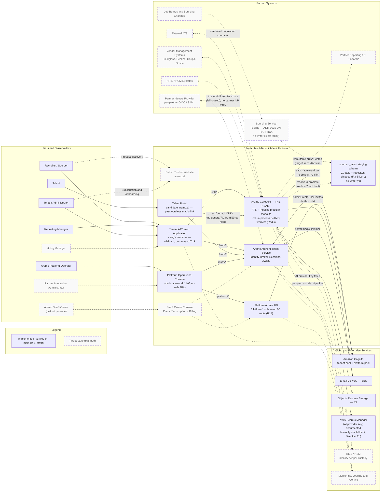

# Aramo Enterprise Context — v2.1

**Status:** Recon-grounded. Solid = implemented, verified against `main` @ `77b9fbf` (2026-07-20, Lead recon + Code verification pass A1–A6 / B1–B6 / C1–C2). Dashed = target-state, not built.

**Supersedes:** v2.0 (refuted on the sourcing flow: ADR-0019 un-ratified, no arrival writer exists).

**Corrections encoded in this version:**
1. Job-board arrivals flow via the sourcing sibling service into the `sourced_talent` staging schema — never JobBoards → Core API. The sourcing service and its write path are TARGET-STATE (dashed): nothing writes arrivals today.
2. Core API ↔ staging is split: the reader exists (admit-arrivals, TR-2b login-time re-link, solid); resolve-and-promote is fix-slice-2, not built (dashed).
3. Portal API edge is `/v1/portal/*` ONLY (Caddy-scoped; no general `/v1` from the portal host).
4. Core API remains THE HEART — ATS + Pipeline modular monolith with in-process BullMQ workers; no separate worker platform node (ADR-0017: extract only when forced).
5. Platform console talks to platform-admin (`/platform/*`), never Core API — the admin host has no `/v1` route (R14).
6. Secrets: AWS Secrets Manager is the primary key path; a documented box-only env fallback exists for the AI provider key (Single-Box Directive 2b).
7. PartnerSSO stays dashed; the fail-closed trusted-IdP verifier mechanism exists in auth-core, but no partner IdP is wired.

## Verification provenance

Solid nodes/edges were verified by direct reads of `docker-compose.prod.yml`, `deploy/caddy/Caddyfile`, `.env.prod.example`, and the implementing modules (recon pass items B1–B5), plus exhaustive ripgrep negative scans (A1–A6) and a sibling-repo sweep (C1–C2). The v2.0 → v2.1 delta is the sourcing flow (C1/C2: no writer, ADR-0019 un-ratified) and the Secrets env-fallback nuance (B6).

Amendments to this document follow standard directive discipline: recon before authoring, Lead ruling, PO filing to OneDrive canonical.
