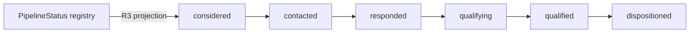
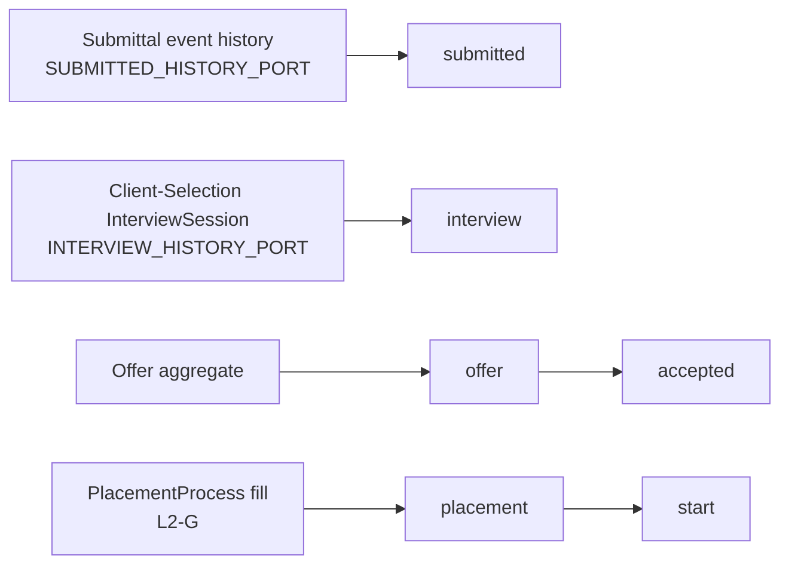
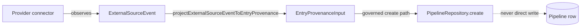

*Aramo Lane 2 — L2-I Enterprise / Provider / Reporting Closure Record — DRAFT (pending PO ratification)*

**ARAMO**

*Talent Intelligence and Entrustment Platform*

**Lane 2 — Talent Pipeline · L2-I (Enterprise / Provider / Reporting) Closure Record**

*Governance close-out of the FINAL Lane-2 slice: the provider-disposition seam, the external source-event contract, and the recruiting/hiring/source-effectiveness reporting surface*

**VERSION 1.0 — DRAFT (pending PO ratification)**

Classification: Internal — Aramo Program

> **Note on status.** This file is the markdown working draft produced by Gate 5
> of L2-I (D5 closure evidence). Post-merge, per the closure-record convention
> (see `doc/t2-closure-record-draft.md`), this is converted to `.docx` and filed
> by the Business Analyst at the canonical OneDrive location as
> `Aramo-L2-I-Closure-Record-v1_0-LOCKED.docx`. The Product Owner ratifies via
> the §7 block; closure takes effect upon PO signature.

# Document Control

## Purpose

This document is the filed substrate artifact for the Lane-2 L2-I closure — the
final slice of the Talent Pipeline lane. It records the D1–D5 deliverable scope,
the enterprise/provider seams established, the reporting surface delivered, the
proof inventory, the seam-boundary (A7 / SB-7) posture, and the Definition-of-Done
mapping to the Lane-2 DDR §6.

## Status

**DRAFT — Version 1.0.** Pending PO ratification.

## Authority

Architect owns Lane-2 doctrine and the DDR. PO is the sole ratifying authority.
Execution authority for L2-I: the filed `Aramo-L2-I-*-Directive-*-LOCKED` set
(D1 provider-mapping seam; D2–D5 closure). Substrate basis: `origin/main` at
`b323be3a` (L2-I D1, PR #719).

# 1. Scope — the five deliverables

| # | Deliverable | Summary |
|---|-------------|---------|
| D1 | Provider-disposition mapping seam | `PipelineProviderDispositionMapping` admin surface — versioned provider→canonical disposition mapping, governed by the narrow `integration:pipeline-mapping:write` scope (tenant_admin + tenant_owner). **MERGED, PR #719 (`b323be3a`).** |
| D2 | External source-event contract | `libs/pipeline` `ExternalSourceEvent` + `projectExternalSourceEventToEntryProvenance` — the canonical shape a provider connector resolves an external sourcing observation into, projected onto the L2-D entry-provenance columns. Provider-sourced origin subset derived from `PIPELINE_ENTRY_ORIGIN_VALUES` (Rule D). No PII, no Talent-trust; the governed create/entry path (never a direct Pipeline write) attaches the entry (SB-7). |
| D3 | Source-effectiveness correlation reader | `getSourceEffectiveness` — per L2-D source origin, correlates the recruiting outcome (canonical status distribution + disposition reasons) with the canonical hiring outcome (PlacementProcess established). CLASSIFIED EVIDENCE only (counts + a percent fill_rate) — no ordinal quality/verdict output (Rule C); a pure read (GP-1). |
| D4a | Recruiting funnel report | `getRecruitingFunnel` — Pipeline-owned, projects the canonical L2-C PipelineStatus registry onto the six recruiting stages (considered/contacted/responded/qualifying/qualified/dispositioned). Carries NO hiring stage. |
| D4b | Hiring funnel report | `getHiringFunnel` — downstream-owner-attributed; each stage sourced from its OWNING aggregate: submitted←Submittal (`SUBMITTED_HISTORY_PORT`), interview←Client-Selection (NEW `INTERVIEW_HISTORY_PORT`), offer/accepted←Offer, placement/start←PlacementProcess fill (L2-G). Carries NO recruiting stage. |
| D5 | Closure evidence | The three reporting routes, OpenAPI documentation, route-parity, Pact provider/consumer interactions, this closure record, and the DoD mapping. |

# 2. Seam posture (A7 / SB-7)

- **A7 (reporting seam-exclusion).** `libs/reporting` imports NO `@aramo/submittal`
  and NO `@aramo/client-selection` implementation. The submitted-history and
  interview-history semantics cross the wall as REPORTING-OWNED ports
  (`SUBMITTED_HISTORY_PORT`, `INTERVIEW_HISTORY_PORT`); the `@aramo/…`-backed
  adapters live at the apps/api composition root (`InterviewHistoryModule`,
  mirroring L2-E's `SubmittedHistoryModule`). Enforced by the structural guard
  `libs/reporting/src/tests/seam-exclusion-structural.spec.ts` (import-line scan
  over every non-spec source file) — the real protection, since both libs are
  `scope:ats` and nx-boundary lint would not block the edge.
- **Reporting-native edges.** Offer + PlacementProcess reads are consumed over
  the existing `reporting→placement` edge (Offer is a `libs/placement` aggregate);
  no seam is crossed for D3/D4b's offer/fill/placement stages.
- **SB-7 (Pipeline⊥ATS / I15).** The D2 contract never writes a Pipeline row;
  a future connector attaches the entry only through the governed
  `PipelineRepository.create` entry-provenance path.

# 3. Proof inventory (Gate-5 verified diff)

**Unit (all GREEN, `nx`/vitest):**
- `libs/pipeline/src/tests/external-source-event.spec.ts` — 4 (origin subset; projection; internal-origin refusal negative control; no-PII).
- `libs/reporting/src/tests/source-effectiveness.spec.ts` — 3 (classification; Rule-C structural evidence; GP-1 zero-Talent-write).
- `libs/reporting/src/tests/recruiting-funnel.spec.ts` — 2 (R3 projection; hiring-stage-exclusion negative control).
- `libs/reporting/src/tests/hiring-funnel.spec.ts` — 4 (owner-attributed sourcing; placement/start split; recruiting-stage-exclusion negative control; empty-visible-set short-circuit).
- `libs/reporting/src/tests/seam-exclusion-structural.spec.ts` — submittal + client-selection import-exclusion + both ports exist.
- `libs/reporting/src/tests/funnel-routes.controller.spec.ts` — 6 (report:read scope on all three routes; source-effectiveness date-only / zone-less / inverted-period 400).

**Integration (PG17-gated):**
- `libs/pipeline/src/tests/external-source-event.integration.spec.ts` — governed create stores VMS provenance.
- `pact/consumers/ats-web/src/reporting.consumer.test.ts` — +6 interactions (recruiting-funnel, hiring-funnel, source-effectiveness — each a 200 + a report:read-refusal 403), reusing the shared `an ats-web recruiter and tenant reporting data exist` provider state.

**Contract:**
- `openapi/ats.yaml` — three GET routes + `RecruitingFunnelReport` / `HiringFunnelReport` / `SourceEffectivenessReport` schemas, all `additionalProperties: false` (ats:refusal-check GREEN, redocly lint GREEN).
- `contract-parity:check` — 0 orphan, 0 unclassified (the three routes matched to OpenAPI ops).

# 4. UAT script (acceptance walk)

Preconditions: a tenant with the ATS capability; an actor holding `report:read`;
seeded pipeline episodes with L2-D entry provenance; at least one Submittal,
InterviewSession, Offer, and established PlacementProcess for a common
(talent, requisition) grain.

1. **Recruiting funnel.** `GET /v1/reports/recruiting-funnel` → 200; body has
   `canonical_source: "PIPELINE"` and exactly the six recruiting stages in fixed
   order; counts reconcile to the current PipelineStatus distribution; no
   `submitted/interview/offer/accepted/placement/start` key appears.
2. **Hiring funnel.** `GET /v1/reports/hiring-funnel` → 200; exactly the six
   hiring stages each with its owner label (SUBMITTAL, CLIENT_SELECTION, OFFER,
   OFFER, PLACEMENT_PROCESS, PLACEMENT_PROCESS); `accepted ≤ offer`,
   `start ≤ placement`; no recruiting-stage key appears.
3. **Source effectiveness.** `GET /v1/reports/source-effectiveness?from=…&to=…`
   → 200; `canonical_fill_source: "PLACEMENT_PROCESS"`; each `sources[]` row
   carries `episodes`, `by_status[]`, `dispositioned_by_reason[]`,
   `established_placements`, and an integer `fill_rate` 0–100; NO quality/verdict
   field is present.
4. **Period validation.** `…/source-effectiveness?from=2026-01-01&to=…` (date-only)
   → 400 `VALIDATION_ERROR`; inverted period → 400.
5. **Authorization.** Any of the three routes without `report:read` → 403
   `INSUFFICIENT_PERMISSIONS`.
6. **Seam.** No response exposes person-level PII or free-text; funnels are
   counts-only; source-effectiveness is aggregate evidence only.

# 5. User-guide notes (operator-facing)

- **Two funnels, never merged.** The *recruiting* funnel answers "how is the
  recruiter's consideration pipeline moving?" (Pipeline-owned). The *hiring*
  funnel answers "how far are grains progressing through the downstream hiring
  aggregates?" (Submittal→Client-Selection→Offer→Placement). They are separate
  routes with disjoint stage vocabularies — a stage from one never appears in the
  other. This separation is a governance invariant (Lane2-DDR §4/§5), not a UI
  choice.
- **Hiring-funnel counts are monotone reached-counts**, not a partition: a grain
  that reached `accepted` is also counted at `submitted`. Read them as a funnel
  (each stage ⊇ the next), not as mutually-exclusive buckets.
- **Source effectiveness is evidence, not a verdict.** `fill_rate` is
  `established_placements / episodes` as a percent; the report deliberately emits
  no ordinal ranking or quality verdict of a source (the Rule-C ban on the Tier-2
  quality vocabulary defined in `scripts/verify-vocabulary.sh`).
- **Visibility.** All three routes are tenant + site + A3 scoped; a recruiter sees
  only their visible requisitions, a tenant admin sees tenant-wide.

# 6. Workflow diagrams

Recruiting funnel (Pipeline-owned projection):

Hiring funnel (downstream-owner-attributed sourcing):

External source-event → governed entry (D2 / SB-7):

# 7. Definition of Done — Lane2-DDR §6 mapping

| DoD item | Status | Evidence |
|----------|--------|----------|
| Provider-disposition mapping seam with a narrow governed scope | ✅ | D1 / PR #719; `integration:pipeline-mapping:write` |
| External source-event contract, PII-free, governed-entry only | ✅ | D2; external-source-event unit + integration |
| Source→outcome correlation as classified evidence (Rule C) | ✅ | D3; source-effectiveness spec (Rule-C structural evidence) |
| Recruiting funnel projected from canonical statuses | ✅ | D4a; recruiting-funnel spec |
| Hiring funnel owner-attributed, A7 seam preserved | ✅ | D4b; hiring-funnel + seam-exclusion specs |
| GP-1: reporting writes nothing to Talent trust | ✅ | source-effectiveness GP-1 spec (talentWriter spies) |
| Reporting routes documented + contract-parity | ✅ | openapi/ats.yaml; contract-parity:check |
| Pact provider/consumer coverage | ✅ | reporting.consumer.test.ts (+6) |
| Two funnels never collapse each other | ✅ | negative-control specs in both funnel suites |

# §7 PO ratification

- [ ] PO ratifies L2-I closure. Signature: __________________ Date: __________
