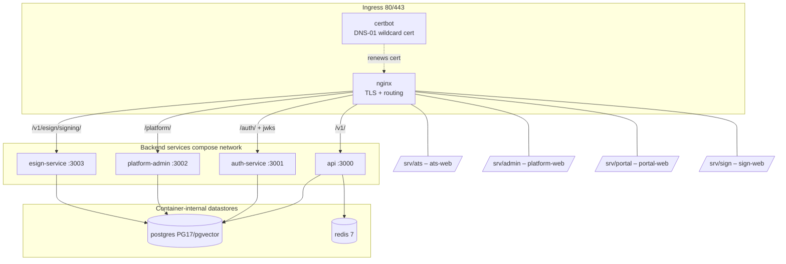
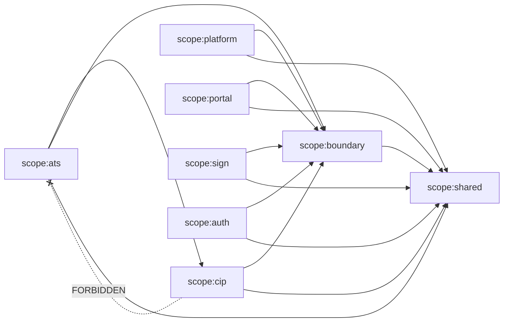

# D01 — System Context, Topology & Monorepo Map (AS-BUILT)
> Baseline SHA 12330b0f5049c97f01022df0b190035933345212 · category AS-BUILT

## Summary

Aramo is an Nx monorepo (`package.json:2` name `aramo-core`; `nx.json:51`
`"defaultBase": "main"`) comprising **8 applications** and **76 libraries** under
`libs/`. The 8 apps split into two kinds:

- **4 backend NestJS services** — each has its own `Dockerfile` and a
  `NestFactory` bootstrap with a default `PORT`: `api` (3000), `auth-service`
  (3001), `platform-admin` (3002), `esign-service` (3003).
- **4 Vite/React SPA frontends** — `ats-web` (dev 4201), `platform-web`
  (dev 4202), `portal-web` (dev 4203), `sign-web` (dev 4204). The SPAs have no
  Dockerfile of their own; they are built and baked into the nginx image.

The 76 libs are partitioned by **nx boundary tags** enforced via
`@nx/enforce-module-boundaries` (`eslint.config.mjs:140`), with the
`SCOPE_DEP_CONSTRAINTS` table (`eslint.config.mjs:77`) encoding the
Pipeline⊥ATS wall and the platform/portal/sign/auth cluster walls.

Two runtime topologies co-exist in the tree: a **single-box prod stack**
(`docker-compose.prod.yml`, project name `aramo-singlebox`) fronted by nginx, and
a **full AWS ECS/ALB/VPC environment set** (`infrastructure/environments/{prod,
staging,dev}`). A separate `infrastructure-lightsail/` track describes the
Lightsail box. Local dev uses `docker-compose.yml` (Postgres + Redis +
LocalStack).

## Modules & Services

| name | role | evidence path:line + symbol |
|------|------|------------------------------|
| api | Core ATS backend (NestJS), default port 3000 | `apps/api/src/main.ts:26` `const port = process.env['PORT'] ?? 3000` |
| auth-service | Identity / JWT / OAuth backend, port 3001 | `apps/auth-service/src/main.ts:11` `?? 3001` |
| platform-admin | Platform Console backend (`scope:platform`), port 3002 | `apps/platform-admin/src/main.ts:17` `?? 3002`; `apps/platform-admin/src/app/app.module.ts` |
| esign-service | Native E-Sign backend, port 3003 | `apps/esign-service/src/main.ts:9` `?? 3003` |
| ats-web | Recruiter ATS SPA (React/Vite), dev 4201 | `apps/ats-web/vite.config.ts:21` `port: 4201` |
| platform-web | Platform Console SPA (`scope:platform`), dev 4202 → served at `/srv/admin` | `apps/platform-web/vite.config.ts:29` `port: 4202` |
| portal-web | Talent-facing Portal SPA (`scope:portal`), dev 4203 | `apps/portal-web/vite.config.ts:23` `port: 4203` |
| sign-web | External-signer SPA (`scope:sign`), dev 4204 | `apps/sign-web/vite.config.ts:16` `port: 4204` |
| nginx | Single ingress on 80/443; TLS + static + path routing | `docker-compose.prod.yml:61` service `nginx`; `deploy/nginx/Dockerfile` |
| certbot | DNS-01 `*.aramo.ai` wildcard-cert sidecar | `docker-compose.prod.yml:128` service `certbot` |
| postgres | PG17 (pgvector image) — authoritative store | `docker-compose.prod.yml:367`; `docker-compose.yml:20` `image: pgvector/pgvector:pg17` (service header `:18`) |
| redis | BullMQ backing store | `docker-compose.prod.yml:388`; `docker-compose.yml:37` `image: redis:7` (service header `:36`) |
| localstack | Local AWS (EventBridge+SQS) for ADR-0033 intake | `docker-compose.yml:56` `image: localstack/localstack:3` (service header `:55`) |

**Scope-tag partition (nx scope tags, all-project counts re-derived — see
coverage fragment):**
`scope:ats` (36), `scope:cip` (14), `scope:shared` (16), `scope:boundary` (9),
`scope:platform` (2), `scope:portal` (1), `scope:sign` (1), `scope:auth` (1).
These are all-project counts; the `scope:platform` (2), `scope:portal` (1) and
`scope:sign` (1) totals are carried entirely by **apps** (platform-admin,
platform-web, portal-web, sign-web) — lib-only those three tags are 0/0/0. The
**76 libs** therefore decompose as `scope:ats` 36 + `scope:cip` 14 +
`scope:shared` 16 + `scope:boundary` 9 + `scope:auth` 1 = 76.
The dependency rules (`eslint.config.mjs:77`–`94`): `scope:cip` may depend only on
`cip|boundary|shared` (`:78`); `scope:ats` may additionally depend on `scope:cip`
(`:79`, the one-directional ATS→Pipeline allowance); `scope:platform`,
`scope:portal`, `scope:sign`, `scope:auth` each depend only on themselves +
`boundary` + `shared` (`:80`–`91`); `scope:boundary` → `boundary|shared` (`:92`);
`scope:shared` → `shared` only (`:93`).

## Data Models

D01 is a topology domain; no new data models are defined here. Persistence is
Prisma-per-lib: **53 git-tracked `schema.prisma` files** (see coverage); the single
`prisma:generate` script (`package.json:25`) enumerates **48** of them explicitly
(`grep -o 'prisma generate'` on that line → 48) — five git-tracked lib schemas
(`libs/audit`, `libs/auth`, `libs/common`, `libs/events`, `libs/matching`) are
absent from the script. All services share one Postgres instance with
per-lib/per-domain schemas (cross-schema references by UUID, no cross-schema FK —
per ADR-0029 I1/I15).

## API Endpoints

D01 does not define HTTP endpoints; it records the **front-door routing topology**
(nginx reverse-proxy map, `deploy/nginx/templates/aramo.conf.template`):

| host class | route | upstream | evidence path:line |
|------------|-------|----------|--------------------|
| tenant | `/v1/` | `api:3000` | `:78`–`79` `proxy_pass http://api:3000` |
| tenant | `/auth/` | `auth-service:3001` | `:81`–`82` |
| tenant | `/v1/talent-intake-drafts/{id}/events` (SSE) | `api:3000` | `:66`–`67` |
| tenant | `/` (SPA) | `root /srv/ats` | `:100` |
| admin | `/platform/` | `platform-admin:3002` | `:148`–`149` |
| admin | `/platform/skills` etc. | `api:3000` | `:139`–`146` |
| admin | `/` (SPA) | `root /srv/admin` | `:162` |
| admin | (no `/v1` location — R14 negative control) | — | `:155` comment |
| portal | `/v1/portal/` | `api:3000` | `:184`–`185` |
| portal | `/` (SPA) | `root /srv/portal` | `:203` |
| sign | `/v1/esign/signing/` | `esign-service:3003` | `:226`–`227` |
| sign | `/` (SPA) | `root /srv/sign` | `:231` |
| all | `/.well-known/jwks.json` | `auth-service:3001` | `:93`–`94`, `:151`–`152`, `:198`–`199` |

## Screens & FE→BE Wiring (FE domains only)

The nginx image baked at build time compiles all four SPAs and places them on
disk (`deploy/nginx/Dockerfile:32`–`35` `nx build aramo-{ats,platform,portal,
sign}-web`; `:80`–`83` `COPY --from=web-builder … /srv/{ats,admin,portal,sign}`):

- `ats-web` → `/srv/ats`, served at the tenant host; calls `/v1/*` (api) and
  `/auth/*` (auth-service).
- `platform-web` → `/srv/admin`, served at the admin host; calls `/platform/*`
  (platform-admin) + `/auth/*`.
- `portal-web` → `/srv/portal`, served at the portal host; HTTP-only against
  `/v1/portal/*` (no backend-lib import — `scope:portal` wall).
- `sign-web` → `/srv/sign`, served at the sign host; HTTP-only against
  `/v1/esign/signing/*`.

The dev-time Vite proxies live in each app's `vite.config.ts` (ports 4201–4204
above).

## Key Flows

### Deployment / component topology (single-box prod stack)

Evidence: `docker-compose.prod.yml:61,146,249,296,328,367,388`;
`deploy/nginx/templates/aramo.conf.template:78,148,226`.

### nx scope-tag dependency wall (summarized)

Evidence: `eslint.config.mjs:77`–`94` `SCOPE_DEP_CONSTRAINTS`; enforced at
`eslint.config.mjs:140` `@nx/enforce-module-boundaries`.

## Evidence Index (load-bearing path:line citations)

- `package.json:2` — workspace name `aramo-core`
- `package.json:25` — `prisma:generate` enumerating 48 lib schemas
- `nx.json:51` — `"defaultBase": "main"`
- `nx.json:38` — `plugins` (@nx/eslint, @nx/vite)
- `apps/api/src/main.ts:26` — api PORT 3000
- `apps/auth-service/src/main.ts:11` — auth-service PORT 3001
- `apps/platform-admin/src/main.ts:17` — platform-admin PORT 3002
- `apps/esign-service/src/main.ts:9` — esign-service PORT 3003
- `apps/ats-web/vite.config.ts:21` — ats-web dev port 4201
- `apps/platform-web/vite.config.ts:29` — platform-web dev port 4202
- `apps/portal-web/vite.config.ts:23` — portal-web dev port 4203
- `apps/sign-web/vite.config.ts:16` — sign-web dev port 4204
- `apps/platform-admin/src/app/app.module.ts:1` — platform-admin Nest app module
- `apps/platform-admin/project.json:6` — tag `scope:platform`
- `apps/platform-web/project.json:6` — tag `scope:platform`
- `apps/portal-web/project.json:6` — tag `scope:portal`
- `apps/sign-web/project.json:6` — tag `scope:sign`
- `eslint.config.mjs:77` — `const SCOPE_DEP_CONSTRAINTS`
- `eslint.config.mjs:78` — `scope:cip` constraint
- `eslint.config.mjs:79` — `scope:ats` may depend on `scope:cip`
- `eslint.config.mjs:140` — `@nx/enforce-module-boundaries` rule
- `docker-compose.yml:20` — local postgres `image: pgvector/pgvector:pg17` (service header `:18`)
- `docker-compose.yml:37` — local redis `image: redis:7` (service header `:36`)
- `docker-compose.yml:56` — local localstack `image: localstack/localstack:3` (service header `:55`)
- `docker-compose.prod.yml:53` — compose project `name: aramo-singlebox`
- `docker-compose.prod.yml:61` — nginx service
- `docker-compose.prod.yml:128` — certbot service
- `docker-compose.prod.yml:146` — api service
- `docker-compose.prod.yml:249` — auth-service service
- `docker-compose.prod.yml:296` — esign-service service
- `docker-compose.prod.yml:328` — platform-admin service
- `docker-compose.prod.yml:367` — prod postgres service
- `docker-compose.prod.yml:388` — prod redis service
- `deploy/nginx/Dockerfile:32` — `nx build aramo-ats-web`
- `deploy/nginx/Dockerfile:80` — `COPY --from=web-builder … /srv/ats`
- `deploy/nginx/templates/aramo.conf.template:66` — SSE talent-intake-drafts events location
- `deploy/nginx/templates/aramo.conf.template:78` — `/v1/` → api
- `deploy/nginx/templates/aramo.conf.template:81` — `/auth/` → auth-service
- `deploy/nginx/templates/aramo.conf.template:100` — `root /srv/ats`
- `deploy/nginx/templates/aramo.conf.template:148` — `/platform/` → platform-admin
- `deploy/nginx/templates/aramo.conf.template:162` — `root /srv/admin`
- `deploy/nginx/templates/aramo.conf.template:203` — `root /srv/portal`
- `deploy/nginx/templates/aramo.conf.template:226` — `/v1/esign/signing/` → esign-service
- `deploy/nginx/templates/aramo.conf.template:231` — `root /srv/sign`
- `doc/generated/repo-map.projects.json:2` — `aliasTotals.total: 79`
- `tsconfig.base.json:1` — 79 `@aramo/*` path mappings
- `infrastructure-lightsail/main.tf:1` — Lightsail single-box track
- `infrastructure/environments/prod/main.tf:1` — ECS/ALB/VPC prod environment
- `infrastructure/modules/talent-intake-events/main.tf:1` — EventBridge+SQS module (ADR-0033)

## NOT VERIFIED (explicit)

- **Running prod runtime vs repo desired-state.** This recon reads the frozen
  tree only; which compose/IaC track is actually live, and whether the
  EventBridge/SQS IaC (`infrastructure/modules/talent-intake-events`) is applied,
  are runtime facts not derivable from code at this SHA — NOT VERIFIED.
- **`.env` / secret values.** Env-var *names* are enumerated in the compose files;
  their runtime values are out of tree — NOT VERIFIED.
- **Exact per-lib tag correctness vs ADR-0029 D5 intended partition** is beyond
  D01's topology scope; the tag *counts* are re-derived in the coverage fragment,
  but individual lib-to-cluster assignment correctness is NOT VERIFIED here.
- **`tsconfig.base.json` path-count vs repo-map alias-count parity** — both equal
  79 by independent grep, but byte-level one-to-one correspondence of every entry
  is NOT individually walked.
