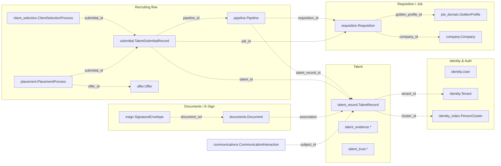
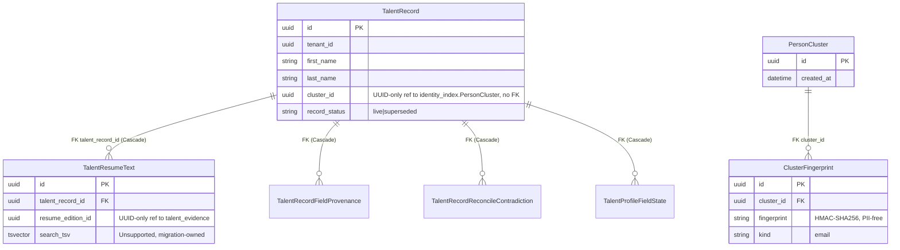
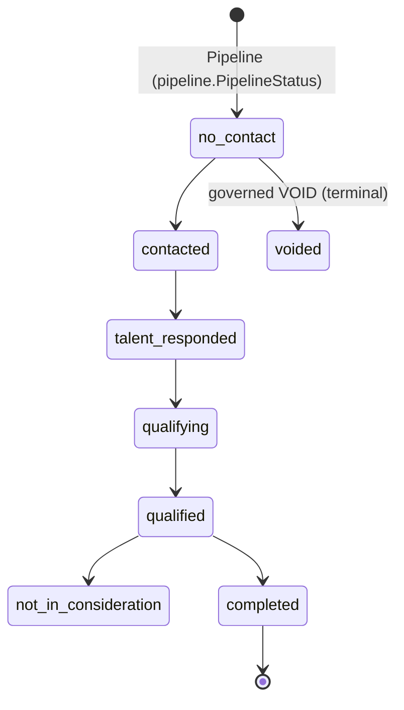
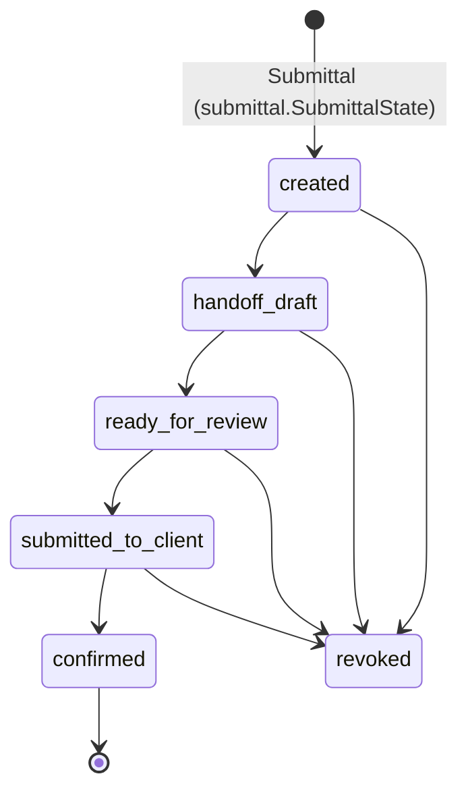
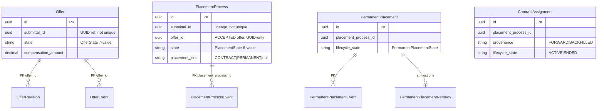
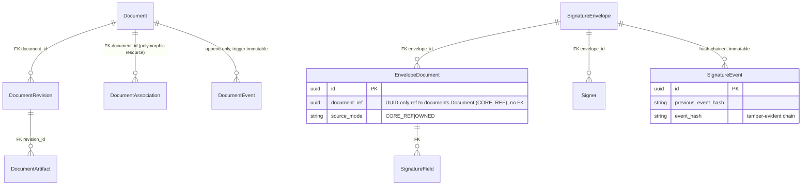

# D02 — Database & Domain Data Model (AS-BUILT)
> Baseline SHA 12330b0f5049c97f01022df0b190035933345212 · category AS-BUILT

## Summary

Aramo persists its domain in PostgreSQL under a **schema-per-module** architecture: each `libs/*` module owns a dedicated Prisma schema file and a dedicated Postgres `@@schema` namespace. Prisma is the single ORM; every module declares `provider = "prisma-client-js"` with a per-module `output = "./generated/client"` and `datasource db { provider = "postgresql" }`.

Re-derived counts at this SHA (every number reproduced by a command noted in the coverage fragment):

- **53** git-tracked `schema.prisma` files (`git ls-files '*/prisma/schema.prisma' | wc -l`). The on-disk tree holds thousands more copies, but all extras live under `.claude/worktrees/` or `*/generated/` — the main tree has exactly 53.
- **209** `model` declarations across those 53 files.
- **5** of the 53 schemas are scaffold-only (zero models): `libs/audit`, `libs/auth`, `libs/common`, `libs/events`, `libs/matching`. Each carries the comment "Zero models exist yet" (e.g. `libs/audit/prisma/schema.prisma:8`). **48** schemas are model-bearing.
- **50** distinct `@@schema("…")` namespace values; **307** `@@schema` annotation lines total.
- **97** `enum` declarations.
- **253** tracked `migration.sql` files.

The data-architecture contract (cross-schema references are UUID-only with NO foreign-key constraint; intra-schema relations carry real FKs; every tenant-scoped table leads with `tenant_id`) is documented in `doc/05-conventions.md:122` and is observed structurally in every schema read for this audit. Two deliberate exceptions exist: the cross-tenant resolution index `identity_index` carries **no** `tenant_id` and **no** PII column (`libs/identity-index/prisma/schema.prisma:11`), and the `PersonCluster` node is tenant-agnostic by design.

Recurring structural idioms observed across modules: per-module transactional-outbox tables (`OutboxEvent`), append-only event-log tables with DB-level immutability triggers, optimistic-concurrency `version` integers, `Decimal(12,2)` money columns (never float), String-plus-app-guard closed vocabularies (in preference to native Postgres enums for evolving value sets), and pgvector / tsvector columns declared `Unsupported(...)` so the hand-authored migration owns their DDL.

## Modules & Services

Model-bearing schema modules (role = the bounded context the schema owns). Evidence cites the schema file + a representative model.

| name | role | evidence path:line+symbol |
|---|---|---|
| libs/talent-record | ATS talent system-of-record (person key) | `libs/talent-record/prisma/schema.prisma:47` model `TalentRecord` |
| libs/talent-evidence | Talent L1 evidence + resume editions + intake drafts | `libs/talent-evidence/prisma/schema.prisma:857` model `TalentIntakeOutboxEvent` |
| libs/talent-trust | Identity resolution / trust / dispute substrate | (model inventory) `ResolutionSubject`, `EvidenceRecord`, `EvidenceLink` |
| libs/talent-embedding | pgvector semantic index for Talent | `libs/talent-embedding/prisma/schema.prisma:41` `embedding Unsupported("vector(1536)")` |
| libs/identity | Users / tenants / sites / roles / scopes / teams | `libs/identity/prisma/schema.prisma:21` model `User` |
| libs/identity-index | Tenant-agnostic cross-tenant person-cluster index | `libs/identity-index/prisma/schema.prisma:50` model `PersonCluster` |
| libs/requisition | ATS job-order + assignment visibility + comp | `libs/requisition/prisma/schema.prisma:111` model `Requisition` |
| libs/job-domain | Job + GoldenProfile matching seam | (model inventory) `Job`, `GoldenProfile` |
| libs/pipeline | (talent × requisition) recruiting state machine | `libs/pipeline/prisma/schema.prisma:74` model `Pipeline` |
| libs/submittal | Submittal workflow entity + event log | `libs/submittal/prisma/schema.prisma:122` model `TalentSubmittalRecord` |
| libs/submittal-eligibility | Per-requisition submittal policy + consumption | (model inventory) `RequisitionSubmittalPolicy` |
| libs/client-selection | Client review/interview decision lifecycle | `libs/client-selection/prisma/schema.prisma:38` model `ClientSelectionProcess` |
| libs/selection | Talent selection aggregate + event log | (model inventory) `TalentSelection`, `TalentSelectionEvent` |
| libs/placement | Placement spine + offer + contract/perm assignment + commercial | `libs/placement/prisma/schema.prisma:90` model `PlacementProcess` |
| libs/placement-pipeline-bridge | Placement↔pipeline inbox bridge | (model inventory) `PlacementPipelineInbox` |
| libs/pre-start-requirement | Pre-start requirement sets/instances | (model inventory) `PreStartRequirementSet` |
| libs/documents | Canonical document identity + templates + packets | `libs/documents/prisma/schema.prisma:53` model `Document` |
| libs/esign | Native e-signature envelopes + tamper-evident event chain | `libs/esign/prisma/schema.prisma:23` model `SignatureEnvelope` |
| libs/company | Client/employer org + party-role + assignment axes | `libs/company/prisma/schema.prisma:41` model `Company` |
| libs/contact | ATS contact reference data | (model inventory) `Contact` |
| libs/communications | Provider-neutral calling/email system-of-record | `libs/communications/prisma/schema.prisma:169` model `CommunicationInteraction` |
| libs/consent | Talent consent event ledger + per-module outbox | (model inventory) `TalentConsentEvent` |
| libs/examination | Talent↔job examination (evidence-only; R10) | `libs/examination/prisma/schema.prisma:82` model `TalentJobExamination` |
| libs/evidence | Immutable talent-job evidence package | (model inventory) `TalentJobEvidencePackage` |
| libs/integration | External connectors + lifecycle mappings + reconciliation | (model inventory) 13 models incl. `IntegrationConnection` |
| libs/skills-taxonomy | Platform-global skills taxonomy + governance | (model inventory) `Skill`, `SkillVersion` |
| libs/canonicalization | Canonicalization outbox + raw-payload ref (+ ingestion ns) | `libs/canonicalization/prisma/schema.prisma` datasource `["canonicalization","ingestion"]` |
| libs/policy-store | Stored policy versions + decision records (ADR-0024) | (model inventory) `StoredPolicyVersion`, `PolicyDecisionRecord` |
| libs/portal-identity | Portal user + login token + notice delivery | (model inventory) `PortalUser` |
| libs/import | Import batch + failure provenance | (model inventory) `ImportBatch` |
| libs/activity | Recruiter activity + enterprise-note ledger | `libs/activity/prisma/schema.prisma:98` model `Activity` |
| libs/conversation-intelligence | CI runs / claims / citations / drafts (DARK) | (model inventory) 5 models |
| libs/auth-storage | Host auth profile + refresh tokens | (model inventory) `HostAuthProfile`, `RefreshToken` |
| (others) | attachment, calendar, client-talent-restriction, conversation-transcript, entitlement, ingestion, job-distribution, metering, platform-trust, saved-list, settings, sourced-talent, task, tenant-reset, ai-draft | per model inventory in Data Models |

The 5 scaffold-only (zero-model) schemas — `libs/audit`, `libs/auth`, `libs/common`, `libs/events`, `libs/matching` — declare generator + datasource only.

## Data Models

Full per-schema model inventory at this SHA (`grep -E '^model '` per tracked schema; 209 models total). Namespace in parentheses where it differs from or extends the lib name.

- **talent_record** (`talent_record`): TalentRecord, TalentResumeText, TalentRecordFieldProvenance, TalentRecordReconcileContradiction, TalentProfileFieldState
- **talent-evidence** (`talent_evidence`): TalentSkillEvidence, TalentWorkHistoryEntry, TalentEducationEntry, TalentCertificationEntry, TalentProjectExperience, TalentContactMethod, TalentRateExpectation, TalentWorkAuthorization, TalentDocument, TalentDerivedSnapshot, TalentResumeEdition, TalentResumeDefault, ResumeExtractionDraft, TalentIntakeDraft, TalentIntakeOutboxEvent
- **talent-trust** (`talent_trust`): ResolutionSubject, ResolutionSubjectRef, EvidenceRecord, EvidenceEvent, EvidenceLink, TrustState, SubjectAnchor, SubjectMatchAdvisory, VerificationProposal, SubjectMergeOperation, VerificationRequest, PortalDispute, PortalDisputeWorkItem, PortalDisputeStatement
- **talent-embedding** (`talent_embedding`): TalentEmbedding
- **identity** (`identity`): User, Tenant, Site, UserTenantMembership, Role, Scope, RoleScope, UserTenantMembershipRole, ServiceAccount, AuthorizationVersion, ExternalIdentity, Invitation, IdentityAuditEvent, ManagementEdge, Team, TeamMembership
- **identity-index** (`identity_index`): PersonCluster, ClusterFingerprint
- **requisition** (`requisition`): Requisition, RequisitionNumberSequence, RequisitionAssignment, UserRequisitionState, RequisitionLifecycleEvent, RequisitionSkillRequirement, RequisitionEmbedding
- **job-domain** (`job_domain`): Job, GoldenProfile
- **pipeline** (`pipeline`): Pipeline, PipelineStatusHistory, PipelineDisposition, PipelineEntryProvenance, OutboxEvent, TalentRequisitionResume
- **submittal** (`submittal`): TalentSubmittalRecord, OutboxEvent, TalentSubmittalEvent
- **submittal-eligibility** (`submittal_policy`): RequisitionSubmittalPolicy, SubmittalConsumption, SubmittalPolicyEvent
- **client-selection** (`client_selection`): ClientSelectionProcess, InterviewSession, ClientSelectionEvent, OutboxEvent
- **selection** (`selection`): TalentSelection, OutboxEvent, TalentSelectionEvent
- **placement** (`placement` + `offer`): PlacementProcess, PlacementProcessEvent, OutboxEvent, Offer, OfferRevision, OfferEvent, OfferOutboxEvent, ContractAssignment, AssignmentExtension, AssignmentRateVersion, CommercialRevisionProposal, CommercialRevisionProposalEvent, PermanentPlacement, PermanentPlacementEvent, PermanentPlacementRemedy, PermanentPlacementGuaranteeTermVersion, PermanentPlacementConversionLineage
- **placement-pipeline-bridge** (`placement_pipeline_bridge`): PlacementPipelineInbox
- **pre-start-requirement** (`pre_start_requirement`): PreStartRequirementSet, PreStartRequirementDefinition, PreStartRequirementInstance, PreStartMaterializationIntent, PreStartRequirementAudit, PreStartReadinessDecision
- **documents** (`documents`): DocumentType, Document, DocumentRevision, DocumentArtifact, DocumentAssociation, DocumentEvent, OutboxEvent, IdempotencyKey, DocumentTemplate, TemplateVersion, TemplateFieldDefinition, TemplateAsset, DocumentRequirement, DocumentPacket, DocumentPacketItem
- **esign** (`esign`): SignatureEnvelope, EnvelopeDocument, Signer, SignatureField, SigningSession, SignerDisclosureAcceptance, SignatureEvent, NotificationDelivery, IdempotencyKey, OutboxEvent, ExecutedDocument, ExecutionCertificate
- **company** (`company`): Company, CompanyDepartment, UserClientAssignment, TeamClientOwnership, CompanyRelationship, CompanyEmbedding
- **contact** (`contact`): Contact
- **communications** (`communications`): CommunicationInteraction, CommunicationAssociation, CommunicationDisposition, CommunicationProviderEvent, CommunicationProviderIdentity, EmailTemplate
- **consent** (`consent` + `audit`): TalentConsentEvent, IdempotencyKey, OutboxEvent, ConsentAuditEvent
- **examination** (`examination`): TalentJobExamination, ExaminationOverride, CanonicalMatchShadowObservation
- **evidence** (`evidence`): TalentJobEvidencePackage
- **integration** (`integration`): IntegrationConnection, RequisitionLifecycleMapping, RequisitionLifecycleMappingSet, PipelineProviderDispositionMappingSet, PipelineProviderDispositionMapping, ExternalPipelineEpisodeIdentity, PipelineExternalReconciliation, PipelineExternalTransitionProvenance, RequisitionExternalReconciliation, RequisitionExternalTransitionProvenance, ConnectorDelivery, LifecycleObservationLedger, ExternalRequisitionIdentity
- **skills-taxonomy** (`skills_taxonomy`): Skill, SkillAuditEvent, SkillAlias, SkillVersion, SkillRelationship, SkillGovernanceProposal, SkillCorrectionTask
- **canonicalization** (`canonicalization` + `ingestion`): OutboxEvent, RawPayloadReference
- **policy-store** (`policy_store`): StoredPolicyVersion, PolicyDecisionRecord
- **portal-identity** (`portal_identity`): PortalUser, PortalLoginToken, NoticeDelivery
- **import** (`import`): ImportBatch, ImportFailure
- **activity** (`activity`): Activity, ActivityNote, ActivityNoteEvent
- **conversation-intelligence** (`conversation_intelligence`): RequisitionAnalysisContextSnapshot, ConversationIntelligenceRun, ConversationIntelligenceClaim, ConversationIntelligenceCitation, ConversationIntelligenceDraft
- **auth-storage** (`auth_storage`): HostAuthProfile, RefreshToken
- Single-model schemas: attachment(`Attachment`), calendar(`CalendarEvent`), client-talent-restriction(`ClientTalentRestriction`), conversation-transcript(`ConversationTranscript`), entitlement(`TenantEntitlement`), ingestion(`RawPayloadReference`), metering(`UsageEvent`), platform-trust(`DormantLink`), sourced-talent(`SourcedTalent`), task(`Task`), tenant-reset(`ResetBatch`), ai-draft(`AiDraftEvent`)
- Two-model schemas: job-distribution(`ChannelPostingState`, `TenantChannelConfig`), saved-list(`SavedList`, `SavedListEntry`)
- Zero-model (scaffold) schemas: audit, auth, common, events, matching

### Namespace notes
- **3** schema files declare a multi-namespace datasource array: `libs/canonicalization` (`["canonicalization","ingestion"]`), `libs/consent` (`["consent","audit"]`), `libs/placement` (`["placement","offer"]`).
- `libs/submittal-eligibility` declares a single-namespace datasource `schemas = ["submittal_policy"]` (`libs/submittal-eligibility/prisma/schema.prisma:31`) and all three models carry `@@schema("submittal_policy")` — it does not reference a bare `submittal` namespace; `libs/placement` straddles `placement` + `offer`.
- `identity_index` is the privacy-wall schema: no `tenant_id`, no PII columns (`libs/identity-index/prisma/schema.prisma:11`), CI-enforced by `src/tests/privacy-wall.spec.ts` per the schema header.

### Cross-cutting substrate idioms
- **Per-module transactional outbox**: models named `OutboxEvent` exist in `canonicalization`, `client-selection`, `consent`, `documents`, `esign`, `pipeline`, `placement`, `selection`, `submittal`; `placement` additionally has `OfferOutboxEvent` (`@@map("OutboxEvent")`, `libs/placement/prisma/schema.prisma:356`); `talent-evidence` has `TalentIntakeOutboxEvent`. The shared drain `libs/outbox-publisher` injects exactly **7** repositories (consent, selection, submittal, canonicalization, placement, pipeline, client-selection) — `libs/outbox-publisher/src/lib/outbox-publisher.processor.ts:104` onward.
- **Append-only / immutable ledgers**: PipelineStatusHistory, PlacementProcessEvent, OfferEvent, DocumentEvent, SignatureEvent, ClientSelectionEvent, TalentSubmittalEvent, ActivityNoteEvent, IdentityAuditEvent, etc. Immutability is enforced by DB triggers in the migrations, not in the Prisma DSL — **45** tracked migrations contain a `BEFORE UPDATE` / `BEFORE INSERT OR UPDATE` rejection trigger (`git ls-files '*migration.sql' | xargs grep -lE 'BEFORE UPDATE|BEFORE INSERT OR UPDATE' | wc -l` = 45).
- **Optimistic concurrency**: `version Int @default(0)` on Pipeline (`:99`), Requisition (`:335`), ClientSelectionProcess, InterviewSession.
- **Unsupported DDL-owned columns**: pgvector `vector(1536)` in `requisition` (`:594`), `company` (`:348`), `talent-embedding` (`:41`); tsvector in `talent-record` (`:269`). **4** schema files declare `Unsupported(...)`.
- **Money**: `Decimal @db.Decimal(12,2)` in placement (rate/comp/exposure), requisition (pay/bill/salary), offer. Never float.

## API Endpoints

D02 is the persistence/data-model domain. The database is reached exclusively through per-module NestJS repositories/services (the Prisma clients generated per schema), not by any DB-direct HTTP route. HTTP surfaces that read/write these models are owned by the per-domain API domains (talent, requisition, pipeline, submittal, placement, documents, esign, identity) and are inventoried in their respective recon domains. No endpoint-to-table mapping is asserted here. NOT VERIFIED within D02 scope.

## Screens & FE→BE Wiring

FE applications (ats-web, platform-admin, platform-web, portal-web, sign-web) consume these models only through the API domains' typed clients; no front-end code holds a Prisma schema or a direct DB connection. FE→BE wiring is owned by the per-feature recon domains, not D02. NOT VERIFIED within D02 scope.

## Key Flows

### Bounded-context map (schema-per-module, UUID-only cross-schema edges)

All dotted edges are UUID-only logical references with NO database FK, per `doc/05-conventions.md:136`.

### Talent context ER (intra-schema FKs are solid; the identity-index link is UUID-only)

### Recruiting-flow state aggregates (status enums per schema)

### Placement / offer context ER (placement + offer namespaces in one schema file)

### Documents / e-sign (same-schema FKs; e-sign references documents by opaque UUID only)

## Evidence Index

- `doc/05-conventions.md:122` — "Database Conventions (Prisma)" section header
- `doc/05-conventions.md:124` — Schema-per-Module convention
- `doc/05-conventions.md:136` — cross-schema references use UUID without FK
- `doc/05-conventions.md:149` — tenant_id required on every tenant-scoped table
- `doc/05-conventions.md:163` — Talent core table is the only tenant-agnostic exception
- `libs/audit/prisma/schema.prisma:8` — "Zero models exist yet" (scaffold schema)
- `libs/activity/prisma/schema.prisma:33` — datasource `schemas = ["activity"]`
- `libs/activity/prisma/schema.prisma:98` — model `Activity`
- `libs/talent-record/prisma/schema.prisma:47` — model `TalentRecord`
- `libs/talent-record/prisma/schema.prisma:146` — `cluster_id` UUID-only ref to `identity_index.PersonCluster`
- `libs/talent-record/prisma/schema.prisma:229` — model `TalentResumeText`
- `libs/talent-record/prisma/schema.prisma:269` — `search_tsv Unsupported("tsvector")`
- `libs/talent-embedding/prisma/schema.prisma:41` — `embedding Unsupported("vector(1536)")`
- `libs/pipeline/prisma/schema.prisma:56` — enum `PipelineStatus` (8-value incl. voided)
- `libs/pipeline/prisma/schema.prisma:74` — model `Pipeline`
- `libs/pipeline/prisma/schema.prisma:99` — `version Int` optimistic CAS token
- `libs/pipeline/prisma/schema.prisma:144` — model `PipelineStatusHistory` (append-only)
- `libs/pipeline/prisma/schema.prisma:281` — model `OutboxEvent`
- `libs/requisition/prisma/schema.prisma:111` — model `Requisition`
- `libs/requisition/prisma/schema.prisma:335` — `version Int` optimistic CAS token
- `libs/requisition/prisma/schema.prisma:386` — model `RequisitionAssignment` (visibility join)
- `libs/requisition/prisma/schema.prisma:589` — model `RequisitionEmbedding`
- `libs/requisition/prisma/schema.prisma:594` — `embedding Unsupported("vector(1536)")`
- `libs/placement/prisma/schema.prisma:42` — datasource `schemas = ["placement","offer"]`
- `libs/placement/prisma/schema.prisma:90` — model `PlacementProcess`
- `libs/placement/prisma/schema.prisma:247` — model `Offer`
- `libs/placement/prisma/schema.prisma:356` — model `OfferOutboxEvent` (`@@map("OutboxEvent")`)
- `libs/placement/prisma/schema.prisma:433` — model `ContractAssignment`
- `libs/placement/prisma/schema.prisma:834` — model `PermanentPlacement`
- `libs/submittal/prisma/schema.prisma:47` — datasource `schemas = ["submittal"]`
- `libs/submittal/prisma/schema.prisma:76` — enum `SubmittalState` (5-state + revoked)
- `libs/submittal/prisma/schema.prisma:122` — model `TalentSubmittalRecord`
- `libs/submittal/prisma/schema.prisma:285` — model `TalentSubmittalEvent`
- `libs/client-selection/prisma/schema.prisma:38` — model `ClientSelectionProcess`
- `libs/client-selection/prisma/schema.prisma:87` — model `InterviewSession`
- `libs/identity/prisma/schema.prisma:21` — model `User`
- `libs/identity/prisma/schema.prisma:44` — model `Tenant`
- `libs/identity/prisma/schema.prisma:185` — model `Site`
- `libs/identity/prisma/schema.prisma:205` — model `UserTenantMembership`
- `libs/identity/prisma/schema.prisma:312` — model `AuthorizationVersion`
- `libs/identity/prisma/schema.prisma:417` — model `ManagementEdge`
- `libs/identity/prisma/schema.prisma:449` — model `Team`
- `libs/identity-index/prisma/schema.prisma:11` — privacy-wall comment (no tenant_id, no PII)
- `libs/identity-index/prisma/schema.prisma:50` — model `PersonCluster`
- `libs/identity-index/prisma/schema.prisma:66` — model `ClusterFingerprint`
- `libs/documents/prisma/schema.prisma:53` — model `Document`
- `libs/documents/prisma/schema.prisma:142` — model `DocumentAssociation` (polymorphic)
- `libs/documents/prisma/schema.prisma:162` — model `DocumentEvent` (append-only)
- `libs/esign/prisma/schema.prisma:23` — model `SignatureEnvelope`
- `libs/esign/prisma/schema.prisma:53` — model `EnvelopeDocument` (CORE_REF UUID-only)
- `libs/esign/prisma/schema.prisma:178` — model `SignatureEvent` (tamper-evident chain)
- `libs/company/prisma/schema.prisma:41` — model `Company`
- `libs/company/prisma/schema.prisma:300` — model `CompanyRelationship` (party/role, ADR-0032)
- `libs/company/prisma/schema.prisma:343` — model `CompanyEmbedding`
- `libs/communications/prisma/schema.prisma:169` — model `CommunicationInteraction`
- `libs/communications/prisma/schema.prisma:253` — model `CommunicationAssociation`
- `libs/examination/prisma/schema.prisma:82` — model `TalentJobExamination`
- `libs/talent-evidence/prisma/schema.prisma:857` — model `TalentIntakeOutboxEvent`
- `libs/outbox-publisher/src/lib/outbox-publisher.processor.ts:104` — first of 7 `drainSchema` calls
- `libs/placement/src/lib/placement-outbox.repository.ts:32` — drains `prisma.outboxEvent` (placement ns only)
- `ci/integration-roots.json` — canonical integration-root registry (roots list)

## NOT VERIFIED (explicit)

- **Endpoint↔table mapping**: not inventoried in D02 (owned by the per-domain API recon). Stated as out-of-scope above.
- **FE↔table wiring**: not inventoried in D02 (owned by per-feature FE recon).
- **Runtime DB state / applied migrations on any environment**: this is a static, read-only schema audit at the frozen SHA; whether all 253 migrations are applied on prod/staging is NOT verified here.
- **Actual row-level FK absence in the live DB**: asserted from schema DSL + conventions (no `@relation` across `@@schema` boundaries); not confirmed against a live `information_schema`.
- **Whether every `BEFORE UPDATE` trigger match is an immutability trigger**: the count (45 migrations containing such a trigger) is a grep over `migration.sql`; a per-trigger classification was not performed.
- **Drain coverage of all outbox-style tables**: `libs/outbox-publisher` injects 7 repositories; the `documents`, `esign`, `offer` (`OfferOutboxEvent`), and `talent-evidence` (`TalentIntakeOutboxEvent`) outbox tables are not drained by that publisher. Whether each is intentionally drained elsewhere (e.g. the esign-service's own delivery, the documents deferral noted in its schema) is only partially verified — see the gap fragment.
- **101-schema figure** in the recon scoping note: not reproduced; the tracked main-tree count is exactly 53. The larger on-disk figure is dominated by `.claude/worktrees/` + `*/generated/` copies.
