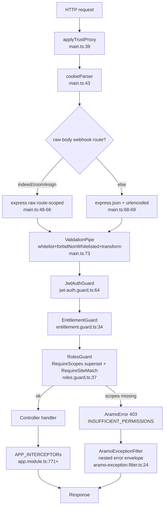
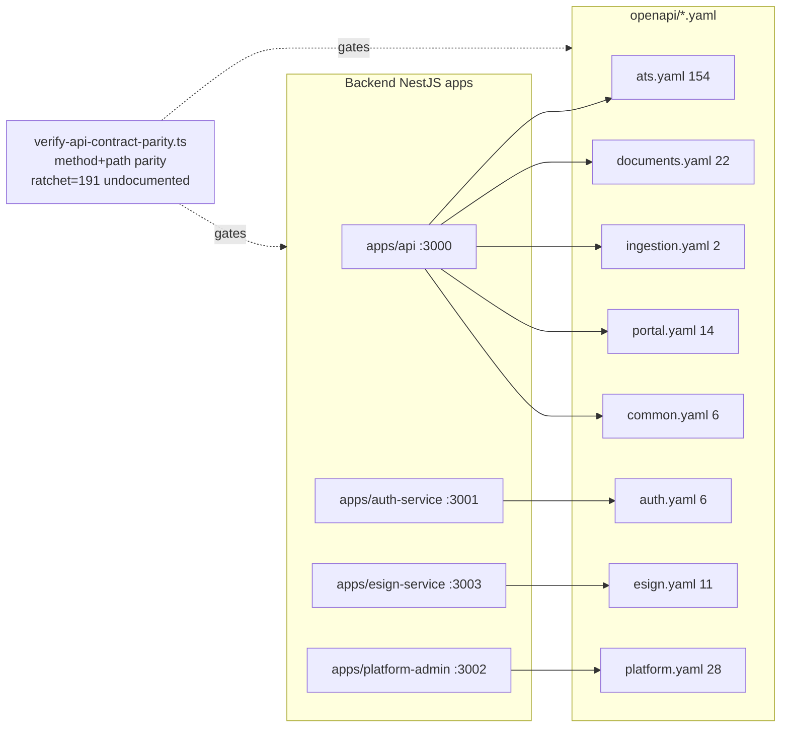

# D03 — Backend API Surface (REST + OpenAPI) (AS-BUILT)
> Baseline SHA 12330b0f5049c97f01022df0b190035933345212 · category AS-BUILT

## Summary

The platform exposes its HTTP surface through **four separately-deployed NestJS
applications**, not one: `apps/api` (tenant ATS core, port 3000), `apps/auth-service`
(session/auth, port 3001), `apps/esign-service` (e-signature, port 3003), and
`apps/platform-admin` (platform-tier administration, port 3002). Controllers are
physically authored in domain **libs** and imported by each app's module graph.
`apps/auth-service` carries **zero controller classes in its own `src`** — its routes
come entirely from `@aramo/auth-core` (apps/auth-service/src/app/auth/auth.module.ts:65).
`apps/esign-service` is the exception among the non-`apps/api` apps: it authors its two
controllers in its **own** `src` — `EsignProviderController`
(apps/esign-service/src/app/esign-http.controller.ts:44) and `EsignSignerController`
(apps/esign-service/src/app/esign-http.controller.ts:155) — wired through its app module
(apps/esign-service/src/app/app.module.ts:71). (`git grep -lE '^@Controller\(' -- apps/esign-service/src`
returns exactly 1 file; the same grep under `apps/auth-service/src` returns only an
integration test spec, no production controller.)

Counts re-derived at this SHA (commands in the coverage fragment):
- **97 controller files** carrying **101 `@Controller(...)` decorators** (some files
  declare multiple route prefixes).
- **466 HTTP handler decorators** across those files: 209 `@Get`, 208 `@Post`, 9 `@Put`,
  19 `@Patch`, 21 `@Delete`.
- **443 `@RequireScopes(...)` applications** and **177 `@RequireSiteMatch` applications**,
  referencing **105 distinct scope keys** applied in live controller decorators (a 106th text-match, `requisition:edit`, survives only in a retired-guard comment at `libs/requisition/src/lib/requisition.repository.ts:1203`, not an active decorator).
- **8 OpenAPI specs** under `openapi/` declaring **243 path-items** total
  (ats 154, platform 28, documents 22, portal 14, esign 11, auth 6, common 6, ingestion 2).

Request validation is enforced globally by a single Nest `ValidationPipe` configured
`whitelist + forbidNonWhitelisted + transform` (apps/api/src/main.ts:73) — this is the
runtime enforcement of each DTO's `additionalProperties:false` contract. There is **no
global `APP_GUARD`**: authentication/authorization are applied **per controller** via
`@UseGuards(JwtAuthGuard, EntitlementGuard, RolesGuard)` (118 `@UseGuards` sites), so a
guardless controller is genuinely anonymous (apps/api/src/controllers/version.controller.ts:9).
Errors are normalized to a single nested envelope by `AramoExceptionFilter`
(libs/common/src/lib/errors/aramo-exception.filter.ts:24).

Code-vs-OpenAPI alignment is governed by the **GLH-1-C contract-parity wall**
(ci/scripts/verify-api-contract-parity.ts:1), which compares live routes to OpenAPI at
**method + normalized-path granularity only** (no schema/scope/security parity). It
currently tolerates a **ratchet of 191 `transitionalUndocumented` governed routes** that
have no OpenAPI operation (ci/config/api-surface-manifest.json). The separately-named
`openapi:drift-check` script only validates intra-spec `$ref` integrity, not code parity
(ci/scripts/compare-spec-to-openapi.ts:3).

## Modules & Services

| name | role | evidence path:line + symbol |
|---|---|---|
| `apps/api` | Tenant ATS core HTTP app; port 3000; disables default bodyParser to control raw-webhook parse order; its single `AppModule` `imports:` array (apps/api/src/app.module.ts:184) lists 98 feature-module entries and its `controllers:` array (apps/api/src/app.module.ts:659) registers 19 app-local controllers | apps/api/src/main.ts:33 `NestFactory.create`; apps/api/src/app.module.ts:1 `AppModule` |
| `apps/auth-service` | Session/auth HTTP app; port 3001; controllers imported from `@aramo/auth-core` | apps/auth-service/src/app/auth/auth.module.ts:65 `controllers: [AuthController, JwksController, PortalAuthController]` |
| `apps/esign-service` | E-signature HTTP app; port 3003; two route prefixes | apps/esign-service/src/app/app.module.ts:71 `controllers: [EsignProviderController, EsignSignerController]` |
| `apps/platform-admin` | Platform-tier admin HTTP app; port 3002; structurally separate Nest deployable | apps/platform-admin/src/main.ts:18 `NestFactory.create`; apps/platform-admin/src/app/platform/platform.controller.ts:58 `@Controller('platform')` |
| `ValidationPipe` (global pipe) | DTO allow-list + transform at the controller boundary | apps/api/src/main.ts:73 `app.useGlobalPipes`; :76 `forbidNonWhitelisted: true` |
| `JwtAuthGuard` | Authentication guard (reads Authorization header or `aramo_access_token` cookie) | libs/auth/src/lib/jwt-auth.guard.ts:64 `export class JwtAuthGuard` |
| `EntitlementGuard` | Entitlement check, runs after JwtAuthGuard | libs/entitlement/src/lib/entitlement.guard.ts:34 `export class EntitlementGuard` |
| `RolesGuard` | Scope superset + site-match authorization; 403 `INSUFFICIENT_PERMISSIONS` | libs/authorization/src/lib/roles.guard.ts:37 `export class RolesGuard`; :72 `INSUFFICIENT_PERMISSIONS` |
| `RequireScopes` decorator | Attaches closed scope list (all-or-nothing superset) to handler/class | libs/authorization/src/lib/require-scopes.decorator.ts:16 `export const RequireScopes` |
| `AramoExceptionFilter` | Converts `AramoError`/`HttpException` to nested `error{...}` envelope | libs/common/src/lib/errors/aramo-exception.filter.ts:24 `export class AramoExceptionFilter` |
| `apiClient` (FE) | Thin `fetch` wrapper, `credentials:'include'` (HttpOnly cookies), default baseUrl `''` | libs/fe-foundation/src/api/client.ts:112 `fetch`; :115 `credentials: 'include'` |

## Data Models

No persistence models are owned at the API-surface layer; DTOs are request/response
transfer objects validated by the global pipe (apps/api/src/main.ts:74). The error
envelope DTO shape is `error{ code, message, display_message?, log_message?, request_id,
details }` (libs/common/src/lib/errors/aramo-exception.filter.ts:7 `interface ErrorEnvelope`),
backed by the error-code registry in libs/common/src/lib/errors/error-codes.ts (921 lines
total; `grep -cE '=|:'` matches 185 registry/mapping lines — the coverage-fragment figure,
not the file length).

## API Endpoints

Full inventory is 466 handler decorators across 97 controller files (coverage fragment
has the command). Representative route groups with their host and classification
(classification from ci/config/api-surface-manifest.json; AP = first-party application,
PZ = public session-less, SS = session/auth, XP = external partner, AD = adapter/ingestion,
IZ = infra/health):

| method/group | route prefix | class | evidence path:line + symbol |
|---|---|---|---|
| ATS talent | `v1/talent-records` | — (manifest-classified) | libs/talent-record/src/lib/talent-record.controller.ts:161 `@Controller('v1/talent-records')` |
| ATS requisitions | `v1/requisitions` | — | libs/requisition/src/lib/requisition.controller.ts:83 `@Controller('v1/requisitions')` |
| ATS pipelines | `v1/pipelines` | AP | libs/pipeline/src/lib/pipeline.controller.ts:74 `@Controller('v1/pipelines')` |
| ATS submittals | `v1/submittals` | — | libs/submittal/src/lib/submittal.controller.ts:68 `@Controller('v1/submittals')` |
| ATS selections | `v1/selections` | — | libs/selection/src/lib/selection.controller.ts:160 `@Controller('v1/selections')` |
| ATS companies | `v1/companies` | — | libs/company/src/lib/company.controller.ts:63 `@Controller('v1/companies')` |
| ATS placements | `v1/placements` | AP | apps/api/src/placement/placement.controller.ts:62 `@Controller('v1/placements')` |
| ATS offers | `v1/offers` | AP | apps/api/src/offer/offer.controller.ts:44 `@Controller('v1/offers')` |
| Me / profile | `v1/me` | AP | apps/api/src/controllers/me.controller.ts:41 `@Controller('v1/me')` |
| Tenant admin | `v1/tenant/users` | — | libs/identity/src/lib/tenant-user/tenant-user-management.controller.ts:61 `@Controller('v1/tenant/users')` |
| Public invitation | `v1/invitations` | PZ | apps/api/src/controllers/public-invitation.controller.ts:32 `@Controller('v1/invitations')` |
| Public verification | `v1/email-verifications` | PZ | apps/api/src/controllers/public-verification.controller.ts:79 `@Controller('v1/email-verifications')` |
| Portal | `v1/portal` | — | libs/portal/src/lib/portal.controller.ts:74 `@Controller('v1/portal')` |
| Health/version | `version` | IZ | apps/api/src/controllers/version.controller.ts:14 `@Controller('version')` |
| Zoom webhook (raw body) | `v1/webhooks/communications` | XP | apps/api/src/communications/zoom-webhook.controller.ts:29 `@Controller('v1/webhooks/communications')` |
| Indeed apply webhook (raw body) | `v1/webhooks/indeed` | — | apps/api/src/webhooks/indeed-apply.controller.ts:32 `@Controller('v1/webhooks/indeed')` |
| E-Sign events webhook (raw body) | `v1/integrations/esign` | SS | apps/api/src/integrations/esign/esign-events.controller.ts:36 `@Controller('v1/integrations/esign')` |
| Ingestion (adapter) | `v1/ingestion` | — | libs/ingestion/src/lib/ingestion.controller.ts:37 `@Controller('v1/ingestion')` |
| Auth (Cognito) | `auth/:consumer` | — | libs/auth-core/src/lib/auth.controller.ts:135 `@Controller('auth/:consumer')` |
| Portal passwordless auth | `auth/portal` | — | libs/auth-core/src/lib/portal-auth.controller.ts:83 `@Controller('auth/portal')` |
| E-Sign envelopes | `v1/esign/envelopes` | SS | apps/esign-service/src/app/esign-http.controller.ts:43 `@Controller('v1/esign/envelopes')` |
| E-Sign signing (signer-facing) | `v1/esign/signing` | PZ (routeOverrides) | apps/esign-service/src/app/esign-http.controller.ts:154 `@Controller('v1/esign/signing')` |
| Platform admin | `platform` | AP | apps/platform-admin/src/app/platform/platform.controller.ts:58 `@Controller('platform')` |

Scope enforcement example: `@RequireScopes(...)` applied 443 times, read by `RolesGuard`
as an all-or-nothing superset check (libs/authorization/src/lib/require-scopes.decorator.ts:16;
libs/authorization/src/lib/roles.guard.ts:37). The site dimension rides
`AuthContext.site_id` via `@RequireSiteMatch` (177 applications), not the scope key.

## Screens & FE->BE Wiring (FE domains only)

The `ats-web` frontend calls the backend through **65 per-domain `*-api.ts` modules**
(e.g. apps/ats-web/src/talent/talent-api.ts:1 `import { ApiError, apiClient } from '@aramo/fe-foundation'`).
All of them funnel through the shared `apiClient` thin `fetch` wrapper
(libs/fe-foundation/src/api/client.ts:72 `this.baseUrl = options.baseUrl ?? ''`), which
always sends session cookies (`credentials: 'include'`, libs/fe-foundation/src/api/client.ts:115)
and transparently retries once through the auth refresh path
(libs/fe-foundation/src/api/client.ts:171 refresh `fetch`). FE auth/scope helpers live in
libs/fe-foundation/src/auth/scopes.ts and libs/fe-foundation/src/auth/consumer.ts. Default
empty baseUrl means the FE targets its own origin (nginx proxies `/v1/*` and `/auth/*` to
the backend apps).

## Key Flows

### Request guard + validation + envelope pipeline (apps/api)

### Four backend apps and their OpenAPI specs

## Evidence Index (load-bearing path:line citations)

- apps/api/src/main.ts:33 `NestFactory.create` (bodyParser:false)
- apps/api/src/main.ts:39 `applyTrustProxy`
- apps/api/src/main.ts:43 `cookieParser()`
- apps/api/src/main.ts:73 `app.useGlobalPipes(new ValidationPipe({...}))`
- apps/api/src/main.ts:76 `forbidNonWhitelisted: true`
- apps/api/src/main.ts:84 `registerBackgroundJobSchedules(app)`
- apps/api/src/app.module.ts:771 `provide: APP_INTERCEPTOR`
- apps/api/src/controllers/version.controller.ts:9 "no APP_GUARD … guardless controller is genuinely anonymous"
- libs/authorization/src/lib/require-scopes.decorator.ts:16 `export const RequireScopes`
- libs/authorization/src/lib/roles.guard.ts:37 `export class RolesGuard`
- libs/authorization/src/lib/roles.guard.ts:72 `'INSUFFICIENT_PERMISSIONS'`
- libs/auth/src/lib/jwt-auth.guard.ts:64 `export class JwtAuthGuard`
- libs/entitlement/src/lib/entitlement.guard.ts:34 `export class EntitlementGuard`
- libs/common/src/lib/errors/aramo-exception.filter.ts:7 `interface ErrorEnvelope`
- libs/common/src/lib/errors/aramo-exception.filter.ts:24 `export class AramoExceptionFilter`
- apps/auth-service/src/app/auth/auth.module.ts:65 `controllers: [AuthController, JwksController, PortalAuthController]`
- apps/esign-service/src/app/app.module.ts:71 `controllers: [EsignProviderController, EsignSignerController]`
- apps/esign-service/src/app/esign-http.controller.ts:43 `@Controller('v1/esign/envelopes')`
- apps/esign-service/src/app/esign-http.controller.ts:154 `@Controller('v1/esign/signing')`
- apps/platform-admin/src/main.ts:18 `NestFactory.create` (port 3002; `const port … ?? 3002` is on :17)
- apps/platform-admin/src/app/platform/platform.controller.ts:58 `@Controller('platform')`
- libs/talent-record/src/lib/talent-record.controller.ts:161 `@Controller('v1/talent-records')`
- libs/requisition/src/lib/requisition.controller.ts:83 `@Controller('v1/requisitions')`
- libs/pipeline/src/lib/pipeline.controller.ts:74 `@Controller('v1/pipelines')`
- libs/submittal/src/lib/submittal.controller.ts:68 `@Controller('v1/submittals')`
- libs/selection/src/lib/selection.controller.ts:160 `@Controller('v1/selections')`
- libs/company/src/lib/company.controller.ts:63 `@Controller('v1/companies')`
- apps/api/src/placement/placement.controller.ts:62 `@Controller('v1/placements')`
- apps/api/src/offer/offer.controller.ts:44 `@Controller('v1/offers')`
- apps/api/src/controllers/me.controller.ts:41 `@Controller('v1/me')`
- libs/identity/src/lib/tenant-user/tenant-user-management.controller.ts:61 `@Controller('v1/tenant/users')`
- apps/api/src/controllers/public-invitation.controller.ts:32 `@Controller('v1/invitations')`
- apps/api/src/controllers/public-verification.controller.ts:79 `@Controller('v1/email-verifications')`
- libs/portal/src/lib/portal.controller.ts:74 `@Controller('v1/portal')`
- apps/api/src/controllers/version.controller.ts:14 `@Controller('version')`
- apps/api/src/communications/zoom-webhook.controller.ts:29 `@Controller('v1/webhooks/communications')`
- apps/api/src/webhooks/indeed-apply.controller.ts:32 `@Controller('v1/webhooks/indeed')`
- apps/api/src/integrations/esign/esign-events.controller.ts:36 `@Controller('v1/integrations/esign')`
- libs/ingestion/src/lib/ingestion.controller.ts:37 `@Controller('v1/ingestion')`
- libs/auth-core/src/lib/auth.controller.ts:135 `@Controller('auth/:consumer')`
- libs/auth-core/src/lib/portal-auth.controller.ts:83 `@Controller('auth/portal')`
- libs/fe-foundation/src/api/client.ts:72 `this.baseUrl = options.baseUrl ?? ''`
- libs/fe-foundation/src/api/client.ts:112 `fetch(\`${this.baseUrl}${path}\`...)`
- libs/fe-foundation/src/api/client.ts:115 `credentials: 'include'`
- libs/fe-foundation/src/api/client.ts:171 refresh-path `fetch`
- apps/ats-web/src/talent/talent-api.ts:1 `import { ApiError, apiClient } from '@aramo/fe-foundation'`
- ci/scripts/verify-api-contract-parity.ts:1 GLH-1-C governed contract-parity wall header
- ci/scripts/verify-api-contract-parity.ts:11 "GA scope = method + normalized path ONLY"
- ci/config/api-surface-manifest.json:3 governed classes XP/AP/SS/AD/PZ, exempt IZ
- ci/scripts/compare-spec-to-openapi.ts:3 "$ref integrity" (not code parity)
- package.json:41 `openapi:lint` (redocly)
- package.json:42 `openapi:drift-check`
- package.json:66 `contract-parity:check`
- .github/workflows/ci.yml:540 `name: contract-parity:check`

## NOT VERIFIED (explicit)

- **Exact total of distinct scope keys in the seeded catalog** — NOT VERIFIED as a single
  number. The seed grows the catalog across many PR blocks
  (libs/identity/prisma/seed.ts:26 "47-tenant-scope catalog", plus later additive blocks at
  :562, :572, :601, :632, :638, :651). The 105 figure above is distinct scope keys *applied by
  live `@RequireScopes` decorators in controllers* (106 by raw text-match, less the one
  `requisition:edit` reference that remains only in a retired-guard comment), not the catalog cardinality.
- **Per-endpoint scope-to-OpenAPI-security alignment** — NOT VERIFIED. The parity wall
  checks method+path only (ci/scripts/verify-api-contract-parity.ts:11); scope/security
  parity between code and OpenAPI is out of its scope and was not independently cross-walked
  here.
- **Which exact OpenAPI spec each of the 466 handlers maps to** — NOT VERIFIED per-route;
  spec-to-app association is stated at app granularity. `esign.yaml`, `portal.yaml`,
  `ingestion.yaml`, `ats.yaml`, `documents.yaml` carry no `servers:` block at this SHA
  (only `auth.yaml`, `common.yaml`, and `platform.yaml` declare `servers:`).
- **Runtime behavior** — all findings are static reads at the frozen SHA; no app was booted.
