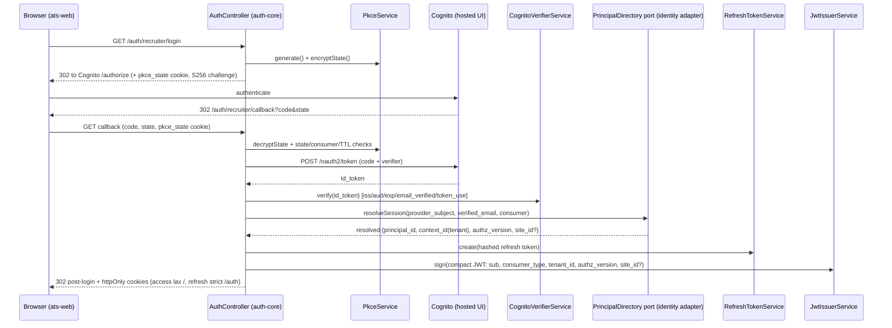
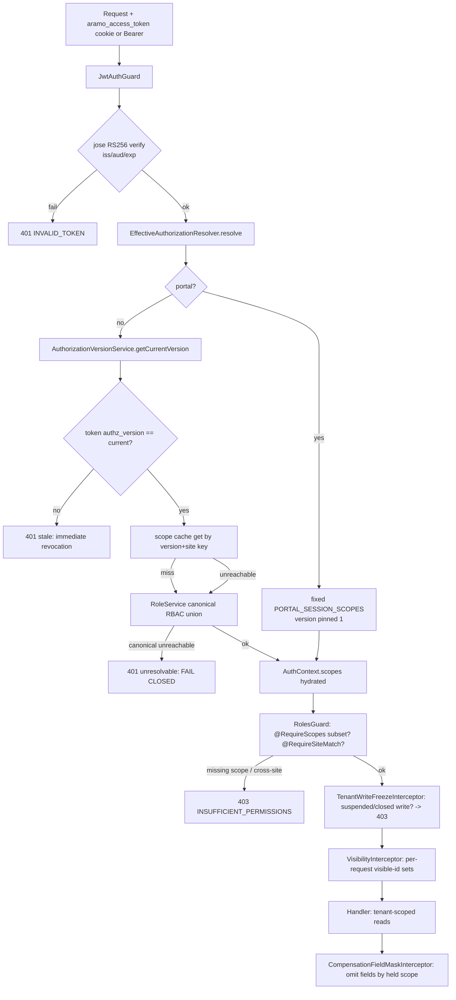
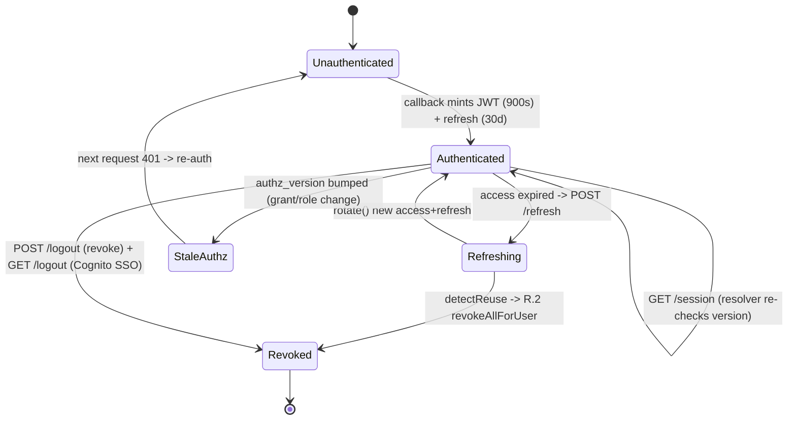

# D04 — Security: Identity, AuthN/AuthZ, Tenant Isolation & Policy (AS-BUILT)
> Baseline SHA 12330b0f5049c97f01022df0b190035933345212 · category AS-BUILT

## Summary

Aramo's security domain is a **three-tier, port-decoupled identity spine**:

1. **AuthN at the edge (`apps/auth-service`)** — an OAuth2/PKCE broker against AWS
   Cognito. It exchanges a Cognito code for an ID token, verifies it, resolves the
   verified identity to an Aramo session via a port, mints a **compact RS256 JWT**
   (`libs/auth-core`), and sets httpOnly cookies. The JWT carries identity + an
   authorization **revision number** — never a scope list.

2. **AuthZ at every protected route (`apps/api`)** — `JwtAuthGuard`
   (`libs/auth`) verifies the JWT signature, then calls a server-side
   **EffectiveAuthorizationResolver** (`libs/identity`) that version-matches the
   token's `authz_version` against the Postgres authority (immediate revocation),
   resolves effective scopes from RBAC (cached in Redis under an immutable
   version key), and hydrates `AuthContext.scopes`. `RolesGuard`
   (`libs/authorization`) then enforces `@RequireScopes` / `@RequireSiteMatch`.

3. **Data-plane isolation** — every tenant principal carries `tenant_id` in the
   JWT; reads are tenant-scoped. A `VisibilityInterceptor` + resolver
   (`libs/visibility`) computes per-request visible-id sets (client/requisition/
   pipeline/contact); `CompensationFieldMaskInterceptor` + `libs/field-masking`
   omits field-level financial data by held scope; `TenantWriteFreezeInterceptor`
   refuses writes to suspended/closed tenants.

Cross-cutting: a **stateless Business Policy Engine** (`libs/policy-engine`/
`libs/policy-store`, ADR-0024) evaluates `(resource, action, context) → decision`
as data, not code; **consent** (`libs/consent`) is an append-only ledger gating
contactability; the **`identity_index`** cross-tenant keyspace is schema-barred
from ever holding `tenant_id` or PII; and RTBF (ADR-0007) is realized today only
as a narrow cluster-purge + portal self-erase, not the deferred anonymization
state machine.

AuthN/AuthZ enforcement is **per-controller** (`@UseGuards`), not a single global
`APP_GUARD`: 91 non-test source files decorate `@UseGuards(JwtAuthGuard …)` and 82
decorate `@RequireScopes(...)` (method/command in the coverage fragment).

## Modules & Services

| name | role | evidence path:line + symbol |
| --- | --- | --- |
| `libs/auth` `JwtAuthGuard` | Request-time JWT verify (jose RS256) + server-side scope hydration; fail-closed | `libs/auth/src/lib/jwt-auth.guard.ts:64` `JwtAuthGuard` |
| `libs/auth` AuthContext types | Closed `CONSUMER_TYPES`, `ACTOR_KINDS`, platform sentinel, `AuthContext` shape | `libs/auth/src/lib/auth-context.types.ts:17` `CONSUMER_TYPES`; `:35` `AuthContext` |
| `libs/auth` `AuthModule` | Provides `JwtAuthGuard` as a singleton (resolver injected `@Optional`) | `libs/auth/src/lib/auth.module.ts:6` `providers:[JwtAuthGuard]` |
| `libs/authorization` `RolesGuard` | AuthZ checkpoint after JwtAuthGuard: scope-subset + site-match → 403 | `libs/authorization/src/lib/roles.guard.ts:37` `RolesGuard` |
| `libs/authorization` decorators | `@RequireScopes` / `@RequireSiteMatch` metadata | `libs/authorization/src/lib/require-scopes.decorator.ts:16` `RequireScopes` |
| `libs/auth-core` `JwtIssuerService` | Mints compact RS256 JWT (`issuer "Aramo Core Auth"`, 900s TTL, kid=SPKI sha256) | `libs/auth-core/src/lib/jwt-issuer.service.ts:46` `sign`; `:17` `ACCESS_TOKEN_TTL_SECONDS=900` |
| `libs/auth-core` `AuthController` | `/auth/{consumer}/login\|callback\|refresh\|logout\|session`; cookie setter | `libs/auth-core/src/lib/auth.controller.ts:135` `@Controller('auth/:consumer')` |
| `libs/auth-core` `SessionOrchestratorService` | PKCE-state verify → Cognito exchange+verify → `resolveSession` port → mint+persist | `libs/auth-core/src/lib/session-orchestrator.service.ts:115` `handleCallback` |
| `libs/auth-core` `CognitoVerifierService` | Cognito ID-token verify; fail-closed `email_verified` w/ trusted-federation normalization | `libs/auth-core/src/lib/cognito-verifier.service.ts:73` `verify`; `:116` `isEmailVerified` |
| `libs/auth-core` `RefreshOrchestratorService` | Refresh rotation + reuse-detection cascade (R.2) | `libs/auth-core/src/lib/refresh-orchestrator.service.ts:48` `handleRefresh`; `:73` revoke-all cascade |
| `libs/auth-core` `JwksController` | `GET /.well-known/jwks.json` public key publish | `libs/auth-core/src/lib/jwks.controller.ts:12` `@Get('.well-known/jwks.json')` |
| `libs/auth-core` `PkceService` / `PortalLoginService` | PKCE challenge/state cipher; passwordless portal login budget | `libs/auth-core/src/lib/pkce.service.ts:1`; `libs/auth-core/src/lib/portal-login.service.ts:1` |
| `libs/auth-storage` `RefreshTokenService` | Refresh-token persist/rotate/revoke/reuse-detect (hashed) | `libs/auth-storage/src/lib/refresh-token.service.ts:1` |
| `libs/identity` `IdentityEffectiveAuthorizationResolver` | Authority-order resolver: version-match → cache → canonical RBAC; fail-closed | `libs/identity/src/lib/authorization/identity-effective-authorization-resolver.ts:46` `resolve` |
| `libs/identity` `AuthorizationVersionService` | Monotonic per-principal authz revision (Postgres authority; baseline 1) | `libs/identity/src/lib/authorization-version.service.ts:26` `getCurrentVersion` |
| `libs/identity` `AuthorizationResolverModule` | `@Global` composition-root binding; Redis-vs-in-memory cache selection | `libs/identity/src/lib/authorization/authorization-resolver.module.ts:31` `forRoot` |
| `libs/identity` `RedisScopeCache` / `InMemoryScopeCache` | Versioned scope-snapshot cache (never expands privilege) | `libs/identity/src/lib/authorization/redis-scope-cache.ts:22` `RedisScopeCache` |
| `libs/identity` `RoleService` | Site-aware effective scope union from RBAC rows | `libs/identity/src/lib/role.service.ts:35` `getScopesByUserTenantAndSite` |
| `libs/identity` audit | Identity audit event write/read (`IdentityAuditEvent`) | `libs/identity/src/lib/audit/audit.controller.ts:1` |
| `libs/identity-index` `ClusterPurgeService` | Cross-schema cluster teardown primitive (6 ordered mutations) | `libs/identity-index/src/lib/cluster-purge.service.ts:40` `CLUSTER_PURGE_STATEMENTS` |
| `libs/portal-identity` | Portal principal store + login-token | `libs/portal-identity/src/lib/portal-identity.repository.ts:1` |
| `libs/visibility` `VisibilityInterceptor`/`VisibilityResolverService` | Per-request visible-id sets; tenant-scoped; fail-CLOSED (under-restriction) | `libs/visibility/src/lib/visibility-resolver.service.ts:57` `resolveForActor`; `:228` `safeRead` |
| `libs/field-masking` | Field-omission-by-scope (compensation/commercial/financials) | `libs/field-masking/src/lib/omit-by-scope.ts:21` `omitFieldsByScopeMap` |
| `libs/policy-engine` | Stateless pure `(resource,action,context)→decision`; no global default | `libs/policy-engine/src/lib/evaluate.ts:65` `evaluate` |
| `libs/policy-store` | Versioned policy packages + decision records (Postgres) | `libs/policy-store/prisma/schema.prisma:47` `StoredPolicyVersion` |
| `libs/consent` `ConsentService`/`ConsentController` | Append-only consent ledger; grant/revoke/check/state/history/decision-log | `libs/consent/src/lib/consent.controller.ts:56` `@Controller('v1/consent')` |
| `apps/auth-service` | AuthN edge app: binds `libs/auth-core` ports to identity/mailer/portal adapters | `apps/auth-service/src/app/auth/auth.module.ts:1` |
| `apps/api` composition | Global interceptor stack: write-freeze → visibility → comp-mask → enrichment | `apps/api/src/app.module.ts:771` `TenantWriteFreezeInterceptor` |

## Data Models

| model | schema | role | evidence path:line |
| --- | --- | --- | --- |
| `User` | `identity` | Principal (user) | `libs/identity/prisma/schema.prisma:21` `model User` |
| `Tenant` | `identity` | Tenant org (isolation root) | `libs/identity/prisma/schema.prisma:44` `model Tenant` |
| `Site` | `identity` | Intra-tenant site axis | `libs/identity/prisma/schema.prisma:185` `model Site` |
| `UserTenantMembership` | `identity` | User↔tenant membership (+ site) | `libs/identity/prisma/schema.prisma:205` `model UserTenantMembership` |
| `Role` / `Scope` / `RoleScope` | `identity` | RBAC catalog + grants | `libs/identity/prisma/schema.prisma:238`,`:253`,`:264` |
| `UserTenantMembershipRole` | `identity` | Membership→role grant | `libs/identity/prisma/schema.prisma:277` |
| `AuthorizationVersion` | `identity` | Monotonic per-principal revision (revocation lever) | `libs/identity/prisma/schema.prisma:312` `model AuthorizationVersion` |
| `ExternalIdentity` | `identity` | IdP subject link (reconcile-by-sub) | `libs/identity/prisma/schema.prisma:327` |
| `IdentityAuditEvent` | `identity` | Identity-rail audit stream | `libs/identity/prisma/schema.prisma:382` |
| `ManagementEdge` / `Team` / `TeamMembership` | `identity` | Visibility graph inputs | `libs/identity/prisma/schema.prisma:417`,`:449`,`:474` |
| `HostAuthProfile` | `auth_storage` | Per-host IdP/base resolution (HRD) | `libs/auth-storage/prisma/schema.prisma:35` |
| `RefreshToken` | `auth_storage` | Hashed refresh token (rotation/reuse) | `libs/auth-storage/prisma/schema.prisma:61` |
| `PersonCluster` / `ClusterFingerprint` | `identity_index` | Cross-tenant identity keyspace — **NO tenant_id, NO PII** | `libs/identity-index/prisma/schema.prisma:50`,`:66`; invariant comment `:17` |
| `PortalUser` / `PortalLoginToken` / `NoticeDelivery` | `portal_identity` | Portal principal + passwordless login | `libs/portal-identity/prisma/schema.prisma:32`,`:63`,`:104` |
| `StoredPolicyVersion` / `PolicyDecisionRecord` | `policy_store` | Policy packages + decision audit | `libs/policy-store/prisma/schema.prisma:47`,`:102` |
| `TalentConsentEvent` / `IdempotencyKey` / `OutboxEvent` | `consent` | Append-only consent ledger | `libs/consent/prisma/schema.prisma:29`,`:75`,`:92` |
| `ConsentAuditEvent` | `audit` | Consent decision/erasure audit marker | `libs/consent/prisma/schema.prisma:107` |

## API Endpoints

| method | route | scopes / guard | evidence path:line |
| --- | --- | --- | --- |
| GET | `/auth/{consumer}/login` | public; 302 to Cognito + PKCE cookie | `libs/auth-core/src/lib/auth.controller.ts:153` `login` |
| GET | `/auth/{consumer}/callback` | public; exchanges code, sets session cookies | `libs/auth-core/src/lib/auth.controller.ts:218` `callback` |
| POST | `/auth/{consumer}/refresh` | refresh cookie; rotates (200) | `libs/auth-core/src/lib/auth.controller.ts:435` `refresh` |
| POST | `/auth/{consumer}/logout` | idempotent local clear + revoke (204) | `libs/auth-core/src/lib/auth.controller.ts:475` `logout` |
| GET | `/auth/{consumer}/logout` | 302 to Cognito hosted-UI /logout | `libs/auth-core/src/lib/auth.controller.ts:536` `logoutRedirect` |
| GET | `/auth/{consumer}/session` | access cookie; server-side scope resolve | `libs/auth-core/src/lib/auth.controller.ts:577` `session` |
| GET | `/.well-known/jwks.json` | public key set | `libs/auth-core/src/lib/jwks.controller.ts:12` |
| POST | `/v1/consent/grant` | `JwtAuthGuard`; Idempotency-Key required | `libs/consent/src/lib/consent.controller.ts:61` |
| POST | `/v1/consent/revoke` | `JwtAuthGuard` | `libs/consent/src/lib/consent.controller.ts:78` |
| POST | `/v1/consent/capture` | `JwtAuthGuard`; multi-scope server-rendered text | `libs/consent/src/lib/consent.controller.ts:101` |
| POST | `/v1/consent/check` | `JwtAuthGuard`; decision in body (200) | `libs/consent/src/lib/consent.controller.ts:137` |
| GET | `/v1/consent/state/{id}` | `JwtAuthGuard` | `libs/consent/src/lib/consent.controller.ts:158` |
| GET | `/v1/consent/history/{id}` | `JwtAuthGuard` | `libs/consent/src/lib/consent.controller.ts:174` |
| GET | `/v1/consent/decision-log/{id}` | `@RequireScopes('consent:decision-log:read')` (403 w/o) | `libs/consent/src/lib/consent.controller.ts:210` |
| POST | `/v1/portal/rights/erase` | `JwtAuthGuard,EntitlementGuard,RolesGuard`; self-keyed RTBF | `apps/api/src/talent-identity/portal-rights.controller.ts:54` `erase` |

## Screens & FE->BE Wiring (FE domains only)

- **Session bootstrap** (`libs/fe-foundation/src/auth/session.ts:41` `fetchSession`):
  on boot calls `GET /auth/{consumer}/session`; 401 → `unauthenticated`. The FE
  `Session` type locks to the 6-field shape (`:16`) so R10 output cannot leak into
  UI by construction. `useSession` (`:84`) drives app auth state; `redirectToLogin`
  (`:52`) navigates to `/auth/{consumer}/login`; `logout` (`:74`) POST-clears then
  navigates to the GET logout (dual-session termination).
- **ats-web login landing** (`apps/ats-web/src/routes/LoginPage.tsx:1`): renders a
  humane page from `?error=<CODE>` the auth-service callback redirects with.
- **ats-web authorization gating** (`apps/ats-web/src/admin/AdminGate.tsx:21`
  `AdminGate`): FE scope guard over `/admin/*` keyed on the `tenant:admin:*` scope
  family (ForbiddenState, not a login redirect). `App.tsx` `RouteGuard` keys on
  session scopes.
- **User-menu display** (`apps/ats-web/src/shell/me-api.ts:20` `ME_PATH`): a
  separate additive `GET /v1/me` supplies display name/email/roles/tenant the lean
  JWT omits; loading-safe (null on error).
- **Portal / platform login**: `apps/portal-web/src/LoginPage.tsx:1`,
  `apps/platform-web/src/App.tsx:1` ride the same `/auth/{consumer}` pipeline with
  a different `consumer`.

## Key Flows

### Authentication (login → session mint)

### Authorization decision (protected `apps/api` request)

### Session / token lifecycle

## Evidence Index

- `libs/auth/src/lib/jwt-auth.guard.ts:64` `JwtAuthGuard` (jose RS256 verify)
- `libs/auth/src/lib/jwt-auth.guard.ts:138` `extractToken` (Bearer-first / cookie-fallback)
- `libs/auth/src/lib/jwt-auth.guard.ts:167` `aramo_access_token` cookie (inlined single use)
- `libs/auth/src/lib/jwt-auth.guard.ts:239` resolver-unbound → fail closed (401)
- `libs/auth/src/lib/jwt-auth.guard.ts:259` resolution `stale` → 401 (immediate revocation)
- `libs/auth/src/lib/jwt-auth.guard.ts:269` resolution `unresolvable` → fail closed
- `libs/auth/src/lib/auth-context.types.ts:17` `CONSUMER_TYPES` closed enum (5)
- `libs/auth/src/lib/auth-context.types.ts:26` `PLATFORM_TENANT_SENTINEL_ID`
- `libs/auth/src/lib/auth-context.types.ts:32` `ACTOR_KINDS` closed enum (3)
- `libs/auth/src/lib/auth-context.types.ts:35` `AuthContext` 7+1-field shape (7 required: `sub`, `consumer_type`, `actor_kind`, `tenant_id`, `scopes`, `iat`, `exp`; +1 optional `site_id?`)
- `libs/auth/src/lib/auth.module.ts:6` `AuthModule` providers `[JwtAuthGuard]`
- `libs/authorization/src/lib/roles.guard.ts:37` `RolesGuard`
- `libs/authorization/src/lib/roles.guard.ts:79` scope-subset enforcement → 403
- `libs/authorization/src/lib/roles.guard.ts:98` `@RequireSiteMatch` branch
- `libs/authorization/src/lib/roles.guard.ts:105` absent/null site claim = tenant-wide (admit any site)
- `libs/authorization/src/lib/require-scopes.decorator.ts:16` `RequireScopes` all-or-nothing
- `libs/authorization/src/lib/authorization.metadata.ts:5` `REQUIRED_SCOPES_KEY`
- `libs/auth-core/src/lib/jwt-issuer.service.ts:15` `ISSUER = 'Aramo Core Auth'`
- `libs/auth-core/src/lib/jwt-issuer.service.ts:17` `ACCESS_TOKEN_TTL_SECONDS = 900`
- `libs/auth-core/src/lib/jwt-issuer.service.ts:46` `sign` (RS256, `authz_version`, no scopes)
- `libs/auth-core/src/lib/jwt-issuer.service.ts:93` `computeKid` (SPKI DER sha256 base64url)
- `libs/auth-core/src/lib/auth.controller.ts:43` `ACCESS_COOKIE='aramo_access_token'`
- `libs/auth-core/src/lib/auth.controller.ts:71` `setAccessCookie` httpOnly/secure/sameSite lax
- `libs/auth-core/src/lib/auth.controller.ts:81` `setRefreshCookie` sameSite strict path `/auth`
- `libs/auth-core/src/lib/auth.controller.ts:135` `@Controller('auth/:consumer')`
- `libs/auth-core/src/lib/session-orchestrator.service.ts:40` `PORTAL_SESSION_SCOPES`
- `libs/auth-core/src/lib/session-orchestrator.service.ts:115` `handleCallback`
- `libs/auth-core/src/lib/session-orchestrator.service.ts:190` `principals.resolveSession` (decoupled per ADR-0021)
- `libs/auth-core/src/lib/session-orchestrator.service.ts:321` `establishPortalSession` (platform sentinel tenant, version 1)
- `libs/auth-core/src/lib/cognito-verifier.service.ts:73` `verify`
- `libs/auth-core/src/lib/cognito-verifier.service.ts:97` `email_not_verified` gate
- `libs/auth-core/src/lib/cognito-verifier.service.ts:116` `isEmailVerified` (trusted-federation normalization, fail-closed)
- `libs/auth-core/src/lib/refresh-orchestrator.service.ts:48` `handleRefresh`
- `libs/auth-core/src/lib/refresh-orchestrator.service.ts:68` `detectReuse`
- `libs/auth-core/src/lib/refresh-orchestrator.service.ts:73` R.2 `revokeAllForUser` cascade + audit
- `libs/auth-core/src/lib/refresh-orchestrator.service.ts:113` `rotate`
- `libs/auth-core/src/lib/jwks.controller.ts:12` `GET /.well-known/jwks.json`
- `libs/identity/src/lib/authorization/identity-effective-authorization-resolver.ts:46` resolver class
- `libs/identity/src/lib/authorization/identity-effective-authorization-resolver.ts:57` portal fixed-set, version 1
- `libs/identity/src/lib/authorization/identity-effective-authorization-resolver.ts:74` version mismatch → `stale`
- `libs/identity/src/lib/authorization/identity-effective-authorization-resolver.ts:95` canonical unreachable → `unresolvable`
- `libs/identity/src/lib/authorization/identity-effective-authorization-resolver.ts:124` `cacheKey` (tenant:principal:version:site)
- `libs/identity/src/lib/authorization-version.service.ts:26` `getCurrentVersion` (absent row = baseline 1)
- `libs/identity/src/lib/authorization/authorization-resolver.module.ts:31` `forRoot` (`@Global` at `:28`; Redis-vs-in-memory)
- `libs/identity/src/lib/authorization/redis-scope-cache.ts:22` `RedisScopeCache` (unreachable throws → resolver falls through)
- `libs/identity/src/lib/role.service.ts:35` `getScopesByUserTenantAndSite`
- `apps/api/src/app.module.ts:191` `AuthorizationResolverModule.forRoot({portalScopes: PORTAL_SESSION_SCOPES})`
- `apps/api/src/app.module.ts:771` `TenantWriteFreezeInterceptor` (first global interceptor)
- `apps/api/src/app.module.ts:780` `VisibilityInterceptor`
- `apps/api/src/app.module.ts:792` `CompensationFieldMaskInterceptor`
- `libs/visibility/src/lib/visibility.interceptor.ts:36` `VisibilityInterceptor`
- `libs/visibility/src/lib/visibility-resolver.service.ts:57` `resolveForActor` (tenant-scoped union)
- `libs/visibility/src/lib/visibility-resolver.service.ts:228` `safeRead` fail-CLOSED (under-restriction)
- `libs/field-masking/src/lib/omit-by-scope.ts:21` `omitFieldsByScopeMap` (field-omission by DELETE)
- `libs/field-masking/src/lib/compensation-scope.ts:22` `COMPENSATION_VIEW_PAY` (6-scope family, non-invertible bundle)
- `libs/policy-engine/src/lib/evaluate.ts:65` `evaluate` (stateless, pure, no global default)
- `libs/policy-engine/src/lib/evaluate.ts:69` unregistered resource → `PolicyEngineError`
- `libs/consent/src/lib/consent.controller.ts:56` `@Controller('v1/consent')` `@UseGuards(JwtAuthGuard, RolesGuard)`
- `libs/consent/src/lib/consent.controller.ts:210` decision-log `@RequireScopes('consent:decision-log:read')`
- `libs/consent/src/lib/consent.service.ts:405` `deriveActorId` (actor from JWT, not body)
- `libs/identity-index/prisma/schema.prisma:17` invariant comment: NO `tenant_id`, NO PII
- `libs/identity-index/prisma/schema.prisma:50` `PersonCluster` (opaque id + timestamps)
- `libs/identity-index/src/lib/cluster-purge.service.ts:40` `CLUSTER_PURGE_STATEMENTS` (6 ordered)
- `libs/identity-index/src/lib/cluster-purge.service.ts:133` `purgeCluster` ($transaction)
- `apps/api/src/talent-identity/portal-rights.controller.ts:46` `@Controller('v1/portal/rights')`
- `apps/api/src/talent-identity/portal-rtbf.service.ts:42` `eraseSelf` (purge → delete residue → revoke sessions)
- `libs/identity/src/lib/dto/scope.dto.ts:27` `SEED_SCOPE_KEYS` (167 keys)
- `libs/identity/src/lib/dto/role.dto.ts:40` `SEED_ROLE_KEYS` (18 roles)
- `libs/identity/prisma/schema.prisma:312` `model AuthorizationVersion`
- `libs/auth-storage/prisma/schema.prisma:61` `model RefreshToken`
- `libs/fe-foundation/src/auth/session.ts:41` `fetchSession` (401 → unauthenticated)
- `libs/fe-foundation/src/auth/session.ts:74` `logout` (dual-session termination)
- `apps/ats-web/src/admin/AdminGate.tsx:21` `AdminGate` (FE `tenant:admin:*` scope gate)
- `apps/ats-web/src/shell/me-api.ts:20` `ME_PATH='/v1/me'`
- `scripts/verify-vocabulary.sh:491` `TIER2_TERMS_REGEX` (R10/vocab CI wall)
- `ci/scripts/prepush.ts:119` `identity-index:privacy-wall` unconditional wall

## NOT VERIFIED (explicit)

- **Real Cognito user-pool routing per consumer.** `SessionOrchestratorService`
  comments state platform login uses a separate pool at Gate 6 and proofs mint
  platform JWTs directly with mocked Cognito; a live two-pool routing by
  `consumer` was NOT verified in code at this SHA
  (`libs/auth-core/src/lib/session-orchestrator.service.ts:51-57`).
- **Runtime behavior of the Redis scope cache against a live Redis** — only the
  code path (fail-fast, fail-closed intent) was read, not executed.
- **Platform-admin app auth surface** — inventory reports `apps/platform-admin`
  has 0 tsx files; its FE auth wiring was not separately inspected beyond the
  shared `libs/fe-foundation` session bootstrap.
- **Exact enforcement coverage per route** — the 91 `@UseGuards(JwtAuthGuard)` and
  82 `@RequireScopes` counts are source-file occurrences (grep), not a per-route
  audit that every mutating route carries a scope gate; unverified routes may rely
  on `consumer_type`/`JwtAuthGuard`-only gating (RolesGuard is a no-op without
  `@RequireScopes` — `libs/authorization/src/lib/roles.guard.ts:53`).
- **`EntitlementGuard`** (used on the portal rights controller) lives outside the
  D04 substrate list and was not deeply read.
