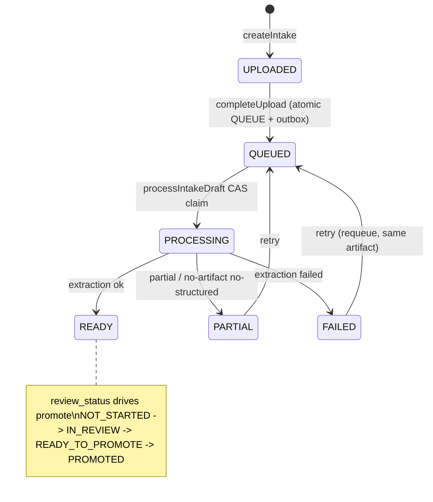
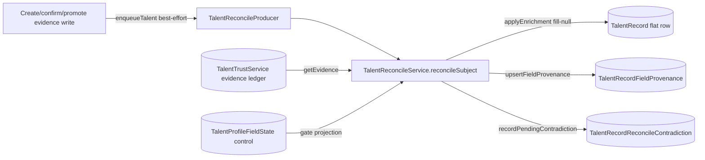

# D05 — Talent Domain (Record, Evidence, Intake, Trust) (AS-BUILT)
> Baseline SHA 12330b0f5049c97f01022df0b190035933345212 · category AS-BUILT

## Summary

The Talent domain spans seven libraries under `libs/` plus the apps/api
consumer composition:

- **`talent-record`** — the recruiter-facing ATS heart: the `TalentRecord`
  entity, the HTTP surface (`TalentRecordController`, `TalentIntakeController`),
  the durable async résumé-first intake lifecycle, promotion, résumé editions,
  and the shared create-from-draft composition.
- **`talent-evidence`** — the typed evidence substrate (work-history, skills,
  education, certifications, contacts, documents, résumé editions) plus the
  durable intake tables (`TalentIntakeDraft`, `ResumeExtractionDraft`,
  `TalentIntakeOutboxEvent`).
- **`talent-extraction`** — the governed-LLM extraction service + ledger/skill
  mapping; owns the evidence read/write methods the controllers call.
- **`talent-reconcile`** / **`talent-reconcile-signal`** — enrich-only
  projection of the trust ledger onto the flat `TalentRecord`, plus the
  best-effort push producer that signals it.
- **`talent-trust`** — the cross-schema (cip) evidence/trust ledger:
  `EvidenceRecord`, `TrustState`, subject resolution, verification proposals,
  portal disputes. Library-only (no `@Controller` in the lib).
- **`talent-embedding`** — the semantic-search embedding substrate (ports +
  `TalentEmbedding` row). Enterprise Search GS-2A.

`TalentRecord` has **multiple creation paths** (enumerated in Key Flows): the
manual `POST /v1/talent-records`, the durable async intake `promote`, and the
sourcing/trust-sourced path (`tenant_status='sourced'` via `repo.create`). No
single path is the sole authority.

Two HTTP controllers are registered in production via `TalentRecordModule`
(`libs/talent-record/src/lib/talent-record.module.ts:70`), imported by
`apps/api/src/app.module.ts:277`. The ADR-0033 EventBridge→SQS→Lambda consumer
runtime (`TalentIntakeConsumerModule`) is bootstrapped only by a Lambda
entrypoint handler and is gated by the `TALENT_INTAKE_EVENT_BUS` env var
(`apps/api/src/talent-intake-consumer/talent-intake-events.config.ts:38`).

## Modules & Services

| name | role | evidence path:line + symbol |
| --- | --- | --- |
| TalentRecordController | ATS talent HTTP surface (21 ops): list/search, CRUD, résumé-editions, field-state, hydration, work-auth, links, resume-upload-url | `libs/talent-record/src/lib/talent-record.controller.ts:164` `TalentRecordController` |
| TalentIntakeController | Durable async intake HTTP surface (10 ops) | `libs/talent-record/src/lib/talent-intake/talent-intake.controller.ts:43` `TalentIntakeController` |
| TalentIntakeService | Intake lifecycle: create/complete-upload/list/get/patch-review/retry/discard/replace/SSE + source-agnostic admission | `libs/talent-record/src/lib/talent-intake/talent-intake.service.ts:39` `TalentIntakeService` |
| TalentIntakePromotionService | The promote step — creates a `TalentRecord` from a reviewed draft (enrichment path + decoupled path) | `libs/talent-record/src/lib/talent-intake/talent-intake-promotion.service.ts:28` `TalentIntakePromotionService` |
| TalentCreateFromDraftService | Shared 3-phase create-from-draft composition reused by manual create, confirm, and intake promote | `libs/talent-record/src/lib/talent-create-from-draft.service.ts:38` `TalentCreateFromDraftService` |
| TalentIntakeExtractionService | Runtime-neutral CAS-claimed extraction path behind `TALENT_INTAKE_PROCESSING_PORT` | `libs/talent-record/src/lib/talent-intake/talent-intake-extraction.service.ts:21` `TalentIntakeExtractionService` |
| TalentIntakeMessageHandler | Runtime-neutral SQS/Lambda message handler (envelope → authoritative re-validate → port) | `libs/talent-record/src/lib/talent-intake/talent-intake-message.handler.ts:37` `TalentIntakeMessageHandler` |
| TalentLinkService | LINK-NOT-CREATE cluster association for a talent record | `libs/talent-record/src/lib/talent-link.service.ts` `TalentLinkService` |
| TalentExtractionService | Governed extraction + the evidence read/write methods (intake draft CRUD, résumé-edition, declared-evidence persist) | `libs/talent-extraction/src/lib/talent-extraction.service.ts` `TalentExtractionService` |
| TalentReconcileService | Enrich-only projection of trust evidence onto the flat `TalentRecord` | `libs/talent-reconcile/src/lib/talent-reconcile.service.ts:31` `TalentReconcileService` |
| TalentReconcileProducer | Best-effort, Redis-gated push producer for the talent-profile reconcile signal | `libs/talent-reconcile-signal/src/lib/talent-reconcile-signal.producer.ts:30` `TalentReconcileProducer` |
| TalentTrustService | The cip evidence/trust ledger service (record evidence, derive trust state, generate proposals, disputes, merges) | `libs/talent-trust/src/lib/talent-trust.service.ts:238` `recordEvidence` |
| TalentEmbeddingRepository | Semantic-search embedding substrate (ports exported; GS-2A) | `libs/talent-embedding/src/index.ts:4` `TalentEmbeddingRepository` |
| TalentIntakeConsumerModule | apps/api Lambda consumer composition — binds port → extraction service, provides handler; NO publisher/drain | `apps/api/src/talent-intake-consumer/talent-intake-consumer.module.ts:33` exports `TalentIntakeMessageHandler` |

`@Injectable` source files (excluding `/tests/`), per lib, re-derived with
`grep -rl '@Injectable' libs/<lib>/src --include='*.ts' | grep -v /tests/ | wc -l`:
talent-record 14, talent-evidence 5, talent-extraction 1, talent-reconcile 2,
talent-reconcile-signal 1, talent-trust 5, talent-embedding 2.

## Data Models

`talent-record` schema (`libs/talent-record/prisma/schema.prisma`):

| model | evidence |
| --- | --- |
| TalentRecord | `:47` — identity + contact + CRM + stated categorical fields (`availability_status`, `engagement_type`, `work_authorization`); scalar `work_authorization` is the coarse current projection |
| TalentResumeText | `:229` — persisted redacted résumé text (per-edition) |
| TalentRecordFieldProvenance | `:297` — I10 provenance-by-reference (which `EvidenceRecord` backs a field) |
| TalentRecordReconcileContradiction | `:327` — append-only occupied+differing contradiction log |
| TalentProfileFieldState | `:361` — TI-1D per-field control state (SET / EXPLICITLY_CLEARED, projection_policy AUTO/HOLD) |

`talent-evidence` schema (`libs/talent-evidence/prisma/schema.prisma`):

| model/enum | evidence |
| --- | --- |
| TalentSkillEvidence | `:185` |
| TalentWorkHistoryEntry | `:261` |
| TalentEducationEntry / TalentCertificationEntry / TalentProjectExperience | `:314` / `:345` / `:378` |
| TalentContactMethod / TalentRateExpectation | `:404` / `:425` |
| TalentWorkAuthorization | `:447` — governed RIGHT_TO_WORK assertion rows (append-only history) |
| TalentDocument | `:482` — résumé evidence document identity |
| TalentDerivedSnapshot | `:501` |
| TalentResumeEdition / TalentResumeDefault | `:564` / `:621` — multi-edition résumé model; `is_default` is authoritative for display, not latest |
| ResumeExtractionDraft | `:665` — governed extraction result/evidence child; `source_kind` ∈ {CREATE_DRAFT_UPLOAD, ATTACHMENT}; status ∈ {PROCESSING, READY_FOR_REVIEW, ACCEPTED, REJECTED, FAILED}; unique `(tenant_id, source_kind, source_ref)` |
| TalentIntakeDraft | `:760` — the pre-Talent durable workflow authority; two lifecycle dimensions `processing_status` + `review_status`; `source_type` source-agnostic; `storage_key` nullable; `promoted_talent_record_id` ADD-not-rename linkage; `version` CAS |
| TalentIntakeOutboxEvent | `:857` — transactional outbox with ADR-0033 canonical-envelope columns + lease |

`talent-trust` schema (`libs/talent-trust/prisma/schema.prisma`):
`ResolutionSubject` `:55`, `ResolutionSubjectRef` `:131`, `EvidenceRecord`
`:165`, `EvidenceEvent` `:238`, `EvidenceLink` `:272`, `TrustState` `:300`,
`SubjectAnchor` `:350`, `SubjectMatchAdvisory` `:411`, `VerificationProposal`
`:522`, `SubjectMergeOperation` `:581`, `VerificationRequest` `:666`,
`PortalDispute` `:719`, `PortalDisputeWorkItem` `:776`, `PortalDisputeStatement`
`:818`.

`talent-embedding` schema: `TalentEmbedding` (`libs/talent-embedding/prisma/schema.prisma:33`),
enum `TalentEmbeddingStatus` (`:24`).

## API Endpoints

`TalentIntakeController` — base `v1/talent-intake-drafts`
(`libs/talent-record/src/lib/talent-intake/talent-intake.controller.ts`).
Class guards: `JwtAuthGuard, EntitlementGuard, RolesGuard` +
`@RequireCapability('ats')` (`:41`).

| method | route | scope | evidence |
| --- | --- | --- | --- |
| POST | / | talent:create + site-match | `:50` `create` |
| POST | :id/complete-upload (202) | talent:create + site-match | `:64` `completeUpload` |
| GET | / | talent:read + site-match | `:78` `list` |
| GET | :id | talent:read + site-match | `:89` `get` |
| PATCH | :id | talent:edit + site-match | `:102` `patchReview` |
| POST | :id/retry | talent:edit + site-match | `:116` `retry` |
| POST | :id/replace-resume | talent:edit + site-match | `:130` `replaceResume` |
| DELETE | :id (204) | talent:edit + site-match | `:145` `discard` |
| POST | :id/promote (201) | talent:create + site-match | `:158` `promote` |
| SSE | :id/events | talent:read + site-match | `:175` `events` |

`TalentRecordController` — base `v1/talent-records`
(`libs/talent-record/src/lib/talent-record.controller.ts`). Class guards same
pattern + `@RequireCapability('ats')` (`:163`). 21 operations re-derived with
`grep -cE '^  @(Get|Post|Patch|Put|Delete|Sse)\('`.

| method | route | scope | evidence |
| --- | --- | --- | --- |
| GET | / (list/search; ?q / ?resume_q additionally require talent:search) | talent:read (+talent:search when searching) | `:231` `list` / search-scope check `:276` |
| GET | duplicate-check | talent:read | `:353` `duplicateCheck` |
| GET | :id/work-history | talent:read + site-match | `:373` `workHistory` |
| GET | :id/field-state | talent:read + site-match | `:395` `getFieldState` |
| GET | :id/profile-hydration | talent:read + site-match | `:442` `getProfileHydration` |
| GET | :id/work-authorization | talent:read + site-match | `:471` `getWorkAuthorizationState` |
| GET | :id/resume-editions | talent:read + site-match | `:502` `listResumeEditions` |
| GET | :id/resume-editions/:editionId/text | talent:read + site-match | `:532` `getResumeEditionText` |
| POST | :id/resume-editions (201) | talent:edit + site-match | `:584` `createResumeEdition` |
| PUT | :id/resume-editions/default | talent:edit + site-match | `:775` `setDefaultResumeEdition` |
| POST | :id/resume-editions/:editionId/archive | talent:edit + site-match | `:823` `archiveResumeEdition` |
| POST | :id/resume-editions/:editionId/confirm | talent:edit + site-match | `:866` `confirmResumeEdition` |
| POST | :id/resume-editions/:editionId/reject | talent:edit + site-match | `:917` `rejectResumeEdition` |
| GET | :id | talent:read + site-match | `:1015` `get` |
| POST | / (201) | talent:create + site-match | `:1039` `create` |
| PATCH | :id (contact anchors need talent:edit:contact) | talent:edit + site-match | `:1336` `update` / contact gate `:1354` |
| DELETE | :id (204) | talent:delete + site-match | `:1523` `delete` |
| GET | :id/link | talent:read + site-match | `:1557` `getLink` |
| POST | :id/link | talent:edit + site-match | `:1573` `link` |
| DELETE | :id/link | talent:edit + site-match | `:1591` `unlink` |
| POST | resume-upload-url | attachment:create + site-match | `:1631` `createResumeUploadUrl` |

Retired: the synchronous `POST /v1/talent-records/draft-from-resume` is gone;
replaced by the durable async intake flow (comment
`libs/talent-record/src/lib/talent-record.controller.ts:1673`).

`TalentIntakeService.createSourceIntake` (source-agnostic non-upload admission,
ADR-0033 Decision 5) exists at
`libs/talent-record/src/lib/talent-intake/talent-intake.service.ts:161` but has
**no HTTP route or consumer caller** — the only reference repo-wide is its own
definition (`grep -rn createSourceIntake libs apps | grep -v tests` → one hit).

## Screens & FE→BE Wiring (FE domains only)

ATS-web talent domain (`apps/ats-web/src/talent/`): `IntakeForm.tsx`,
`ResumeDropzone.tsx`, `ParseProgress.tsx`, `ResumePreview.tsx`,
`InProgressTable.tsx`, `DraftsLegacyRedirect.tsx`, `TalentCreateView.tsx`,
`TalentEditView.tsx`, `TalentListView.tsx`, `WorkHistoryPanel.tsx`,
`profile-hydration.ts`, `draft-recovery.ts`, `talent-workspace.ts`.

Intake wiring: `apps/ats-web/src/talent/talent-intake-api.ts:96` sets
`BASE = '/v1/talent-intake-drafts'`; calls `complete-upload` (`:110`),
`promote` (`:135`), and opens the SSE `events` stream via `EventSource`
(`:163`, `withCredentials: true`).

## Key Flows

### Intake → async extraction → promotion

```mermaid
sequenceDiagram
  actor Recruiter
  participant FE as ats-web talent-intake-api
  participant IC as TalentIntakeController
  participant IS as TalentIntakeService
  participant S3 as ObjectStorage
  participant OB as TalentIntakeOutboxEvent
  participant Pub as outbox publisher / EventBridge
  participant H as TalentIntakeMessageHandler
  participant EX as TalentIntakeExtractionService
  participant Orch as ResumeExtractionOrchestrator (governed LLM)
  participant PS as TalentIntakePromotionService
  participant CF as TalentCreateFromDraftService

  Recruiter->>FE: upload résumé
  FE->>IC: POST /v1/talent-intake-drafts
  IC->>IS: createIntake (presign + persist UPLOADED draft)
  IS-->>FE: draft_id + presigned PUT
  FE->>S3: PUT bytes
  FE->>IC: POST :id/complete-upload
  IC->>IS: completeUpload (headObject, mark committed)
  IS->>OB: atomic QUEUE + outbox write (same tx) -> 202
  Pub->>H: deliver AramoEventEnvelope (at-least-once)
  H->>H: event_type / source guard + authoritative draft re-validate
  H->>EX: processIntakeDraft (CAS claim QUEUED->PROCESSING)
  EX->>Orch: extractResume (ONE governed call)
  Orch-->>EX: structured result
  EX->>EX: child READY_FOR_REVIEW; parent READY/PARTIAL/FAILED
  Recruiter->>FE: review (GET / SSE events)
  FE->>IC: POST :id/promote
  IC->>PS: promote
  alt confirmable governed child
    PS->>CF: confirmCreateFromDraftUpload (3-phase, evidence-first)
  else decoupled (child absent/FAILED/slow)
    PS->>CF: createFromReviewedUpload (reviewed fields alone)
  end
  CF-->>Recruiter: TalentRecord (idempotent on reserved id)
```

Admission is the only creation prerequisite: name + `email1` + `phone_cell`;
extraction state is never a gate
(`libs/talent-record/src/lib/talent-intake/talent-intake-promotion.service.ts:59`).
A hard active-email duplicate blocks promote with 409 before any linkage claim
(`:125`). Exactly-one `TalentRecord` is guaranteed by a guarded promotion-linkage
CAS on a reserved id (`:134`).

### TalentIntakeDraft processing lifecycle



Enum values: `TalentIntakeProcessingStatus`
(`libs/talent-evidence/prisma/schema.prisma:736`) and
`TalentIntakeReviewStatus` (`:750`). The non-artifact source branch transitions
straight to READY (structured payload present) or PARTIAL, with no extraction
child (`libs/talent-record/src/lib/talent-intake/talent-intake-extraction.service.ts:76`).

### Trust ledger → reconcile → flat TalentRecord



Reconcile is enrich-only (fill-null + append) and never auto-refills
EXPLICITLY_CLEARED / HOLD fields
(`libs/talent-reconcile/src/lib/talent-reconcile.service.ts:64`); the watermark
advances last for idempotency (`:114`). The producer is Redis-gated and
best-effort — a missed signal never fails the domain write
(`libs/talent-reconcile-signal/src/lib/talent-reconcile-signal.producer.ts:43`).

## Evidence Index (load-bearing)

- `libs/talent-record/src/lib/talent-intake/talent-intake.controller.ts:43,50,64,158,175` — intake controller + ops
- `libs/talent-record/src/lib/talent-record.controller.ts:164,1039,1085,1336,1523,1631,1673` — record controller, manual create, draft-backed branch, update, delete, upload-url, retired-route note
- `libs/talent-record/src/lib/talent-intake/talent-intake.service.ts:104,161,222,540` — createIntake, createSourceIntake (unwired), completeUpload, streamIntakeEvents
- `libs/talent-record/src/lib/talent-intake/talent-intake-promotion.service.ts:28,35,59,85,113,125,134` — promotion authority, admission-only gate, enrichment path, decoupled path, dup-before-claim, reserved-id CAS
- `libs/talent-record/src/lib/talent-create-from-draft.service.ts:38,55,187,357` — shared composition, confirm path, decoupled create, work-auth evidence
- `libs/talent-record/src/lib/talent-intake/talent-intake-extraction.service.ts:21,32,66,76,107` — runtime-neutral port impl, CAS claim, runIntakeExtraction, non-artifact branch, child upsert
- `libs/talent-record/src/lib/talent-intake/talent-intake-message.handler.ts:37,46,49,67` — handler, handle, event guard, authoritative re-validate
- `libs/talent-record/src/lib/talent-intake/talent-intake-processing.port.ts:12` — TALENT_INTAKE_PROCESSING_PORT
- `libs/talent-reconcile/src/lib/talent-reconcile.service.ts:31,40,64,114` — service, reconcileSubject, field-state gate, watermark-last
- `libs/talent-reconcile-signal/src/lib/talent-reconcile-signal.producer.ts:30,37,43` — producer, enqueueTalent, redis gate
- `libs/talent-trust/src/lib/talent-trust.service.ts:238,1696,1710` — recordEvidence, recomputeTrustState, generateProposalsForSubject
- `libs/talent-record/prisma/schema.prisma:47,229,297,327,361` — TalentRecord + projection tables
- `libs/talent-evidence/prisma/schema.prisma:185,261,447,482,564,665,760,857` — evidence + intake + outbox models
- `libs/talent-trust/prisma/schema.prisma:55,165,300,411,522` — ledger models
- `libs/talent-embedding/prisma/schema.prisma:24,33` — embedding status + row
- `libs/talent-record/src/lib/talent-record.module.ts:70` — both controllers registered
- `apps/api/src/app.module.ts:277` — TalentRecordModule imported
- `apps/api/src/talent-intake-consumer/talent-intake-consumer.module.ts:33` — Lambda consumer exports handler, no publisher
- `apps/api/src/talent-intake-consumer/talent-intake-events.config.ts:38` — TALENT_INTAKE_EVENT_BUS gate
- `apps/ats-web/src/talent/talent-intake-api.ts:96,110,135,163` — FE intake wiring

## NOT VERIFIED (explicit)

- Whether the ADR-0033 EventBridge→SQS→Lambda transport is deployed/active in
  any environment is NOT established from code alone; `TALENT_INTAKE_EVENT_BUS`
  gating is present but its runtime value per environment is NOT VERIFIED here.
- The exact HTTP surface that exposes `VerificationProposal` /
  `SubjectMatchAdvisory` (the trust-proposals / identity-advisories FE under
  `apps/ats-web/src`) is NOT in `libs/talent-*`; its controller location is NOT
  VERIFIED in this pass (no `@Controller` in `libs/talent-trust/src`).
- `talent-embedding` runtime enablement (semantic DARK) is governed by env
  outside these libs; not asserted from the lib code here.
- `talent-extraction.service.ts` internal method bodies were not read in full
  (only its public method names invoked by the controllers were traced).
- The full `TalentTrustService` surface (2560 lines) was inventoried by method
  signature grep, not line-by-line.
