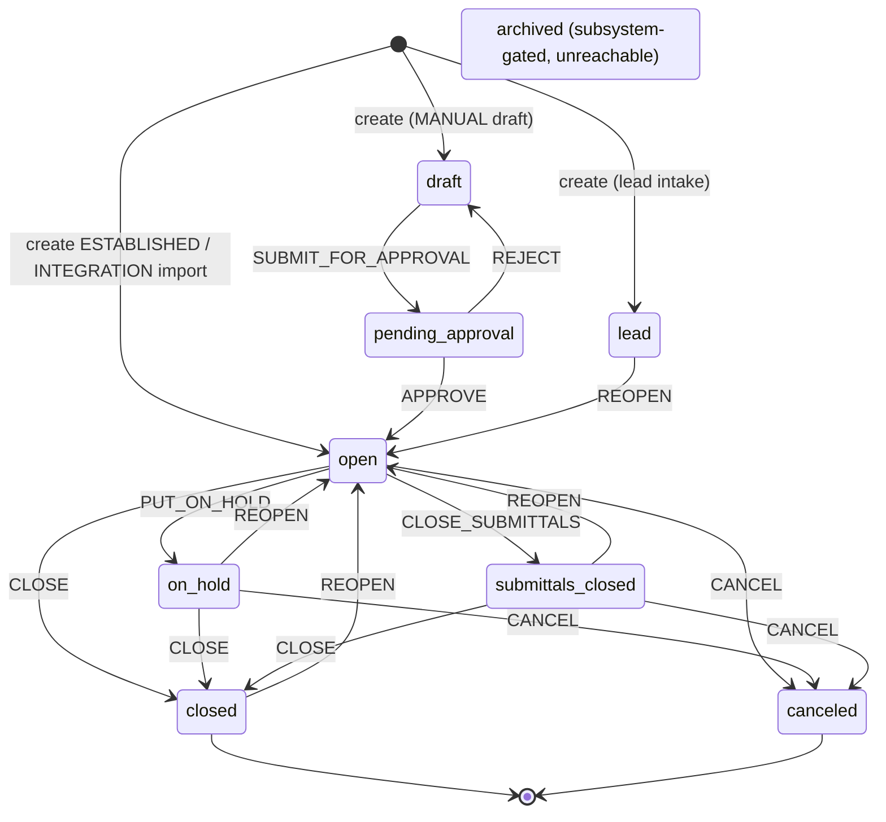
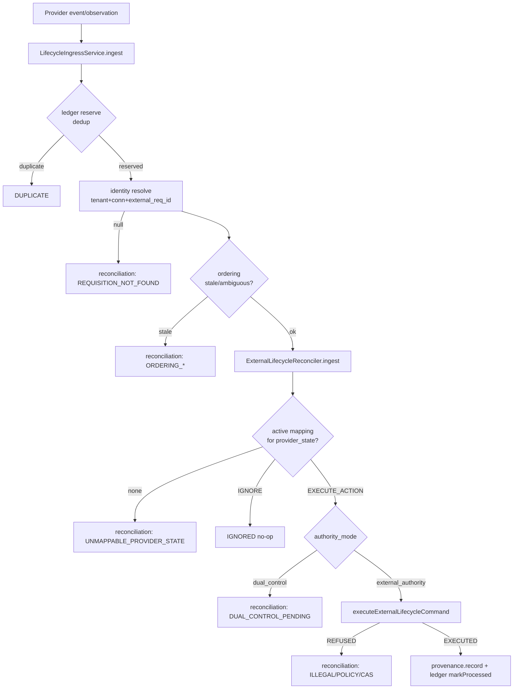

# D06 — Requisition, Job & VMS (AS-BUILT)
> Baseline SHA 12330b0f5049c97f01022df0b190035933345212 · category AS-BUILT

## Summary

D06 covers the ATS job-order aggregate (`Requisition`) and the surfaces around
it: the declared recruiting lifecycle (a governed status machine), the
Job/GoldenProfile capture spine, outbound job distribution (channel posting),
pre-start onboarding requirements, and the VMS/external-lifecycle integration
seam (ADR-0030) with its tenant-authored provider-state → action mapping.

The `Requisition` entity lives in `libs/requisition` (schema-per-module
`requisition`). Its declared status is `RecruitingStatus` (a stored enum, nine
values). Lifecycle changes are not free status writes: a status-changing PATCH
is routed through a GOVERNED transition action (`CLOSE`, `REOPEN`,
`PUT_ON_HOLD`, `CANCEL`, `SUBMIT_FOR_APPROVAL`, `APPROVE`, `REJECT`,
`CLOSE_SUBMITTALS`), gated by the ADR-0024 policy engine against the declared
FROM status, applied via an optimistic-concurrency compare-and-swap, and audited
by an append-only `RequisitionLifecycleEvent`. The SAME gate → CAS → event
pipeline is reused by an integration-origin seam
(`executeExternalLifecycleCommand`) so an authoritative external (VMS/client)
event can issue a mapped action — never a direct status write (ADR-0030
R-INVARIANT).

Two creation authorities exist for `Requisition`: the human/system path
(`RequisitionRepository.create`, behind `POST /v1/requisitions`) and the import
path (`createForImport`, driven by the requisition-import engine). Job and
GoldenProfile are a separate, narrow create/read spine in `libs/job-domain`.
Outbound distribution (`libs/job-distribution`) is a per-channel posting-state
projection with a pure CREATE/UPDATE/NOOP transition planner. Pre-start
requirements (`libs/pre-start-requirement`) model placement-scoped onboarding
readiness and expose assessment only (never transition a placement).

## Modules & Services

| name | role | evidence path:line + symbol |
| --- | --- | --- |
| RequisitionModule | ATS requisition DI root | libs/requisition/src/index.ts:1 `RequisitionModule` |
| RequisitionController | HTTP CRUD + lifecycle + profile + assignment surface (`v1/requisitions`) | libs/requisition/src/lib/requisition.controller.ts:83 `@Controller('v1/requisitions')` |
| RequisitionRepository | write/read floor; create, update (transition executor), external-lifecycle seam, CAS, visibility | libs/requisition/src/lib/requisition.repository.ts:599 `RequisitionRepository` |
| RequisitionTransitionPolicyService | governed-transition policy evaluator (ADR-0024); fail-closed on no package | libs/requisition/src/lib/policy/requisition-transition-policy.service.ts:67 `RequisitionTransitionPolicyService` |
| SetPriorityPolicyService | `is_hot` SET_PRIORITY policy gate (sibling) | libs/requisition/src/lib/policy/set-priority-policy.service.ts (exported) index.ts:47 |
| RequisitionLifecycleEventStore | append-only lifecycle history write API | libs/requisition/src/lib/requisition-lifecycle-event.store.ts:83 `RequisitionLifecycleEventStore` |
| RequisitionAssignmentRepository | recruiter assignment join (visibility driver) | libs/requisition/src/lib/requisition-assignment.repository.ts (exported) index.ts:13 |
| RequisitionIntakeService | pre-creation AI intake draft (ADR-0015 v1.2) | libs/requisition/src/lib/requisition-intake.service.ts (ctor dep) controller.ts:91 |
| RequisitionProfileService | JD + GoldenProfile draft/confirm/read | libs/requisition/src/lib/requisition-profile.service.ts (ctor dep) controller.ts:90 |
| JobDomainRepository | Job + GoldenProfile create/read spine | libs/job-domain/src/lib/job-domain.repository.ts:73 `JobDomainRepository` |
| job-distribution (posting) | pure posting-action planner + per-channel state repo | libs/job-distribution/src/lib/posting-transition.ts:36 `planPublishableAction` |
| pre-start-requirement | onboarding requirement sets/instances/readiness; assessment only | libs/pre-start-requirement/src/lib/pre-start-requirement.types.ts:179 `BlockingAssessment` |
| PreStartRequirementController | pre-start HTTP surface (`v1/pre-start-requirement`) | apps/api/src/pre-start-requirement/pre-start-requirement.controller.ts:38 `@Controller('v1/pre-start-requirement')` |
| ExternalLifecycleReconciler | ADR-0030 orchestration seam: normalize → mapping → authority mode → command | apps/api/src/requisition-integration/external-lifecycle-reconciler.ts:59 `ExternalLifecycleReconciler` |
| LifecycleIngressService | provider-neutral ingress: ledger dedup → identity resolve → ordering → reconciler | apps/api/src/requisition-integration/lifecycle-ingress.service.ts:55 `LifecycleIngressService` |
| ReconciliationDrainProcessor | BullMQ worker draining pending reconciliation rows (ADR-0018 manualRegistration) | apps/api/src/requisition-integration/reconciliation-drain.processor.ts:21 `ReconciliationDrainProcessor` |
| RequisitionLifecycleMappingAdminController | VMS lifecycle-mapping administration (`v1/integrations/:connectionId/requisition-lifecycle-mappings`) | libs/integration/src/lib/lifecycle/mapping-admin/requisition-lifecycle-mapping-admin.controller.ts:49 `RequisitionLifecycleMappingAdminController` |
| REQUISITION_LIFECYCLE_PACKAGE | the seeded ADR-0024 policy DATA (matrix → engine rules) | apps/api/src/policy/requisition-lifecycle.package.ts:225 `REQUISITION_LIFECYCLE_PACKAGE` |

## Data Models

Schema `requisition` (libs/requisition/prisma/schema.prisma):
- `Requisition` (model, schema.prisma:111) — the job-order entity. Declared
  `status RecruitingStatus @default(open)` (schema.prisma:134); immutable
  per-tenant `requisition_number` (schema.prisma:125); optimistic-concurrency
  `version Int @default(0)` (schema.prisma:335); structured compensation,
  enterprise, gated financial-planning, publish (`advertised_*`), and VMS
  provenance (`source_system`/`external_req_id`/`imported_at`,
  schema.prisma:244-246) field groups; `golden_profile_id` seam
  (schema.prisma:305). `openings_available` column was RETIRED — availability is
  derived from placement (schema.prisma:185-191).
- `RecruitingStatus` enum — nine values `lead, draft, pending_approval, open,
  on_hold, submittals_closed, canceled, closed, archived` (schema.prisma:66).
- `RequisitionNumberSequence` (schema.prisma:371) — per-tenant monotonic
  allocator, seeds at 1000.
- `RequisitionAssignment` (schema.prisma:386) — join driving the recruiter
  visibility predicate; intra-schema FK with `onDelete: Cascade`.
- `UserRequisitionState` (schema.prisma:435) — personal per-user bookmark state.
- `RequisitionLifecycleEvent` (schema.prisma:486) — append-only lifecycle
  history; `previous_status`/`next_status` nullable; `policy_decision_id`
  UUID-only cross-schema ref; `origin` enum `ui|agent|integration`
  (schema.prisma:465).
- `RequisitionSkillRequirement` (schema.prisma:549) — SKILL-TAX-1D canonical seam.
- `RequisitionEmbedding` + `RequisitionEmbeddingStatus` (schema.prisma:589,581) —
  GS-2B pgvector semantic index (DARK).

Schema `job_domain` (libs/job-domain/prisma/schema.prisma): `Job` (:55),
`GoldenProfile` (:76).

Schema `job_distribution` (libs/job-distribution/prisma/schema.prisma):
`ChannelPostingState` (:25), `TenantChannelConfig` (:55).

Schema `pre_start_requirement` (libs/pre-start-requirement/prisma/schema.prisma):
`PreStartRequirementSet` (:49), `PreStartRequirementDefinition` (:78),
`PreStartRequirementInstance` (:123), `PreStartMaterializationIntent` (:184),
`PreStartRequirementAudit` (:217), `PreStartReadinessDecision` (:253).

Schema `integration` (libs/integration/prisma/schema.prisma) — VMS lifecycle
seam: `RequisitionLifecycleAuthorityMode` enum `external_authority|dual_control`
(:167), `RequisitionLifecycleMapping` (:181), `RequisitionLifecycleMappingSet`
(:243, exactly-one-active via partial unique index),
`RequisitionExternalReconciliation` (:457),
`RequisitionExternalTransitionProvenance` (:519), `LifecycleObservationLedger`
(:617), `ExternalRequisitionIdentity` (:687).

## API Endpoints

`RequisitionController` (libs/requisition/src/lib/requisition.controller.ts),
class-level `@UseGuards(JwtAuthGuard, EntitlementGuard, RolesGuard)` +
`@RequireCapability('ats')`:

| method | route | scopes | evidence |
| --- | --- | --- | --- |
| GET | /v1/requisitions | requisition:read (+ requisition:search when `?q=`) | controller.ts:115 `list`; search gate controller.ts:131 |
| GET | /v1/requisitions/:id | requisition:read | controller.ts:151 `get` |
| POST | /v1/requisitions | requisition:create | controller.ts:195 `create` |
| POST | /v1/requisitions/intake | requisition:create | controller.ts:262 `intake` |
| PATCH | /v1/requisitions/:id | (in-service: requisition:edit OR requisition:edit:status) | controller.ts:290 `update` |
| DELETE | /v1/requisitions/:id | requisition:delete | controller.ts:319 `delete` |
| PUT | /v1/requisitions/:id/bookmark | requisition:read | controller.ts:362 `setBookmark` |
| GET | /v1/requisitions/:id/profile | requisition:read | controller.ts:418 `getProfile` |
| POST | /v1/requisitions/:id/profile/draft | requisition:profile:generate | controller.ts:437 `draftProfile` |
| POST | /v1/requisitions/:id/profile/confirm | requisition:profile:generate | controller.ts:459 `confirmProfile` |
| GET | /v1/requisitions/:id/assignments | requisition:assign | controller.ts:486 `listAssignments` |
| POST | /v1/requisitions/:id/assignments | requisition:assign | controller.ts:501 `assign` |
| DELETE | /v1/requisitions/:id/assignments/:user_id | requisition:assign | controller.ts:520 `unassign` |

VMS mapping administration
(libs/integration/src/lib/lifecycle/mapping-admin/requisition-lifecycle-mapping-admin.controller.ts),
`@Controller('v1/integrations/:connectionId/requisition-lifecycle-mappings')`:

| method | route | scopes | evidence |
| --- | --- | --- | --- |
| GET | (list sets) | integration:read | controller.ts:55 `list` |
| GET | /active | integration:read | controller.ts:69 `active` |
| GET | /versions/:version | integration:read | controller.ts:82 `getVersion` |
| POST | /versions | integration:write | controller.ts:95 `createDraft` |
| PUT | /versions/:version | integration:write | controller.ts:110 `replaceDraft` |
| POST | /versions/:version/validate | integration:read | controller.ts:127 `validate` |
| POST | /versions/:version/activate | integration:write | controller.ts:143 `activate` |

Pre-start requirements
(apps/api/src/pre-start-requirement/pre-start-requirement.controller.ts),
`@Controller('v1/pre-start-requirement')`: `POST sets` (:57,
pre_start_requirement:configure), `PUT sets/:setId` (:115), `POST
sets/:setId/publish` (:141, :publish), `GET sets/applicable` (:152, :read), `GET
effective` (:166), `GET layers` (:184), `GET history` (:202), `GET
placements/:placementId/requirements` (:269), `POST
requirements/:instanceId/status` (:286, :act), `POST
requirements/:instanceId/reopen` (:319, :reopen), `POST
requirements/:instanceId/waive` (:349, :act), `POST
requirements/:instanceId/verify` (:371, :verify), `POST
placements/:placementId/ready` (:399, :act).

The external-lifecycle command seam has NO HTTP route (grep confirms zero
`*.controller.ts` callers): it has two in-app callers, both acting as the
connector service account — the reconciler
(external-lifecycle-reconciler.ts:144-163) and the drain path
(RequisitionReconciliationDrainService, reconciliation-drain.service.ts:336).

## Screens & FE→BE Wiring (ats-web only)

`apps/ats-web/src/requisitions/` is the requisition FE domain. The API client
`requisitions-api.ts` wires: `listRequisitions` → GET /v1/requisitions
(requisitions-api.ts:29); `getRequisition` → GET /v1/requisitions/:id (:48);
`setRequisitionBookmark` → PUT …/bookmark (:56); `createRequisition` → POST
/v1/requisitions (:92); `draftRequisitionFromIntake` → POST
/v1/requisitions/intake (:105); `updateRequisition` → PATCH /v1/requisitions/:id
(:111); `getRequisitionProfile` → GET …/profile (:126);
`draftRequisitionProfile` / `confirmRequisitionProfile` → POST …/profile/draft |
confirm (:141,:154). Views include `RequisitionsListView.tsx`,
`RequisitionDetailView.tsx`, `RequisitionCreateView.tsx`,
`NewRequisitionView.tsx`, `RequisitionForm.tsx`, `ProfileWorkbenchPanel.tsx`,
`board-governed-move.ts`, `approval-affordance.ts`. Requisition imports have a
dedicated FE domain `apps/ats-web/src/requisition-imports/`.

## Key Flows

### Requisition declared lifecycle (RecruitingStatus)



Edge/action resolution is `governingAction(from,to)`
(dto/requisition-transitions.ts:65); per-action from-status eligibility is the
`TRANSITION_MATRIX` in the seeded policy package
(apps/api/src/policy/requisition-lifecycle.package.ts:156). `archived` is
unreachable by construction (GATED_RECRUITING_STATUS_VALUES,
dto/requisition-status.ts:36 → 422 REQUISITION_STATUS_GATED at
requisition.repository.ts:1265; gate block opens at
requisition.repository.ts:1263).

### A governed PATCH transition (human, origin='ui')

```mermaid
sequenceDiagram
    participant FE as ats-web
    participant C as RequisitionController.update
    participant R as RequisitionRepository.update
    participant G as gateTransition
    participant P as RequisitionTransitionPolicyService
    participant DB as requisition schema (tx)
    FE->>C: PATCH /v1/requisitions/:id {status,version}
    C->>R: update({input,scopes,visibility})
    R->>R: assertStatusOnlyEditScope + comp/financial gates
    R->>R: visibility-scoped existence read (null → 404)
    R->>R: gated-status guard (422 if archived)
    R->>R: version required when status changes (400 if absent)
    R->>G: gateTransition(from,to,origin='ui')
    G->>G: governingAction(from,to) (null → ungoverned edit)
    G->>G: assertApprovalAuthorization (SoD on APPROVE)
    G->>P: decide(action, from_status)
    P-->>G: ALLOW | DENY (fail-closed NO_POLICY_PUBLISHED)
    alt DENY
        G-->>R: throw POLICY_DENIED (403); no mutation
    else ALLOW
        G-->>R: {provenance, decision_id}
        R->>DB: casUpdate (WHERE version=expected) → 409 on mismatch
        R->>DB: insert PolicyDecisionRecord (decision_id)
        R->>DB: record RequisitionLifecycleEvent (origin='ui')
        DB-->>R: committed atomically
    end
    R-->>FE: RequisitionView
```

Human path: requisition.repository.ts:1438 (`gateTransition` call) →
requisition.repository.ts:1472 (tx). External path reuses the same gate/CAS/event
via `executeExternalLifecycleCommand` (requisition.repository.ts:1538), stamping
`origin='integration'` and running with EMPTY scopes
(requisition.repository.ts:1590).

### VMS external-lifecycle ingress (ADR-0030)



Evidence: lifecycle-ingress.service.ts:65-192; external-lifecycle-reconciler.ts:73-198;
executeExternalLifecycleCommand requisition.repository.ts:1538-1650.

## Evidence Index

- libs/requisition/src/lib/requisition.controller.ts:83 `@Controller('v1/requisitions')`
- libs/requisition/src/lib/requisition.controller.ts:115 `list`
- libs/requisition/src/lib/requisition.controller.ts:131 requisition:search gate
- libs/requisition/src/lib/requisition.controller.ts:151 `get`
- libs/requisition/src/lib/requisition.controller.ts:195 `create`
- libs/requisition/src/lib/requisition.controller.ts:215 `companyClientCheck.isClientCompany` (ADR-0032)
- libs/requisition/src/lib/requisition.controller.ts:262 `intake`
- libs/requisition/src/lib/requisition.controller.ts:290 `update`
- libs/requisition/src/lib/requisition.controller.ts:319 `delete`
- libs/requisition/src/lib/requisition.controller.ts:362 `setBookmark`
- libs/requisition/src/lib/requisition.controller.ts:418 `getProfile`
- libs/requisition/src/lib/requisition.controller.ts:437 `draftProfile`
- libs/requisition/src/lib/requisition.controller.ts:459 `confirmProfile`
- libs/requisition/src/lib/requisition.controller.ts:501 `assign`
- libs/requisition/src/lib/requisition.controller.ts:520 `unassign`
- libs/requisition/src/lib/dto/requisition-status.ts:17 `RECRUITING_STATUS_VALUES`
- libs/requisition/src/lib/dto/requisition-status.ts:36 `GATED_RECRUITING_STATUS_VALUES`
- libs/requisition/src/lib/dto/requisition-transitions.ts:20 `TRANSITION_ACTIONS`
- libs/requisition/src/lib/dto/requisition-transitions.ts:43 `ACTION_TARGET_STATUS`
- libs/requisition/src/lib/dto/requisition-transitions.ts:65 `governingAction`
- libs/requisition/src/lib/dto/external-lifecycle-command.ts:35 `ExternalLifecycleTransitionCommand`
- libs/requisition/src/lib/dto/external-lifecycle-command.ts:91 `EXTERNAL_LIFECYCLE_ACTIONS`
- libs/requisition/src/lib/policy/requisition-transition-policy.service.ts:70 `decide`
- libs/requisition/src/lib/policy/requisition-transition-policy.service.ts:101 fail-closed `NO_POLICY_PUBLISHED`
- libs/requisition/src/lib/requisition.repository.ts:599 `RequisitionRepository`
- libs/requisition/src/lib/requisition.repository.ts:745 `gateTransition`
- libs/requisition/src/lib/requisition.repository.ts:908 `create`
- libs/requisition/src/lib/requisition.repository.ts:1054 `createForImport`
- libs/requisition/src/lib/requisition.repository.ts:1185 `update`
- libs/requisition/src/lib/requisition.repository.ts:1265 `REQUISITION_STATUS_GATED` (422; gate block opens :1263)
- libs/requisition/src/lib/requisition.repository.ts:1438 `gateTransition` call site
- libs/requisition/src/lib/requisition.repository.ts:1538 `executeExternalLifecycleCommand`
- libs/requisition/src/lib/requisition.repository.ts:1590 EMPTY scopes on integration seam
- libs/requisition/src/lib/requisition.repository.ts:1664 `casUpdate`
- libs/requisition/src/lib/requisition-lifecycle-event.store.ts:109 `record`
- libs/requisition/prisma/schema.prisma:66 `enum RecruitingStatus`
- libs/requisition/prisma/schema.prisma:111 `model Requisition`
- libs/requisition/prisma/schema.prisma:335 `version Int @default(0)`
- libs/requisition/prisma/schema.prisma:371 `RequisitionNumberSequence`
- libs/requisition/prisma/schema.prisma:386 `RequisitionAssignment`
- libs/requisition/prisma/schema.prisma:486 `RequisitionLifecycleEvent`
- libs/job-domain/src/lib/job-domain.repository.ts:73 `JobDomainRepository`
- libs/job-domain/src/lib/job-domain.repository.ts:78 `createJob`
- libs/job-domain/src/lib/job-domain.repository.ts:95 `createGoldenProfile`
- libs/job-distribution/src/lib/posting-transition.ts:36 `planPublishableAction`
- libs/job-distribution/prisma/schema.prisma:25 `ChannelPostingState`
- libs/pre-start-requirement/src/lib/pre-start-requirement.types.ts:179 `BlockingAssessment`
- apps/api/src/pre-start-requirement/pre-start-requirement.controller.ts:38 `@Controller('v1/pre-start-requirement')`
- apps/api/src/policy/requisition-lifecycle.package.ts:156 `TRANSITION_MATRIX`
- apps/api/src/policy/requisition-lifecycle.package.ts:225 `REQUISITION_LIFECYCLE_PACKAGE`
- apps/api/src/policy/requisition-lifecycle.package.ts:234 `version: '7.0.0'`
- apps/api/src/requisition-integration/external-lifecycle-reconciler.ts:73 `ingest`
- apps/api/src/requisition-integration/lifecycle-ingress.service.ts:65 `ingest`
- apps/api/src/requisition-integration/reconciliation-drain.processor.ts:21 `ReconciliationDrainProcessor`
- libs/integration/src/lib/lifecycle/mapping-admin/requisition-lifecycle-mapping-admin.controller.ts:49 `RequisitionLifecycleMappingAdminController`
- libs/integration/prisma/schema.prisma:181 `RequisitionLifecycleMapping`
- libs/integration/prisma/schema.prisma:243 `RequisitionLifecycleMappingSet`
- apps/ats-web/src/requisitions/requisitions-api.ts:29 `listRequisitions`
- apps/ats-web/src/requisitions/requisitions-api.ts:92 `createRequisition`
- apps/ats-web/src/requisitions/requisitions-api.ts:111 `updateRequisition`
- openapi/ats.yaml:107 `/v1/requisitions` (post-only documented)

## NOT VERIFIED (explicit)

- Runtime behavior (tests, live transitions) was not executed; this is a static
  read at the frozen SHA.
- `ActivityNote` (named in the task substrate) lives in `libs/activity`
  (libs/activity/prisma/schema.prisma:156 `ActivityNote`; `Activity.subject_type`
  may be `'requisition'`, schema.prisma:108). The requisition-lifecycle policy
  governs a `REQUISITION_NOTE` resource column
  (apps/api/src/policy/requisition-lifecycle.package.ts:50) as ALLOW in every
  state, but the note entity itself is a separate domain and was not audited
  here beyond this linkage.
- The EventBridge/SQS/Lambda durable transport (ADR-0033) is referenced by the
  integration/import layer but is out of D06 scope and NOT VERIFIED here.
- `RequisitionReconciliationDrainService.drainBatch` internals and the
  `LifecyclePollProducer` schedule were not read line-by-line.
- Exact scope seeding (catalog/id-map) for the requisition scopes was not
  cross-checked against the seed layer.
- Whether `openings_available` is still surfaced in `RequisitionView` as a
  derived (not stored) field was confirmed in code comments but the placement
  projection math was not re-derived.
