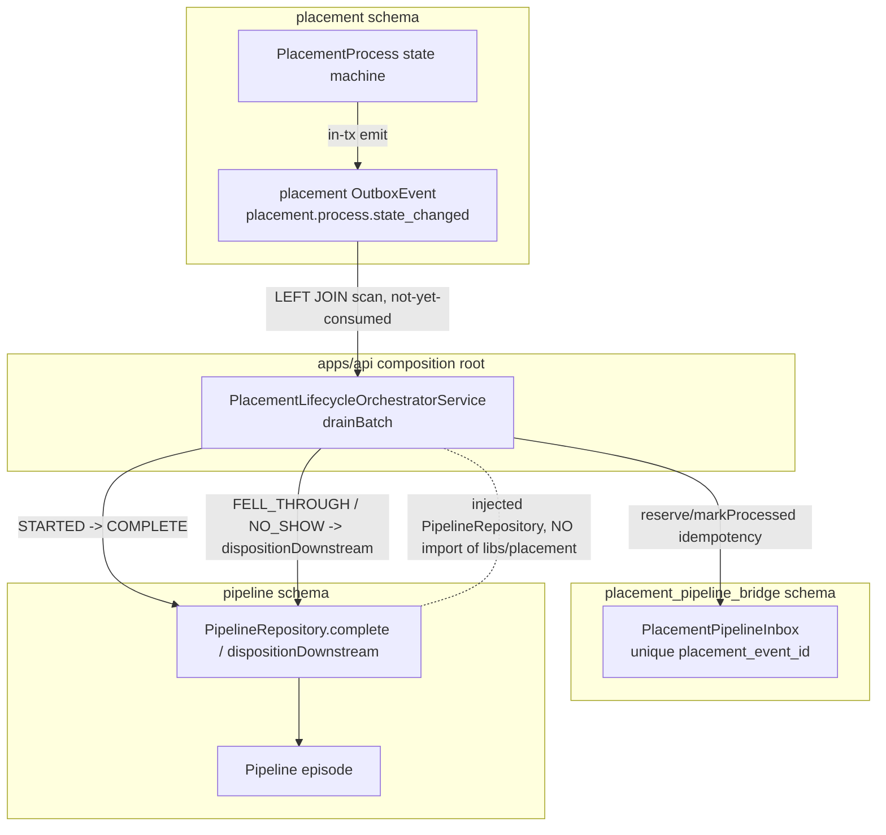
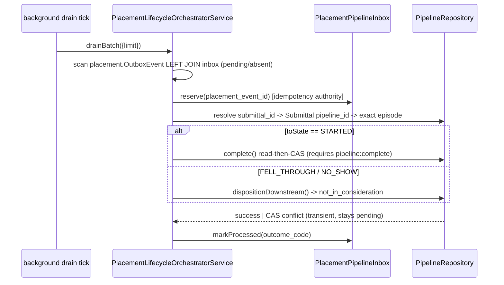

# D07 — Pipeline, Placement & Selection (AS-BUILT)
> Baseline SHA 12330b0f5049c97f01022df0b190035933345212 · category AS-BUILT

## Summary

Domain D07 spans the recruiting-funnel and post-qualification workflow substrate: five libs — `pipeline`, `selection`, `client-selection`, `placement`, `placement-pipeline-bridge` — plus four apps/api orchestration controllers. The division of ownership is explicit in code:

- **`libs/pipeline`** owns RECRUITING PROGRESS ONLY — a canonical 8-value `PipelineStatus` enum whose active funnel stops at `qualified` (`libs/pipeline/src/lib/pipeline-state.ts:38` `PIPELINE_STATUS_VALUES`). Everything past `qualified` is owned by downstream aggregates and is never a Pipeline status (`libs/pipeline/src/lib/pipeline-state.ts:5`).
- **`libs/selection`** owns the recruiter-side talent-engagement lifecycle (`TalentSelection`, an 11-state machine; `libs/selection/src/lib/selection-state.ts:17`).
- **`libs/client-selection`** owns the client's review/decision lifecycle over one submitted talent (`ClientSelectionProcess`, 5 states) plus `InterviewSession` (5 states) (`libs/client-selection/src/lib/client-selection-state.ts:5`, `libs/client-selection/src/lib/interview-session-state.ts:6`).
- **`libs/placement`** owns the post-acceptance spine: `PlacementProcess` (6 states), the dedicated `Offer` aggregate, `ContractAssignment`, `PermanentPlacement`, and commercial-revision governance (`libs/placement/prisma/schema.prisma:90`). It ships NO controller of its own; it is exposed via apps/api controllers.
- **`libs/placement-pipeline-bridge`** owns ONLY idempotent-consumer bookkeeping (a processed-event inbox) for the Placement→Pipeline lifecycle bridge; it carries no business rules (`libs/placement-pipeline-bridge/prisma/schema.prisma:1`).

All five schemas use UUID-only cross-schema references with no FK — this is the I1 / Architecture §7.3 schema-per-module convention applied across the ATS schemas (stated in every schema header, e.g. `libs/pipeline/prisma/schema.prisma:31`). It is NOT, by itself, the ADR-0029 I15 Pipeline⊥ATS wall: ADR-0029 D5 scopes "Pipeline" to the sourcing-intelligence libs (the `sourced_*`/`talent_trust`/`identity_index`/TR-* lib family named in the ADR), whereas `libs/pipeline` here is the ATS recruiting funnel (scope:ats) — the two share a word, not the wall. The orchestrator nonetheless keeps a clean seam: it drives Pipeline commands through an injected `PipelineRepository` and never imports `libs/placement` (`apps/api/src/placement-pipeline-orchestration/placement-lifecycle-orchestrator.service.ts:1`).

Cross-boundary movement is governed, not direct: Placement→Pipeline COMPLETE/disposition runs through the bridge inbox + apps/api orchestrator; client DECLINED/WITHDRAWN runs through a dedicated decision orchestrator (not the forward-transition route); the accidental-add VOID correction runs through a dedicated apps/api controller.

## Modules & Services

| name | role | evidence path:line+symbol |
| --- | --- | --- |
| PipelineController | HTTP surface for `v1/pipelines` (list/get/history/create/transition/actions + resume-edition read/set) | `libs/pipeline/src/lib/pipeline.controller.ts:74` `@Controller('v1/pipelines')` |
| PipelineRepository | Pipeline writes: create, transition (CAS), applyAction, evidence commands, void, complete, dispositionDownstream | `libs/pipeline/src/lib/pipeline.repository.ts:373` `async create` |
| pipeline-state (state machine) | Canonical 8-value enum + `LEGAL_TRANSITIONS` matrix + recruiter-action map + VOID vocabulary | `libs/pipeline/src/lib/pipeline-state.ts:106` `LEGAL_TRANSITIONS` |
| AddTalentPolicyService + override-resolution | ADR-0024 policy gate on pipeline create (ALLOW/DENY/REQUIRES_OVERRIDE) | `libs/pipeline/src/lib/pipeline.controller.ts:336` `addTalentPolicy.decide` |
| SelectionController | HTTP surface for `v1/selections` (list/create/transitions/response/conversation/get/events + two engagement sub-routes) | `libs/selection/src/lib/selection.controller.ts:160` `@Controller('v1/selections')` |
| selection-state (state machine) | 11-value `TalentSelection` state tuple + `canTransition` (10 legal edges) | `libs/selection/src/lib/selection-state.ts:47` `canTransition` |
| ClientSelectionController | HTTP surface for `v1/client-selection` (get/transition/schedule-interview + interview-session read/transition/meeting/interviewers) | `libs/client-selection/src/lib/client-selection.controller.ts:58` `@Controller('v1/client-selection')` |
| client-selection-state + interview-session-state | 5-value process machine + 5-value interview-session machine | `libs/client-selection/src/lib/client-selection-state.ts:39` `LEGAL_TRANSITIONS` |
| placement lifecycle registries | `PlacementProcess` (6 states), `Offer`, commercial-approval, permanent — TS registries are the source of truth; migration SQL is generated | `libs/placement/src/lib/lifecycle/placement-lifecycle.ts:75` `TRANSITIONS` |
| PlacementPipelineInboxRepository | Idempotent-consumer inbox (reserve/markProcessed) for the Placement→Pipeline bridge | `libs/placement-pipeline-bridge/src/lib/placement-pipeline-inbox.repository.ts:43` `async reserve` |
| PlacementController (apps/api) | `v1/placements` read + lifecycle transition + assignment end/extend/convert + permanent + commercials | `apps/api/src/placement/placement.controller.ts:62` `@Controller('v1/placements')` |
| GuaranteeTermsController (apps/api) | `v1/permanent-placement-guarantee-terms` per-requisition write/read/effective/revise | `apps/api/src/placement/guarantee-terms.controller.ts:23` `@Controller(...)` |
| PipelineVoidController (apps/api) | `POST v1/pipelines/:id/void` — governed accidental-add correction (not a generic transition) | `apps/api/src/pipeline-void/pipeline-void.controller.ts:23` `@Post(':id/void')` |
| ClientDecisionController (apps/api) | `POST v1/client-selection/:id/decision` — governed DECLINED/WITHDRAWN that also dispositions the upstream Pipeline | `apps/api/src/client-decision-orchestration/client-decision.controller.ts:39` `@Post(':id/decision')` |
| PlacementLifecycleOrchestratorService (apps/api) | Consumes `placement.process.state_changed`, drives Pipeline COMPLETE / dispositionDownstream by stored lineage | `apps/api/src/placement-pipeline-orchestration/placement-lifecycle-orchestrator.service.ts:54` `async drainBatch` |

## Data Models

| schema | model/enum | evidence path:line |
| --- | --- | --- |
| pipeline | `enum PipelineStatus` (8 values) | `libs/pipeline/prisma/schema.prisma:56` |
| pipeline | `model Pipeline` (status default `no_contact`, `version`, `ended_at`) | `libs/pipeline/prisma/schema.prisma:74` |
| pipeline | `model PipelineStatusHistory` (append-only, nullable `status_from`) | `libs/pipeline/prisma/schema.prisma:144` |
| pipeline | `model PipelineDisposition` (one-per-pipeline, 4 authority classes) | `libs/pipeline/prisma/schema.prisma:185` |
| pipeline | `model PipelineEntryProvenance` (immutable source-of-hire; 12 origin types) | `libs/pipeline/prisma/schema.prisma:233` |
| pipeline | `model OutboxEvent` + `model TalentRequisitionResume` (append-only working resume selection) | `libs/pipeline/prisma/schema.prisma:281`, `:305` |
| selection | `enum SelectionState` (11) + `model TalentSelection` + `model TalentSelectionEvent` + `OutboxEvent` | `libs/selection/prisma/schema.prisma:67`, `:100`, `:182`, `:144` |
| client-selection | `enum ClientSelectionState` (5) + `model ClientSelectionProcess` | `libs/client-selection/prisma/schema.prisma:28`, `:38` |
| client-selection | `enum InterviewSessionState` (5) + `model InterviewSession` + `model ClientSelectionEvent` | `libs/client-selection/prisma/schema.prisma:77`, `:87`, `:142` |
| placement | `enum PlacementState` (6) + `enum PlacementKind` (CONTRACT/PERMANENT) + `model PlacementProcess` | `libs/placement/prisma/schema.prisma:51`, `:82`, `:90` |
| placement | `model PlacementProcessEvent` (append-only; governed reason columns) | `libs/placement/prisma/schema.prisma:163` |
| placement | `enum OfferState` (7) + `model Offer` (+ `OfferRevision`, `OfferEvent`) | `libs/placement/prisma/schema.prisma:225`, `:247` |
| placement | `model ContractAssignment` (+ `AssignmentExtension`, `AssignmentRateVersion`) | `libs/placement/prisma/schema.prisma:433` |
| placement | `model PermanentPlacement` (+ remedy / guarantee-term-version / conversion-lineage) | `libs/placement/prisma/schema.prisma:834` |
| placement | `model CommercialRevisionProposal` (+ event) | `libs/placement/prisma/schema.prisma:672` |
| placement_pipeline_bridge | `model PlacementPipelineInbox` (unique `placement_event_id`; status pending/processed) | `libs/placement-pipeline-bridge/prisma/schema.prisma:26` |

Model/enum counts per schema (re-derived): pipeline 6 models, selection 3 models, client-selection 4 models, placement 17 models, placement_pipeline_bridge 1 model.

## API Endpoints

| method | route | scopes | evidence |
| --- | --- | --- | --- |
| GET | /v1/pipelines | pipeline:read | `libs/pipeline/src/lib/pipeline.controller.ts:90` |
| GET | /v1/pipelines/:id | pipeline:read | `libs/pipeline/src/lib/pipeline.controller.ts:112` |
| GET | /v1/pipelines/:id/resume-edition | pipeline:read | `libs/pipeline/src/lib/pipeline.controller.ts:144` |
| PUT | /v1/pipelines/:id/resume-edition | pipeline:resume:set | `libs/pipeline/src/lib/pipeline.controller.ts:177` |
| GET | /v1/pipelines/:id/history | pipeline:read | `libs/pipeline/src/lib/pipeline.controller.ts:283` |
| POST | /v1/pipelines | pipeline:add | `libs/pipeline/src/lib/pipeline.controller.ts:304` |
| POST | /v1/pipelines/:id/transition | pipeline:change-status | `libs/pipeline/src/lib/pipeline.controller.ts:440` |
| POST | /v1/pipelines/:id/actions | pipeline:change-status | `libs/pipeline/src/lib/pipeline.controller.ts:479` |
| POST | /v1/pipelines/:id/void | pipeline:change-status | `apps/api/src/pipeline-void/pipeline-void.controller.ts:25` |
| GET | /v1/selections | selection:read | `libs/selection/src/lib/selection.controller.ts:197` |
| POST | /v1/selections | selection:write | `libs/selection/src/lib/selection.controller.ts:247` |
| POST | /v1/selections/:id/transitions | selection:write | `libs/selection/src/lib/selection.controller.ts:331` |
| POST | /v1/selections/:id (engagement draft sub-route) | selection: engagement scope | `libs/selection/src/lib/selection.controller.ts:429` |
| POST | /v1/selections/:id (engagement send sub-route) | selection: engagement scope | `libs/selection/src/lib/selection.controller.ts:700` |
| POST | /v1/selections/:id/response | selection:write | `libs/selection/src/lib/selection.controller.ts:1011` |
| POST | /v1/selections/:id/conversation | selection:write | `libs/selection/src/lib/selection.controller.ts:1138` |
| GET | /v1/selections/:id | selection:read | `libs/selection/src/lib/selection.controller.ts:1232` |
| GET | /v1/selections/:id/events | selection:read | `libs/selection/src/lib/selection.controller.ts:1274` |
| GET | /v1/client-selection/:id | client-selection:read | `libs/client-selection/src/lib/client-selection.controller.ts:72` |
| POST | /v1/client-selection/:id/transition | client-selection:transition | `libs/client-selection/src/lib/client-selection.controller.ts:98` |
| POST | /v1/client-selection/:id/decision | client-selection:transition | `apps/api/src/client-decision-orchestration/client-decision.controller.ts:41` |
| POST | /v1/client-selection/:id/interviews | client-selection:interview:schedule | `libs/client-selection/src/lib/client-selection.controller.ts:143` |
| GET | /v1/client-selection/interview-sessions/:sessionId | client-selection:read | `libs/client-selection/src/lib/client-selection.controller.ts:226` |
| POST | /v1/client-selection/interview-sessions/:sessionId/transition | client-selection:interview:transition | `libs/client-selection/src/lib/client-selection.controller.ts:252` |
| POST | /v1/client-selection/interview-sessions/:sessionId/meeting | client-selection:interview:transition | `libs/client-selection/src/lib/client-selection.controller.ts:317` |
| PATCH | /v1/client-selection/interview-sessions/:sessionId/interviewers | client-selection:interview:transition | `libs/client-selection/src/lib/client-selection.controller.ts:356` |
| GET | /v1/placements | placement:read | `apps/api/src/placement/placement.controller.ts:78` |
| POST | /v1/placements | placement:create | `apps/api/src/placement/placement.controller.ts:113` |
| POST | /v1/placements/:id/transition | (edge-authority resolved in body) | `apps/api/src/placement/placement.controller.ts:155` |
| POST | /v1/placements/:id/assignment/end | assignment:end | `apps/api/src/placement/placement.controller.ts:261` |
| POST | /v1/placements/:id/assignment/extend | assignment:extend | `apps/api/src/placement/placement.controller.ts:291` |
| POST | /v1/placements/:id/assignment/convert-to-permanent | assignment:end + placement:permanent:transition | `apps/api/src/placement/placement.controller.ts:325` |
| GET | /v1/placements/:id, /:id/events, /:id/assignment, /:id/permanent | placement:read / assignment:read / placement:permanent:read | `apps/api/src/placement/placement.controller.ts:341`, `:374`, `:410`, `:444` |
| POST | /v1/placements/:id/permanent/transition, /falloff, /remedy/complete | placement:permanent:transition / placement:remedy:resolve | `apps/api/src/placement/placement.controller.ts:479`, `:505`, `:534` |
| GET/POST/PATCH | /v1/placements/:id/assignment/commercials(/revisions,/proposals,…) | assignment:commercials:read/write/approve | `apps/api/src/placement/placement.controller.ts:564`…`:812` |
| POST/GET | /v1/permanent-placement-guarantee-terms/requisitions/:requisitionId(/effective,/revise) | placement:permanent:terms:write / placement:permanent:read | `apps/api/src/placement/guarantee-terms.controller.ts:31`…`:90` |

Guard chains: PipelineController + ClientSelectionController + PlacementController + PipelineVoidController + ClientDecisionController all layer `JwtAuthGuard` + `RolesGuard` (+ `EntitlementGuard` / `@RequireCapability('ats')`) with route-level `@RequireScopes` / `@RequireSiteMatch` (`libs/pipeline/src/lib/pipeline.controller.ts:75`, `libs/client-selection/src/lib/client-selection.controller.ts:59`). SelectionController uses `JwtAuthGuard` + `RolesGuard` with no `@RequireCapability` (`libs/selection/src/lib/selection.controller.ts:161`).

## Screens & FE->BE Wiring

FE (ats-web only — other FE apps carry no D07 wiring):

| FE domain | BE route(s) called | evidence path:line |
| --- | --- | --- |
| `apps/ats-web/src/pipeline/` | POST /v1/pipelines, /:id/transition, /:id/void, /:id/history, /:id/resume-edition | `apps/ats-web/src/pipeline/pipeline-api.ts:54` (create), `:102` (void) |
| `apps/ats-web/src/selection/` | /v1/selections list/get/events/transitions/response/conversation + engagement sub-routes | `apps/ats-web/src/selection/selection-api.ts:71` (response) |
| `apps/ats-web/src/submittal-workspace/` | POST /v1/client-selection/:id/transition and /:id/decision | `apps/ats-web/src/submittal-workspace/client-selection-api.ts:27`, `:44` |
| `apps/ats-web/src/interviews/` | /v1/client-selection/:id/interviews + interview-sessions transition/meeting/interviewers | `apps/ats-web/src/interviews/interviews-api.ts:109` (schedule) |
| `apps/ats-web/src/placement/` | /v1/placements read + assignment end/extend/convert + commercials + permanent | `apps/ats-web/src/placement/placement-api.ts:43` (list) |
| `apps/ats-web/src/requisitions/` | AddTalentDialog → POST /v1/pipelines; TalentJourneySection → journey read | `apps/ats-web/src/requisitions/AddTalentDialog.tsx` |

35 ats-web source files reference these `v1/` routes (re-derived — see coverage fragment).

## Key Flows

### Pipeline recruiting funnel (state machine)

Grounded in `LEGAL_TRANSITIONS` (`libs/pipeline/src/lib/pipeline-state.ts:106`) and the evidence-backed-stages / recruiter-action / VOID rules.

```mermaid
stateDiagram-v2
  [*] --> no_contact: create() birth row (NULL -> no_contact)
  no_contact --> contacted: recordContactEvidence (I1, evidence-backed)
  no_contact --> talent_responded: recordResponseEvidence (I2, evidence-backed)
  no_contact --> not_in_consideration: DISPOSITION
  contacted --> talent_responded: recordResponseEvidence
  contacted --> no_contact: one-step correction
  contacted --> not_in_consideration: DISPOSITION
  talent_responded --> qualifying: START_QUALIFICATION
  talent_responded --> contacted: one-step correction
  talent_responded --> not_in_consideration: DISPOSITION
  qualifying --> qualified: QUALIFY
  qualifying --> talent_responded: one-step correction
  qualifying --> not_in_consideration: DISPOSITION
  qualified --> qualifying: one-step correction
  qualified --> not_in_consideration: DISPOSITION
  qualified --> completed: COMPLETE (system-only; driven by Placement STARTED)
  no_contact --> voided: VOID (governed; apps/api only; not a generic edge)
  not_in_consideration --> [*]
  completed --> [*]
  voided --> [*]
```

Notes: `contacted` and `talent_responded` are EVIDENCE_BACKED_STAGES — reachable only via `recordContactEvidence` / `recordResponseEvidence`, never a naked stage click (`libs/pipeline/src/lib/pipeline-state.ts:90`). `COMPLETE` is rejected on the recruiter /actions surface (`libs/pipeline/src/lib/pipeline.controller.ts:500`). `VOID` has no incoming edge in the matrix and is written by the dedicated `void()` repository command (`libs/pipeline/src/lib/pipeline-state.ts:146`).

### Placement lifecycle (state machine)

Grounded in `TRANSITIONS` (`libs/placement/src/lib/lifecycle/placement-lifecycle.ts:75`) — 8 edges, acyclicity by terminal/engaged positions.

```mermaid
stateDiagram-v2
  [*] --> PRE_START: created DOWNSTREAM of an ACCEPTED Offer
  PRE_START --> READY_TO_START
  PRE_START --> BLOCKED
  PRE_START --> FELL_THROUGH
  BLOCKED --> PRE_START
  BLOCKED --> FELL_THROUGH
  READY_TO_START --> STARTED
  READY_TO_START --> NO_SHOW
  READY_TO_START --> FELL_THROUGH
  STARTED --> [*]: ENGAGED (no outgoing edge; hands off to ContractAssignment / PermanentPlacement)
  NO_SHOW --> [*]: TERMINAL
  FELL_THROUGH --> [*]: TERMINAL
```

### Pipeline⊥ATS boundary + Placement→Pipeline bridge (component)

Grounded in ADR-0029 I15 (UUID-only, no hard import) and the orchestrator (`apps/api/src/placement-pipeline-orchestration/placement-lifecycle-orchestrator.service.ts:16`).

### Placement STARTED → Pipeline COMPLETE (sequence)

## Evidence Index

- `libs/pipeline/src/lib/pipeline-state.ts:38` `PIPELINE_STATUS_VALUES` (8 values incl. `completed`, `voided`)
- `libs/pipeline/src/lib/pipeline-state.ts:90` `EVIDENCE_BACKED_STAGES` (`contacted`, `talent_responded`)
- `libs/pipeline/src/lib/pipeline-state.ts:106` `LEGAL_TRANSITIONS`
- `libs/pipeline/src/lib/pipeline-state.ts:156` `CANONICAL_TERMINAL_STATUSES`
- `libs/pipeline/src/lib/pipeline-state.ts:220` `RECRUITER_ACTION_TO_STATUS` (START_QUALIFICATION/QUALIFY/DISPOSITION)
- `libs/pipeline/src/lib/pipeline-state.ts:245` `VOID_ACTION`; `:250` `VOID_REASON_VALUES` (`ADDED_BY_MISTAKE`)
- `libs/pipeline/src/lib/pipeline.controller.ts:74` `@Controller('v1/pipelines')`
- `libs/pipeline/src/lib/pipeline.controller.ts:304` POST create (`pipeline:add`); `:336` `addTalentPolicy.decide`
- `libs/pipeline/src/lib/pipeline.controller.ts:440` transition; `:479` applyAction; `:500` COMPLETE rejected
- `libs/pipeline/src/lib/pipeline.controller.ts:532` DELETE withdrawn (L2-B)
- `libs/pipeline/src/lib/pipeline.repository.ts:935` `recordContactEvidence`; `:961` `recordResponseEvidence`
- `libs/pipeline/src/lib/pipeline.repository.ts:1075` `void`; `:1224` `complete`; `:1286` `dispositionDownstream`
- `libs/pipeline/src/lib/pipeline.repository.ts:1236` `complete` requires `pipeline:complete` scope
- `libs/pipeline/src/lib/pipeline-disposition.ts:10` 4 authority classes; `:36` reason taxonomy
- `libs/pipeline/prisma/schema.prisma:56` `enum PipelineStatus`; `:74` `model Pipeline`; `:99` `version`
- `libs/pipeline/prisma/schema.prisma:144` `PipelineStatusHistory`; `:185` `PipelineDisposition`; `:233` `PipelineEntryProvenance`
- `libs/pipeline/prisma/schema.prisma:281` `OutboxEvent`; `:305` `TalentRequisitionResume`
- `libs/selection/src/lib/selection-state.ts:17` `SELECTION_STATE_VALUES` (11); `:47` `canTransition`
- `libs/selection/src/lib/selection.controller.ts:160` `@Controller('v1/selections')`; `:1011` response; `:1138` conversation
- `libs/selection/prisma/schema.prisma:67` `SelectionState`; `:100` `TalentSelection`; `:182` `TalentSelectionEvent`
- `libs/client-selection/src/lib/client-selection-state.ts:5` 5 states; `:39` `LEGAL_TRANSITIONS`
- `libs/client-selection/src/lib/client-selection.controller.ts:116` DECLINED/WITHDRAWN rejected on /transition
- `libs/client-selection/src/lib/interview-session-state.ts:6` 5 interview states; `:40` transitions
- `libs/client-selection/prisma/schema.prisma:38` `ClientSelectionProcess`; `:87` `InterviewSession`
- `libs/placement/src/lib/lifecycle/placement-lifecycle.ts:28` `PLACEMENT_STATES`; `:57` `STATE_POSITION`; `:75` `TRANSITIONS`; `:139` `isPlacementGuardReleased`
- `libs/placement/src/lib/lifecycle/offer-lifecycle.ts:20` `OFFER_STATES`
- `libs/placement/prisma/schema.prisma:51` `PlacementState`; `:82` `PlacementKind`; `:90` `PlacementProcess`; `:163` `PlacementProcessEvent`; `:225` `OfferState`; `:247` `Offer`; `:433` `ContractAssignment`; `:834` `PermanentPlacement`
- `libs/placement-pipeline-bridge/prisma/schema.prisma:26` `PlacementPipelineInbox`
- `libs/placement-pipeline-bridge/src/lib/placement-pipeline-inbox.repository.ts:43` `reserve`; `:79` `markProcessed`
- `apps/api/src/placement/placement.controller.ts:62` `@Controller('v1/placements')`; `:155` transition; `:325` convert-to-permanent
- `apps/api/src/placement/guarantee-terms.controller.ts:23` `@Controller(...)`
- `apps/api/src/pipeline-void/pipeline-void.controller.ts:23` `@Post(':id/void')`; `:25` `pipeline:change-status`
- `apps/api/src/client-decision-orchestration/client-decision.controller.ts:39` `@Post(':id/decision')`; `:41` scope
- `apps/api/src/client-decision-orchestration/client-decision.orchestrator.ts:75` WITHDRAWN requires closed reason_code (422)
- `apps/api/src/placement-pipeline-orchestration/placement-lifecycle-orchestrator.service.ts:17` STARTED→COMPLETE mapping; `:28` `PIPELINE_LIFECYCLE_SYSTEM_ACTOR_ID`; `:54` `drainBatch`; `:125` STARTED branch; `:174` dispositionDownstream branch
- `apps/ats-web/src/pipeline/pipeline-api.ts:54` POST /v1/pipelines; `:102` void
- `apps/ats-web/src/selection/selection-api.ts:71` /v1/selections/:id/response
- `apps/ats-web/src/submittal-workspace/client-selection-api.ts:27` transition; `:44` decision
- `apps/ats-web/src/interviews/interviews-api.ts:109` schedule interview
- `apps/ats-web/src/placement/placement-api.ts:43` GET /v1/placements

## NOT VERIFIED (explicit)

- The `/v1/placements/:id/transition` route has NO class/route-level `@RequireScopes` literal in the controller head block grepped; authority is resolved per-edge via `edgeAuthorityClass(current.state, body.to)` (`apps/api/src/placement/placement.controller.ts:170`). The exact scope mapping per edge was not exhaustively traced — labeled NOT VERIFIED.
- `recordResponseEvidence` is invoked internally from within `recordContactEvidence`/an evidence path at `libs/pipeline/src/lib/pipeline.repository.ts:1050`; its external HTTP trigger (which controller/orchestrator calls the evidence commands for the RESPONSE_EVIDENCE case) was traced to `apps/api/src/pipeline-integration/pipeline-provider-mapping-target.ts:20` (provider observation mapping) and `apps/api/src/microsoft/microsoft-email.service.ts:262` / `apps/api/src/communications/communication-call.service.ts:295` (CONTACT_EVIDENCE) only — the full external trigger surface for RESPONSE_EVIDENCE was not exhaustively enumerated.
- Exact migration-level enforcement of append-only triggers, the `Pipeline_live_episode_key` partial unique index, and placement immutability triggers live in raw migrations (referenced in schema headers) and were NOT opened line-by-line in this pass.
- `libs/placement` commercial/permanent sub-domains (CommercialRevisionProposal, remedy, guarantee-term-version) were inventoried at the model/route level only; their internal lifecycle guards were not deeply read.
- The full `selection` engagement sub-route internals (draft/send) were confirmed to exist at `libs/selection/src/lib/selection.controller.ts:429` / `:700` but not read in depth; route-path literals contain a Tier-2-guarded token and are therefore described obliquely per `scripts/verify-vocabulary.sh`.
