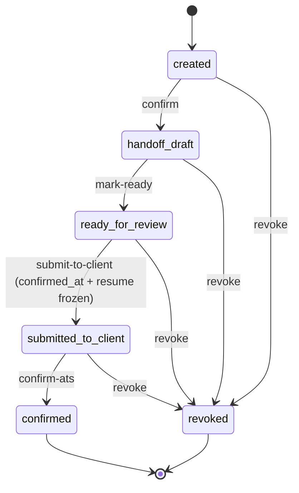
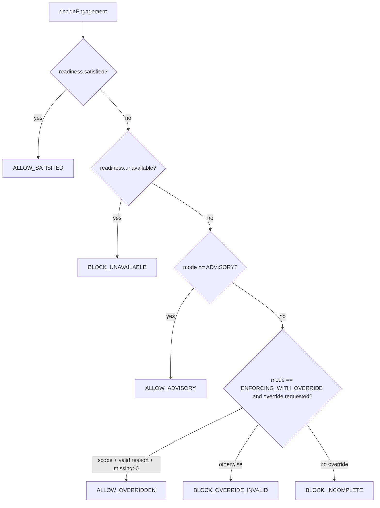

# D08 — Submittal, Engagement & Client Policy (AS-BUILT)
> Baseline SHA 12330b0f5049c97f01022df0b190035933345212 · category AS-BUILT

## Summary

D08 is the workflow spine that carries a Talent from a draft submittal record to an authoritative "submitted to client" fact, gated by a layered policy stack. It spans six libs and five apps/api composition modules.

- **Submittal lifecycle** (`libs/submittal`) owns the `TalentSubmittalRecord` entity, a canonical 6-value state tuple with an 8-transition guard, an append-only `TalentSubmittalEvent` log, and a per-module `OutboxEvent`.
- **Two write authorities were RE-POINTED into `apps/api`**: create (`CreateSubmittalController`, deriving the pipeline link server-side) and send (`SubmitTalentController` → `SubmitTalentToClientService`, the single cross-schema atomic transaction). The in-lib `SubmittalController` retains confirm / mark-ready / confirm-ats / revoke / get / discovery handlers.
- **Submittal eligibility** (`libs/submittal-eligibility`) is a pure, connection-agnostic decision port (`evaluateEligibility`) plus the serialized slot consumer (`consumeSlot`) and the unified readiness authority (`evaluateSubmittalReadiness`) that the FE preflight and the submit mutation share by construction.
- **Engagement** (`libs/engagement`) is a provider-neutral policy domain: a pure decision function (`decideEngagement`) over ADVISORY / ENFORCING / ENFORCING_WITH_OVERRIDE modes, a layered TENANT→CLIENT→REQUISITION merge, and a composition-root gate (`EngagementGateService`) that writes append-only decision provenance.
- **Client Submittal Policy** (`libs/client-submittal-policy`) is a second layered-policy domain built on the generic policy-engine/policy-store; its `mergeLayers` enforces a non-relaxable TENANT FLOOR and compiles to a generic `PolicyPackage` for the decision.
- **Client Talent Restriction** (`libs/client-talent-restriction`) records source-attributed bars via a URL-shape-enforced nested route; the submit transaction reads it as one of the eligibility gates.

The submit-to-client order is single-sourced: submittal state machine → pipeline-link verdict → requisition-open → resume-selection → eligibility (window → restriction → engagement → RTR) → client-submittal policy → serialized slot consumption → authoritative write. Any failure rolls back the whole transaction.

## Modules & Services

| name | role | evidence path:line + symbol |
|---|---|---|
| `SubmittalController` | In-lib confirm / mark-ready / confirm-ats / revoke / get / discovery handlers under `v1/submittals` | `libs/submittal/src/lib/submittal.controller.ts:68` `@Controller('v1/submittals')` |
| `SubmittalRepository` | Write path for `TalentSubmittalRecord`; orchestrates evidence-package build; 5 state-changing methods + board read | `libs/submittal/src/lib/submittal.repository.ts:171` `class SubmittalRepository` |
| `canTransition` | Application-layer 8-transition state guard (defense-in-depth atop DB trigger) | `libs/submittal/src/lib/submittal-state.ts:54` `function canTransition` |
| `TalentSubmittalEventRepository` | Append-only event log surface | `libs/submittal/src/lib/talent-submittal-event.repository.ts:1` |
| `CreateSubmittalController` | Re-pointed authoritative `POST /v1/submittals` (recruiter + idempotency) | `apps/api/src/create-submittal/create-submittal.controller.ts:43` |
| `CreateSubmittalOrchestrator` | Derives the sole live pipeline episode server-side, then calls `createSubmittal` | `apps/api/src/create-submittal/create-submittal.service.ts:30` |
| `SubmitTalentController` | Re-pointed `submit-to-client` (+ `submit-to-ats` compat alias) | `apps/api/src/submit-talent/submit-talent.controller.ts:57` |
| `SubmitTalentToClientService` | The single cross-schema atomic submit transaction | `apps/api/src/submit-talent/submit-talent.service.ts:132` |
| `SubmittalWorkspaceController` | `GET /v1/submittals/{id}/workspace` composed read | `apps/api/src/submittal-workspace/submittal-workspace.controller.ts:30` |
| `evaluateEligibility` | Pure authoritative eligibility decision (window→restriction→engagement→RTR) | `libs/submittal-eligibility/src/lib/submittal-eligibility.port.ts:163` |
| `consumeSlot` | Serialized `FOR UPDATE` slot consumer (write-skew-proof) | `libs/submittal-eligibility/src/lib/submittal-consumption.ts:43` |
| `evaluateSubmittalReadiness` | Unified readiness authority shared by FE preflight + submit | `libs/submittal-eligibility/src/lib/submittal-readiness.ts:248` |
| `pipelineLinkVerdict` / `isRequisitionSubmittable` | Shared structural predicates the submit command re-uses | `libs/submittal-eligibility/src/lib/submittal-readiness.ts:190`, `:180` |
| `decideEngagement` | Pure engagement decision over enforcement mode × readiness × override | `libs/engagement/src/lib/domain/engagement-decision.ts:70` |
| `EngagementPolicyService` | Publish + layered TENANT→CLIENT→REQUISITION merge + effective resolution | `libs/engagement/src/lib/engagement-policy.service.ts:143` |
| `EngagementGateService` | Composition-root gate: resolve + evidence + decide + append-only provenance | `apps/api/src/engagement/engagement-gate.service.ts:60` |
| `EngagementController` | Admin publish/read + recruiter readiness under `v1/engagement` | `apps/api/src/engagement/engagement.controller.ts:26` |
| `ClientSubmittalPolicyService` | Layered merge with FLOOR enforcement; compiles to generic `PolicyPackage` | `libs/client-submittal-policy/src/lib/client-submittal-policy.service.ts:129` |
| `ClientSubmittalPolicyController` | Admin authoring/read under `v1/client-submittal-policy` | `apps/api/src/client-submittal-policy/client-submittal-policy.controller.ts:20` |
| `ClientTalentRestrictionController` | Nested-route record/current/history/close | `libs/client-talent-restriction/src/lib/client-talent-restriction.controller.ts:50` |
| `ClientTalentRestrictionRepository` | Source-attributed restriction persistence + active-set reads | `libs/client-talent-restriction/src/lib/client-talent-restriction.repository.ts:119` |

## Data Models

| model | owner schema | evidence path:line |
|---|---|---|
| `TalentSubmittalRecord` | `submittal` | `libs/submittal/prisma/schema.prisma:122` |
| `SubmittalState` enum (`created`, `handoff_draft`, `ready_for_review`, `submitted_to_client`, `confirmed`, `revoked`) | `submittal` | `libs/submittal/prisma/schema.prisma:76` |
| `SubmittalDeliveryChannel` enum (manual_vms / manual_client_portal / manual_email / manual_other / aramo_connector) | `submittal` | `libs/submittal/prisma/schema.prisma:95` |
| `TalentSubmittalEvent` (append-only, intra-schema FK) | `submittal` | `libs/submittal/prisma/schema.prisma:285` |
| `OutboxEvent` | `submittal` | `libs/submittal/prisma/schema.prisma:245` |
| `ClientTalentRestriction` | `client_talent_restriction` | `libs/client-talent-restriction/prisma/schema.prisma` |

`pipeline_id` (nullable cross-schema ref) `:151` and the FROZEN `resume_edition_id` snapshot `:159` live on `TalentSubmittalRecord`. The SW-2 immutable submit provenance columns (`submitted_at`, `submitted_by_actor_id`, `delivery_channel`, `submitted_bill_rate`, `submitted_rate_currency`, `submitted_rate_period`, `external_reference`, `external_submitted_at`) are pinned once at the send transition `:188`. **Engagement and Client-Submittal-Policy own NO prisma schema** — both persist through `@aramo/policy-store` (`StoredPolicyVersion` + `PolicyDecisionRecord`).

## API Endpoints

| method | route | scope / posture | evidence path:line |
|---|---|---|---|
| POST | `/v1/submittals` | `submittal:create` + recruiter | `apps/api/src/create-submittal/create-submittal.controller.ts:49` |
| GET | `/v1/submittals?talent_id=&job_id=` | `submittal:create` + recruiter | `libs/submittal/src/lib/submittal.controller.ts:296` |
| GET | `/v1/submittals/{id}` | recruiter | `libs/submittal/src/lib/submittal.controller.ts:332` |
| GET | `/v1/submittals/{id}/evidence-package` | recruiter | `libs/submittal/src/lib/submittal.controller.ts:378` |
| POST | `/v1/submittals/{id}/confirm` | `submittal:approve` | `libs/submittal/src/lib/submittal.controller.ts:177` |
| POST | `/v1/submittals/{id}/mark-ready` | `submittal:approve` | `libs/submittal/src/lib/submittal.controller.ts:602` |
| POST | `/v1/submittals/{id}/confirm-ats` | `submittal:approve` | `libs/submittal/src/lib/submittal.controller.ts:670` |
| POST | `/v1/submittals/{id}/revoke` | `submittal:approve` | `libs/submittal/src/lib/submittal.controller.ts:494` |
| POST | `/v1/submittals/{id}/submit-to-client` | `submittal:approve` + recruiter | `apps/api/src/submit-talent/submit-talent.controller.ts:68` |
| POST | `/v1/submittals/{id}/submit-to-ats` | `submittal:approve` (compat alias) | `apps/api/src/submit-talent/submit-talent.controller.ts:84` |
| GET | `/v1/submittals/{id}/workspace` | composed read | `apps/api/src/submittal-workspace/submittal-workspace.controller.ts:36` |
| GET | `/v1/engagement/capabilities` | `engagement:policy:read` | `apps/api/src/engagement/engagement.controller.ts:38` |
| GET | `/v1/engagement/policy/effective` | `engagement:policy:read` | `apps/api/src/engagement/engagement.controller.ts:52` |
| GET | `/v1/engagement/policy/layers` | `engagement:policy:read` | `apps/api/src/engagement/engagement.controller.ts:77` |
| GET | `/v1/engagement/policy/history` | `engagement:policy:read` | `apps/api/src/engagement/engagement.controller.ts:95` |
| POST | `/v1/engagement/policy` | `engagement:policy:write` | `apps/api/src/engagement/engagement.controller.ts:152` |
| GET | `/v1/engagement/readiness` | `pipeline:read` | `apps/api/src/engagement/engagement.controller.ts:212` |
| GET | `/v1/client-submittal-policy/effective` | `client-submittal-policy:read` | `apps/api/src/client-submittal-policy/client-submittal-policy.controller.ts:31` |
| GET | `/v1/client-submittal-policy/layers` | `client-submittal-policy:read` | `apps/api/src/client-submittal-policy/client-submittal-policy.controller.ts:53` |
| GET | `/v1/client-submittal-policy/history` | `client-submittal-policy:read` | `apps/api/src/client-submittal-policy/client-submittal-policy.controller.ts:74` |
| POST | `/v1/client-submittal-policy` | `client-submittal-policy:write` | `apps/api/src/client-submittal-policy/client-submittal-policy.controller.ts:137` |
| POST | `/v1/clients/{client_company_id}/talent/{talent_record_id}/restrictions` | recruiter | `libs/client-talent-restriction/src/lib/client-talent-restriction.controller.ts:60` |
| GET | `.../restrictions/current` | recruiter | `libs/client-talent-restriction/src/lib/client-talent-restriction.controller.ts:134` |
| GET | `.../restrictions/history` | recruiter | `libs/client-talent-restriction/src/lib/client-talent-restriction.controller.ts:157` |
| POST | `.../restrictions/{restriction_id}/close` | recruiter | `libs/client-talent-restriction/src/lib/client-talent-restriction.controller.ts:178` |

The engagement publish body is a `channel`-discriminated union mapped to concrete `VoiceRequirementDto` / `EmailRequirementDto` sub-DTOs via class-transformer `discriminator` (`apps/api/src/engagement/dto/engagement.dto.ts:49`) — the fix for the `@Type(() => Object)` + `forbidNonWhitelisted` 400 trap.

## Screens & FE→BE Wiring (ats-web)

| FE file | BE route(s) consumed |
|---|---|
| `apps/ats-web/src/submittals/SubmittalWizard.tsx` + `submittals-api.ts` | `POST /v1/submittals`, confirm, mark-ready, confirm-ats, revoke, GET by id |
| `apps/ats-web/src/submittal-workspace/SubmittalWorkspaceView.tsx` + `submittal-workspace-api.ts` | `GET /v1/submittals/{id}/workspace`, `submit-to-client` |
| `apps/ats-web/src/submittal-workspace/RecordSubmittalDialog.tsx` | `POST .../submit-to-client` |
| `apps/ats-web/src/engagement/EngagementPolicyPanel.tsx` + `engagement-policy-api.ts` | `GET/POST /v1/engagement/policy*` |
| `apps/ats-web/src/engagement/EngagementReadinessSummary.tsx` + `engagement-api.ts` | `GET /v1/engagement/readiness` |
| `apps/ats-web/src/engagement/EngagementOverridePrompt.tsx` | override reason passed into `submit-to-client` body |

No FE domain folder was found for `client-submittal-policy` authoring or `client-talent-restriction` (NOT VERIFIED beyond a filename scan).

## Key Flows

### Submit-Talent-to-Client orchestration (submittal → engagement → policy)

```mermaid
sequenceDiagram
    participant FE as ats-web
    participant C as SubmitTalentController
    participant S as SubmitTalentToClientService (1 tx)
    participant SM as canTransition (@aramo/submittal)
    participant EL as evaluateEligibility
    participant EG as EngagementGateService
    participant CP as ClientSubmittalPolicyService
    participant DB as Postgres (cross-schema)

    FE->>C: POST /v1/submittals/{id}/submit-to-client (Idempotency-Key)
    C->>C: recruiter + Idempotency replay/conflict
    C->>S: submitToClient(input)
    S->>DB: SELECT ... FOR UPDATE submittal
    S->>SM: canTransitionSubmittal(state,'submitted_to_client')
    S->>DB: SELECT ... FOR UPDATE linked Pipeline
    S->>S: pipelineLinkVerdict (identity + live)
    S->>DB: read requisition status + bill rate (must be 'open')
    S->>DB: read current resume selection (must exist + ACTIVE)
    S->>EG: assess(...)  -->  writes PolicyDecisionRecord (own conn)
    S->>EL: evaluateEligibility(window→restriction→engagement→RTR)
    S->>CP: resolveEffective + decide (FLOOR; in-tx provenance)
    S->>DB: consumeSlot (FOR UPDATE, ON CONFLICT DO NOTHING)
    S->>DB: UPDATE state='submitted_to_client' + provenance + event + outbox + usage
    S-->>C: {submittal, event}
    C-->>FE: 200 {submittal, event}
```

### TalentSubmittalRecord lifecycle



### Engagement decision (pure)



## Evidence Index

- `libs/submittal/src/lib/submittal-state.ts:26` — `SUBMITTAL_STATE_VALUES` 6-value tuple
- `libs/submittal/src/lib/submittal-state.ts:54` — `canTransition` 8-transition matrix
- `libs/submittal/src/lib/submittal.controller.ts:68` — `@Controller('v1/submittals')`
- `libs/submittal/src/lib/submittal.controller.ts:177` — `confirmSubmittal` (ATTESTATION_MISSING 422 manual check `:208`)
- `libs/submittal/src/lib/submittal.controller.ts:296` — `findByTalentAndJob` discovery GET
- `libs/submittal/src/lib/submittal.controller.ts:332` — `getSubmittal`
- `libs/submittal/src/lib/submittal.controller.ts:378` — `getEvidencePackage`
- `libs/submittal/src/lib/submittal.controller.ts:494` — `revokeSubmittal`
- `libs/submittal/src/lib/submittal.controller.ts:602` — `markReady`
- `libs/submittal/src/lib/submittal.controller.ts:660` — stale comment asserting a repository `submitToAts` "remains"
- `libs/submittal/src/lib/submittal.controller.ts:670` — `confirmAts`
- `libs/submittal/src/lib/submittal.repository.ts:193` — `createSubmittal` (builds evidence package `:211`)
- `libs/submittal/src/lib/submittal.repository.ts:356` — `repointTalentRecordRefs` (SET LOCAL app.reconcile)
- `libs/submittal/src/lib/submittal.repository.ts:408` — `confirmSubmittal` 8-step enforcement
- `libs/submittal/src/lib/submittal.repository.ts:701` — `markReady`
- `libs/submittal/src/lib/submittal.repository.ts:806` — `confirmAts`
- `libs/submittal/src/lib/submittal.repository.ts:919` — `revokeSubmittal`
- `libs/submittal/src/lib/submittal.repository.ts:1043` — `listByRequisitionForBoard`
- `libs/submittal/prisma/schema.prisma:76` — `SubmittalState` enum
- `libs/submittal/prisma/schema.prisma:122` — `TalentSubmittalRecord`
- `libs/submittal/prisma/schema.prisma:151` — nullable `pipeline_id`
- `libs/submittal/prisma/schema.prisma:159` — frozen `resume_edition_id`
- `libs/submittal/prisma/schema.prisma:245` — `OutboxEvent`
- `libs/submittal/prisma/schema.prisma:285` — `TalentSubmittalEvent`
- `apps/api/src/create-submittal/create-submittal.controller.ts:43` — `CreateSubmittalController`
- `apps/api/src/create-submittal/create-submittal.controller.ts:49` — `@Post` create (201)
- `apps/api/src/create-submittal/create-submittal.service.ts:30` — `CreateSubmittalOrchestrator`
- `apps/api/src/create-submittal/create-submittal.service.ts:45` — `findLiveEpisode`
- `apps/api/src/create-submittal/create-submittal.service.ts:54` — `SUBMITTAL_NO_LIVE_PIPELINE_EPISODE` refusal
- `apps/api/src/submit-talent/submit-talent.controller.ts:57` — `SubmitTalentController`
- `apps/api/src/submit-talent/submit-talent.controller.ts:68` — `submit-to-client`
- `apps/api/src/submit-talent/submit-talent.controller.ts:84` — `submit-to-ats` compat alias
- `apps/api/src/submit-talent/submit-talent.service.ts:132` — `SubmitTalentToClientService`
- `apps/api/src/submit-talent/submit-talent.service.ts:147` — `submitToClient` (one interactive tx)
- `apps/api/src/submit-talent/submit-talent.service.ts:199` — `pipelineLinkVerdict` call
- `apps/api/src/submit-talent/submit-talent.service.ts:278` — `isRequisitionSubmittable` gate
- `apps/api/src/submit-talent/submit-talent.service.ts:367` — `engagementGate.assess`
- `apps/api/src/submit-talent/submit-talent.service.ts:386` — `evaluateEligibility`
- `apps/api/src/submit-talent/submit-talent.service.ts:405` — `clientSubmittalPolicy.resolveEffective`
- `apps/api/src/submit-talent/submit-talent.service.ts:441` — `insertPolicyDecisionRecordInTx`
- `apps/api/src/submit-talent/submit-talent.service.ts:471` — `consumeSlot`
- `apps/api/src/submit-talent/submit-talent.service.ts:522` — authoritative `UPDATE state='submitted_to_client'`
- `apps/api/src/submit-talent/submit-talent.service.ts:641` — `isRestrictedAtClient` raw read
- `libs/submittal-eligibility/src/lib/submittal-eligibility.port.ts:25` — `EligibilityDenyCode`
- `libs/submittal-eligibility/src/lib/submittal-eligibility.port.ts:131` — `deriveWindowStatus`
- `libs/submittal-eligibility/src/lib/submittal-eligibility.port.ts:163` — `evaluateEligibility`
- `libs/submittal-eligibility/src/lib/submittal-consumption.ts:43` — `consumeSlot`
- `libs/submittal-eligibility/src/lib/submittal-readiness.ts:63` — `deriveSubmittalReadiness`
- `libs/submittal-eligibility/src/lib/submittal-readiness.ts:180` — `isRequisitionSubmittable`
- `libs/submittal-eligibility/src/lib/submittal-readiness.ts:190` — `pipelineLinkVerdict`
- `libs/submittal-eligibility/src/lib/submittal-readiness.ts:248` — `evaluateSubmittalReadiness`
- `libs/engagement/src/lib/domain/engagement-decision.ts:15` — `EngagementDecisionOutcome`
- `libs/engagement/src/lib/domain/engagement-decision.ts:70` — `decideEngagement`
- `libs/engagement/src/lib/engagement-policy.service.ts:143` — `EngagementPolicyService`
- `libs/engagement/src/lib/engagement-policy.service.ts:149` — `publish` (validate + activation guard)
- `libs/engagement/src/lib/engagement-policy.service.ts:207` — `mergeLayers`
- `libs/engagement/src/lib/engagement-policy.service.ts:252` — `resolveEffective`
- `apps/api/src/engagement/engagement.controller.ts:26` — `EngagementController`
- `apps/api/src/engagement/engagement.controller.ts:38` — `capabilities`
- `apps/api/src/engagement/engagement.controller.ts:52` — `effective`
- `apps/api/src/engagement/engagement.controller.ts:77` — `layers`
- `apps/api/src/engagement/engagement.controller.ts:95` — `history`
- `apps/api/src/engagement/engagement.controller.ts:152` — `publish`
- `apps/api/src/engagement/engagement.controller.ts:212` — `readiness`
- `apps/api/src/engagement/engagement-gate.service.ts:60` — `EngagementGateService`
- `apps/api/src/engagement/engagement-gate.service.ts:73` — `assess`
- `apps/api/src/engagement/engagement-gate.service.ts:135` — `readReadiness`
- `apps/api/src/engagement/engagement-gate.service.ts:203` — `resolveApplicability`
- `apps/api/src/engagement/engagement-gate.service.ts:217` — `recordProvenance`
- `apps/api/src/engagement/dto/engagement.dto.ts:34` — `PublishEngagementPolicyRequestDto`
- `apps/api/src/engagement/dto/engagement.dto.ts:49` — `@Type(() => Object)` discriminator mapping
- `libs/client-submittal-policy/src/lib/client-submittal-policy.service.ts:129` — `ClientSubmittalPolicyService`
- `libs/client-submittal-policy/src/lib/client-submittal-policy.service.ts:162` — `mergeLayers` (FLOOR fail-closed)
- `libs/client-submittal-policy/src/lib/client-submittal-policy.service.ts:257` — `resolveEffective`
- `libs/client-submittal-policy/src/lib/client-submittal-policy.service.ts:369` — `decide` (generic engine)
- `libs/client-submittal-policy/src/lib/client-submittal-policy.service.ts:398` — `publish` (early FLOOR guard)
- `apps/api/src/client-submittal-policy/client-submittal-policy.controller.ts:20` — `ClientSubmittalPolicyController`
- `apps/api/src/client-submittal-policy/client-submittal-policy.controller.ts:31` — `effective`
- `apps/api/src/client-submittal-policy/client-submittal-policy.controller.ts:53` — `layers`
- `apps/api/src/client-submittal-policy/client-submittal-policy.controller.ts:74` — `history`
- `apps/api/src/client-submittal-policy/client-submittal-policy.controller.ts:137` — `publish`
- `libs/client-talent-restriction/src/lib/client-talent-restriction.controller.ts:48` — nested `@Controller` route (URL-as-enforcement)
- `libs/client-talent-restriction/src/lib/client-talent-restriction.controller.ts:60` — `record`
- `libs/client-talent-restriction/src/lib/client-talent-restriction.controller.ts:134` — `current`
- `libs/client-talent-restriction/src/lib/client-talent-restriction.controller.ts:157` — `history`
- `libs/client-talent-restriction/src/lib/client-talent-restriction.controller.ts:178` — `close`
- `libs/client-talent-restriction/src/lib/client-talent-restriction.repository.ts:119` — `recordRestriction`
- `libs/client-talent-restriction/src/lib/client-talent-restriction.repository.ts:192` — `closeRestriction`
- `libs/client-talent-restriction/src/lib/client-talent-restriction.repository.ts:282` — `findCurrentForClientTalent`
- `libs/client-talent-restriction/src/lib/client-talent-restriction.repository.ts:309` — `findActiveRestrictedTalentIds`
- `libs/client-talent-restriction/src/lib/client-talent-restriction.repository.ts:336` — `findHistoryForClientTalent`
- `apps/api/src/submittal-workspace/submittal-workspace.controller.ts:30` — workspace `@Controller('v1/submittals')`
- `apps/api/src/submittal-workspace/submittal-workspace.controller.ts:36` — `GET :submittal_id/workspace`
- `apps/api/src/submittal-workspace/submittal-workspace.service.ts:1` — SW-4 read composition (reuses `evaluateSubmittalReadiness`)
- `libs/common/src/lib/errors/error-codes.ts:638` — engagement deny codes (POLICY_MISSING / INCOMPLETE / EVIDENCE_UNAVAILABLE)
- `libs/common/src/lib/errors/error-codes.ts:668` — `SUBMITTAL_PIPELINE_LINK_INVALID`
- `libs/common/src/lib/errors/error-codes.ts:675` — `SUBMITTAL_NO_LIVE_PIPELINE_EPISODE`
- `libs/identity/src/lib/dto/scope.dto.ts:38` — `submittal:create` / `submittal:approve`
- `libs/identity/src/lib/dto/scope.dto.ts:402` — `engagement:policy:*`
- `libs/identity/src/lib/dto/scope.dto.ts:413` — `client-submittal-policy:*`
- `openapi/ats.yaml:813` — `/v1/submittals` path documented
- `openapi/ats.yaml:5234` — `/v1/engagement/capabilities` path documented

## NOT VERIFIED (explicit)

- No FE domain folder for `client-submittal-policy` authoring or `client-talent-restriction` recording was located; whether an admin UI consumes these routes is NOT VERIFIED.
- The `TalentSubmittalEventRepository` surface and the `client-talent-restriction` schema field set were enumerated by directory + signature scan, not line-by-line read.
- Runtime behaviour (actual transaction rollback, idempotency replay, FLOOR rejection) was read from source only; no test or runtime execution was performed in this read-only audit.
- Exact OpenAPI documentation status for `/v1/engagement/policy/layers`, `/v1/engagement/policy/history`, all `/v1/client-submittal-policy/*`, and all `.../restrictions` routes: see the gap fragment (grep-confirmed absent from `openapi/ats.yaml`).
