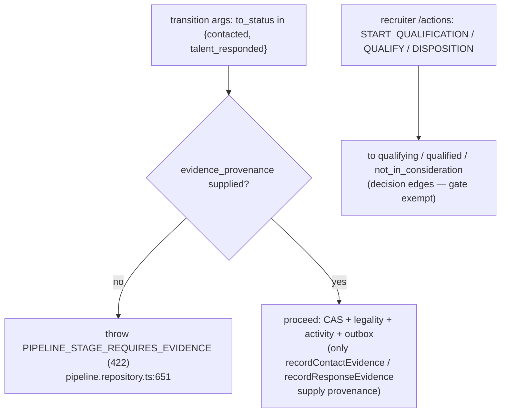

# D09 — Communications, Activity & Recruiting Evidence (AS-BUILT)
> Baseline SHA 12330b0f5049c97f01022df0b190035933345212 · category AS-BUILT

## Summary

D09 spans four domain libraries — `communications`, `activity`, `contact`,
`calendar` — plus the apps/api composition-root orchestration that wires durable
communication evidence to the Pipeline recruiting journey.

The load-bearing workflow is the **Recruiting-Journey Evidence-Governed
Milestones** gate. Two Pipeline stages, `contacted` and `talent_responded`, are
declared EVIDENCE-backed (`libs/pipeline/src/lib/pipeline-state.ts:90`,
`EVIDENCE_BACKED_STAGES`). A transition INTO either stage without an
`evidence_provenance` reference is refused in the Pipeline domain authority with
`PIPELINE_STAGE_REQUIRES_EVIDENCE` (HTTP 422)
(`libs/pipeline/src/lib/pipeline.repository.ts:651`). The generic `/transition`
and recruiter `/actions` surfaces never supply provenance, so a naked stage click
into these milestones is rejected server-side — not merely hidden in the FE.
These milestones are reachable only through the evidence-bearing commands
`recordContactEvidence` → `contacted`
(`libs/pipeline/src/lib/pipeline.repository.ts:935`) and `recordResponseEvidence`
→ `talent_responded` (`libs/pipeline/src/lib/pipeline.repository.ts:961`), each a
thin wrapper over `transition()` that supplies the provenance. The recruiter
DECISION edges `qualifying` / `qualified` remain nakedly invocable
(`libs/pipeline/src/lib/pipeline-state.ts:220`, `RECRUITER_ACTION_TO_STATUS`).

`CommunicationInteraction` is the communication system-of-record
(`libs/communications/prisma/schema.prisma:169`; ADR-0031 §3.1). A stored
`evidence_authority` column
(`libs/communications/prisma/schema.prisma:182`) distinguishes
`provider_verified` from `recruiter_attested`
(`libs/communications/src/lib/domain/communication-enums.ts:43`), so a
recruiter-attested off-platform response can never be read as a provider-verified
two-way call.

Five producers ground the milestones on durable evidence, all through the same
evidence-bearing commands: (1) the recruiter attests a response via
`POST /v1/communications/talent-responses`
(`apps/api/src/communications/talent-response.controller.ts:31`), which writes an
attested interaction then advances via `reconcileForward`
(`apps/api/src/communications/talent-response.service.ts:122`); (2) an accepted
recruiter email advances `no_contact → contacted` as a best-effort side effect via
`recordContactEvidence` (`apps/api/src/microsoft/microsoft-email.service.ts:262`);
(3) a two-way Zoom voice webhook advances to `talent_responded` via
`reconcileForward` (`apps/api/src/communications/zoom-webhook.service.ts:275`);
(4) an outbound voice call (COMM-C2A / §6) advances `no_contact → contacted` as a
best-effort side effect via `recordContactEvidence`
(`apps/api/src/communications/communication-call.service.ts:295`); and (5) the
provider-observation orchestrator advances an evidence-backed milestone through
`reconcileForward` carrying provider-verified provenance
(`apps/api/src/pipeline-integration/pipeline-provider-observation.orchestrator.ts:124`).
The backend-owned
`recruiting_available_actions` field
(`apps/api/src/talent-journey/talent-journey-read.service.ts:337`) tells the FE
which single next action is available per milestone; the FE never derives it from
stage equality.

## Modules & Services

| name | role | evidence path:line + symbol |
|------|------|------------------------------|
| `communications` lib | CommunicationInteraction SoR, associations, dispositions, provider-event inbox, email templates | `libs/communications/src/lib/communications.module.ts:17` providers |
| `CommunicationsRepository` | Attested-response write, outbound-contact lookup, interaction/association/disposition persistence | `libs/communications/src/lib/communications.repository.ts:138` `recordAttestedResponse` |
| `activity` lib | Activity timeline SoR + RN-1 append-only ActivityNoteEvent ledger | `libs/activity/src/lib/activity.module.ts` ; `libs/activity/src/lib/activity.repository.ts:162` `activityNoteEvent.create` |
| `contact` lib | Contact records (party contact points), trigram search | `libs/contact/src/lib/contact.controller.ts:38` `@Controller('v1/contacts')` |
| `calendar` lib | CalendarEvent records | `libs/calendar/src/lib/calendar.controller.ts:46` `@Controller('v1/calendar-events')` |
| `PipelineRepository` (pipeline lib) | Evidence gate + evidence-bearing commands + forward reconciler | `libs/pipeline/src/lib/pipeline.repository.ts:651` evidence gate |
| `TalentResponseService` (apps/api) | Composition-root orchestration: attested evidence write → milestone advance | `apps/api/src/communications/talent-response.service.ts:22` |
| `maybeAdvanceToContacted` (apps/api microsoft) | Email-accept → `contacted` best-effort orchestration | `apps/api/src/microsoft/microsoft-email.service.ts:243` |
| `ZoomWebhookService.maybeAdvanceResponded` (apps/api) | Two-way voice → `talent_responded` orchestration | `apps/api/src/communications/zoom-webhook.service.ts:271` |
| `CommunicationCallService.maybeAdvanceToContacted` (apps/api) | Outbound voice call (COMM-C2A) → `contacted` best-effort orchestration | `apps/api/src/communications/communication-call.service.ts:295` `recordContactEvidence` |
| `PipelineProviderObservationOrchestrator` (apps/api) | Provider-verified observation → evidence-backed milestone via `reconcileForward` | `apps/api/src/pipeline-integration/pipeline-provider-observation.orchestrator.ts:124` |
| `TalentJourneyReadService` (apps/api) | GET-only journey read-composer; owns `recruiting_available_actions` | `apps/api/src/talent-journey/talent-journey-read.service.ts:350` `deriveRecruitingAvailableActions` |

## Data Models

| model | lib | evidence path:line |
|-------|-----|--------------------|
| `CommunicationInteraction` | communications | `libs/communications/prisma/schema.prisma:169` |
| `CommunicationAssociation` | communications | `libs/communications/prisma/schema.prisma:253` |
| `CommunicationDisposition` | communications | `libs/communications/prisma/schema.prisma:274` |
| `CommunicationProviderEvent` | communications | `libs/communications/prisma/schema.prisma:295` |
| `CommunicationProviderIdentity` | communications | `libs/communications/prisma/schema.prisma:326` |
| `EmailTemplate` | communications | `libs/communications/prisma/schema.prisma:377` |
| `Activity` | activity | `libs/activity/prisma/schema.prisma:98` |
| `ActivityNote` | activity | `libs/activity/prisma/schema.prisma:156` |
| `ActivityNoteEvent` (append-only ledger) | activity | `libs/activity/prisma/schema.prisma:183` |
| `Contact` | contact | `libs/contact/prisma/schema.prisma:31` |
| `CalendarEvent` | calendar | `libs/calendar/prisma/schema.prisma:54` |

Key column facts: `evidence_authority` defaults `provider_verified`
(`libs/communications/prisma/schema.prisma:182`); `integration_connection_id` is
NULLABLE (NULL only for recruiter-attested) on the interaction model
(`libs/communications/prisma/schema.prisma:189`); `idempotency_key` is nullable,
with a (tenant_id, idempotency_key) dedup constraint
(`libs/communications/prisma/schema.prisma:207`). The attested-evidence substrate
was added by migration
`libs/communications/prisma/migrations/20261006160000_recruiting_journey_attested_response_evidence/migration.sql:11`
(new `CommunicationEvidenceAuthority` enum, `recorded` status, `other` channel).

## API Endpoints

| method | route | scopes | evidence path:line |
|--------|-------|--------|--------------------|
| POST | `/v1/communications/talent-responses` | `pipeline:change-status` | `apps/api/src/communications/talent-response.controller.ts:31` / `:33` |
| GET | `/v1/pipelines/:id/journey` | `pipeline:read` | `apps/api/src/talent-journey/talent-journey.controller.ts:23` / `:25` |
| POST | `/v1/communications/calls` | `communication:voice:call` | `apps/api/src/communications/communications.controller.ts:50` / `:52` |
| GET | `/v1/communications/capabilities` | `communication:read` | `apps/api/src/communications/communications.controller.ts:102` / `:104` |
| GET | `/v1/communications/voice-evidence` | `communication:read` | `apps/api/src/communications/communications.controller.ts:207` / `:209` |
| GET | `/v1/communications/interactions/:interactionId` | `communication:read` | `apps/api/src/communications/communications.controller.ts:225` / `:227` |
| POST | `/v1/communications/interactions/:interactionId/disposition` | `communication:disposition:write` | `apps/api/src/communications/communications.controller.ts:248` / `:250` |
| POST | `/v1/communications/interactions/:interactionId/provider-reference` | `communication:voice:call` | `apps/api/src/communications/communications.controller.ts:264` / `:266` |
| GET | `/v1/talents/:talentId/communications` | `communication:read` | `apps/api/src/communications/talent-communications.controller.ts:24` / `:26` |
| GET/POST/PATCH | `/v1/communications/email-templates` (list/get/create/patch/deactivate/preview) | `communication:template:read` / `:manage` | `apps/api/src/communications/email-template.controller.ts:33` |
| POST | `/v1/communications/email-drafts/general-contact` | `communication:email:send` | `apps/api/src/communications/general-talent-contact-draft.controller.ts:27` / `:29` |
| POST | `/v1/communications/email-drafts/requisition-contact` | `communication:email:send` | `apps/api/src/communications/requisition-contact-draft.controller.ts:27` / `:29` |
| POST | `/v1/webhooks/communications/zoom` | (webhook; signature-verified, no scope guard) | `apps/api/src/communications/zoom-webhook.controller.ts:29` / `:33` |
| GET/GET/POST/PATCH/DELETE | `/v1/activities` (+ `/:id`, `/:id/pin`, `/:id/unpin`, `/:id/redact`) | `activity:read` / `activity:create` | `libs/activity/src/lib/activity.controller.ts:43` |
| GET/POST/PATCH/DELETE | `/v1/calendar-events` | `calendar:event-edit` / `-create` / `-delete` | `libs/calendar/src/lib/calendar.controller.ts:46` |
| GET/POST/PATCH/DELETE | `/v1/contacts` | `contact:read` / `:create` / `:edit` / `:delete` | `libs/contact/src/lib/contact.controller.ts:38` |

## Screens & FE→BE Wiring (ats-web only)

- `apps/ats-web/src/communications/talent-response-api.ts` — `recordTalentResponse`
  posts to `/v1/communications/talent-responses` with an `Idempotency-Key` header;
  maps the FE `phone` channel tile to the backend `voice` channel
  (`apps/ats-web/src/communications/talent-response-api.ts` `CHANNEL_TO_BACKEND`).
  The FE never sets Pipeline stage.
- `apps/ats-web/src/communications/RecordTalentResponseModal.tsx:116` — routes both
  HTTP 400 and 422 to an inline field message on `occurred_at` (surfacing the
  server's specific §-rule reason) rather than the generic banner; 409 is handled
  separately for the "journey changed" stale-CAS path.
- `apps/ats-web/src/requisitions/TalentJourneySection.tsx:171` — reads the
  backend-owned `recruiting_available_actions` (never stage equality) and maps the
  single available action to a CTA: `contact_talent` / `record_talent_response`
  open a real business surface; `start_qualifying` / `mark_qualified` dispatch a
  governed decision transition (`TalentJourneySection.tsx:176`).
- `apps/ats-web/src/pipeline/talent-journey-api.ts` — the GET
  `/v1/pipelines/:id/journey` read client; mirrors the apps/api
  `TalentRequisitionJourney` contract and consumes the composed stages as the
  single stage source.

## Key Flows

Evidence-gated milestone recording (recruiter-attested response path):

```mermaid
sequenceDiagram
    actor Recruiter
    participant FE as ats-web RecordTalentResponseModal
    participant Ctl as TalentResponseController
    participant Svc as TalentResponseService
    participant Comm as CommunicationsRepository
    participant Pipe as PipelineRepository

    Recruiter->>FE: submit response (channel, occurred_at, note)
    FE->>Ctl: POST /v1/communications/talent-responses (Idempotency-Key)
    Ctl->>Ctl: require Idempotency-Key else 422 VALIDATION_ERROR
    Ctl->>Svc: recordResponse(auth, pipelineId, channel, occurredAt, note)
    Svc->>Pipe: findByIdForActor (visibility-scoped)
    alt pipeline absent / not visible
        Pipe-->>Svc: null
        Svc-->>Ctl: 404 NOT_FOUND (concealed)
    end
    Svc->>Svc: validate channel=other needs note; occurred_at not future
    Svc->>Comm: findFirstOutboundContactInstant(talent, requisition)
    Svc->>Svc: 422 if occurred_at precedes first contact
    Svc->>Comm: recordAttestedResponse (interaction + associations + disposition, 1 tx)
    Comm-->>Svc: { interaction_id, deduped }
    Svc->>Pipe: reconcileForward(target=talent_responded, evidence=communication_interaction:id)
    Pipe->>Pipe: EVIDENCE GATE passes (provenance supplied); CAS-guarded hops
    Pipe-->>Svc: advanced PipelineView
    Svc-->>Ctl: { interaction_id, deduped, pipeline }
    Ctl-->>FE: { interaction_id, deduped, pipeline_stage, pipeline_version }
```

Evidence gate refusal on a naked transition (generic surfaces):



## Evidence Index (load-bearing path:line citations)

- `libs/pipeline/src/lib/pipeline-state.ts:90` — `EVIDENCE_BACKED_STAGES`
- `libs/pipeline/src/lib/pipeline-state.ts:96` — `isEvidenceBackedStage`
- `libs/pipeline/src/lib/pipeline-state.ts:120` — `contacted` legal transitions
- `libs/pipeline/src/lib/pipeline-state.ts:128` — `talent_responded` legal transitions
- `libs/pipeline/src/lib/pipeline-state.ts:220` — `RECRUITER_ACTION_TO_STATUS` (CONTACT/MARK_RESPONDED retired)
- `libs/pipeline/src/lib/pipeline.repository.ts:651` — evidence gate throw `PIPELINE_STAGE_REQUIRES_EVIDENCE`
- `libs/pipeline/src/lib/pipeline.repository.ts:935` — `recordContactEvidence`
- `libs/pipeline/src/lib/pipeline.repository.ts:961` — `recordResponseEvidence`
- `libs/pipeline/src/lib/pipeline.repository.ts:993` — `reconcileForward`
- `libs/common/src/lib/errors/error-codes.ts:829` — `PIPELINE_STAGE_REQUIRES_EVIDENCE` code registration
- `libs/common/src/lib/errors/aramo-error.ts:249` — `PIPELINE_STAGE_REQUIRES_EVIDENCE: 422` status mapping
- `apps/api/src/communications/talent-response.controller.ts:31` — `POST talent-responses`
- `apps/api/src/communications/talent-response.controller.ts:33` — `@RequireScopes('pipeline:change-status')`
- `apps/api/src/communications/talent-response.service.ts:102` — `recordAttestedResponse` call
- `apps/api/src/communications/talent-response.service.ts:122` — `reconcileForward` to `talent_responded`
- `libs/communications/src/lib/communications.repository.ts:138` — `recordAttestedResponse`
- `libs/communications/src/lib/communications.repository.ts:225` — `findFirstOutboundContactInstant`
- `apps/api/src/microsoft/microsoft-email.service.ts:243` — `maybeAdvanceToContacted`
- `apps/api/src/microsoft/microsoft-email.service.ts:262` — `recordContactEvidence` call on email accept
- `apps/api/src/communications/zoom-webhook.service.ts:271` — `maybeAdvanceResponded`
- `apps/api/src/communications/zoom-webhook.service.ts:275` — `reconcileForward` call on two-way voice
- `apps/api/src/communications/communication-call.service.ts:295` — `recordContactEvidence` call on outbound voice call (COMM-C2A)
- `apps/api/src/pipeline-integration/pipeline-provider-observation.orchestrator.ts:124` — `reconcileForward` call on provider-verified observation
- `apps/api/src/communications/zoom-webhook.controller.ts:29` — `POST /v1/webhooks/communications/zoom`
- `apps/api/src/talent-journey/talent-journey-read.service.ts:337` — `recruiting_available_actions` emission
- `apps/api/src/talent-journey/talent-journey-read.service.ts:350` — `deriveRecruitingAvailableActions`
- `apps/api/src/talent-journey/talent-journey.controller.ts:23` — `GET :id/journey`
- `libs/communications/src/lib/domain/communication-enums.ts:43` — `COMMUNICATION_EVIDENCE_AUTHORITIES`
- `libs/communications/src/lib/domain/communication-enums.ts:32` — `recorded` interaction status
- `libs/communications/src/lib/domain/communication-enums.ts:8` — channels incl `other`
- `libs/communications/prisma/schema.prisma:182` — `evidence_authority` column
- `libs/communications/prisma/schema.prisma:189` — `integration_connection_id` NULLABLE
- `libs/communications/prisma/schema.prisma:207` — `idempotency_key`
- `libs/communications/prisma/migrations/20261006160000_recruiting_journey_attested_response_evidence/migration.sql:11` — evidence-authority enum
- `libs/activity/prisma/schema.prisma:183` — `ActivityNoteEvent`
- `libs/activity/src/lib/activity.repository.ts:162` — `activityNoteEvent.create` (CREATED)
- `libs/activity/src/lib/activity.repository.ts:238` — `activityNoteEvent.create` (PINNED/UNPINNED)
- `apps/ats-web/src/communications/RecordTalentResponseModal.tsx:116` — 400/422 inline-field routing
- `apps/ats-web/src/requisitions/TalentJourneySection.tsx:171` — backend-owned recruiting action consumption
- `apps/ats-web/src/requisitions/TalentJourneySection.tsx:176` — CTA dispatch (contact/record_response/decision)

## NOT VERIFIED (explicit)

- The LOCKED directive governing the Recruiting-Journey Evidence-Governed
  Milestones program (referenced in code only as "Recruiting-Journey §5/§7/§8/§14/§16/§17"
  and "I1–I6") was NOT located as a readable file under `doc/adr/*` nor among the
  canonical OneDrive `Aramo/locked` entries at this SHA; the §/I references are
  therefore AS-BUILT self-descriptions, not verified against the ratified spec text.
- The COMM voice stack (`CallButton`, `CallDrawer`, Zoom provider adapters) is
  catalogued by file presence only; its DORMANT/dark operational posture (per
  MEMORY) was not exercised at runtime in this read-only audit.
- Scope-to-role resolution and the actual tenant-50 seed grants for the scopes
  cited above were not traced; only the route-level `@RequireScopes` declarations
  were read.
- Pact/OpenAPI conformance for these routes was not cross-checked against the
  controllers in this pass.
