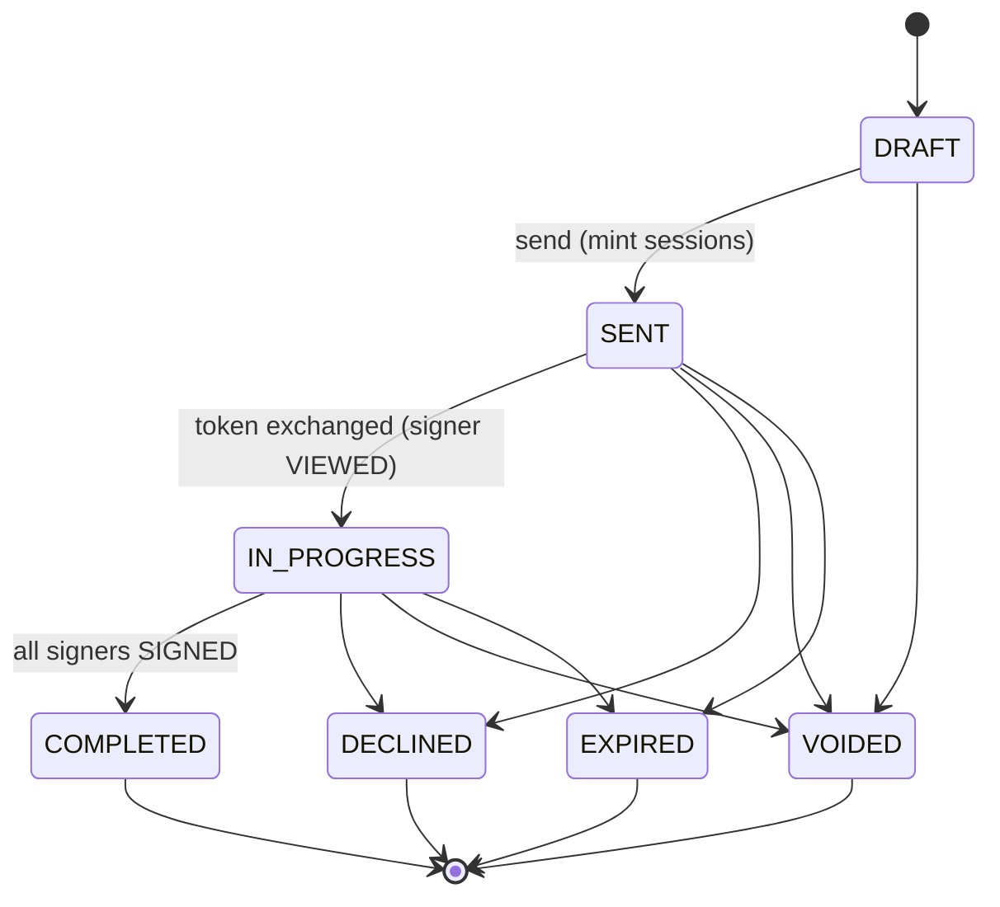
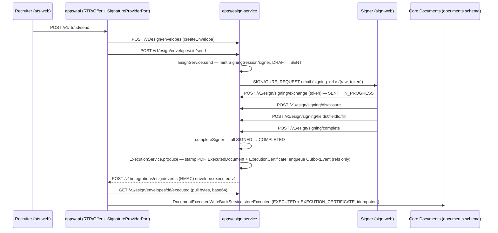
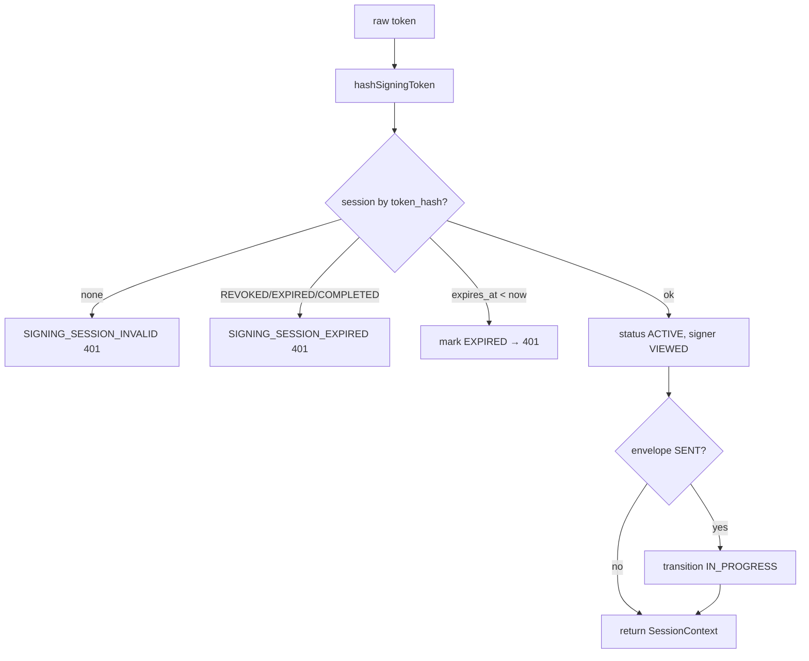

# D10 — Documents & E-Signature (AS-BUILT)
> Baseline SHA 12330b0f5049c97f01022df0b190035933345212 · category AS-BUILT

## Summary

D10 is the Documents + Native E-Signature program (DOC-1a..6 + the E-Sign
Operational-Closure / Product-Experience follow-ons). It is realized as three
cooperating surfaces:

1. **Core Documents** (`libs/documents`, schema `documents`) — the canonical,
   workflow-neutral document identity: `DocumentType`, `Document`,
   `DocumentRevision`, `DocumentArtifact`, `DocumentAssociation` (the primary
   polymorphic bridge; `DocumentRequirement` also carries a `resource_type`/
   `resource_id` tuple mirroring the same vocab), templates/versions/fields,
   requirements, and packets.
   Exposed by the ATS API (`apps/api` imports `@aramo/documents`) under tenant
   JWT + scope guards.
2. **Native E-Sign service** (`apps/esign-service`, lib `libs/esign`, schema
   `esign`) — a separately-deployed application (own threat model, port 3003)
   that owns the signature envelope state machine, capability-token signing
   sessions, the append-only hash-chained `SignatureEvent` ledger, executed-PDF
   production, and the evidence manifest / execution certificate. It is
   ATS-neutral: it references Core documents only by opaque UUID.
3. **Sign Web** (`apps/sign-web`) — the isolated external-signer SPA that drives
   the public `/v1/esign/signing/*` transport.

The two services are decoupled by two seams: a provider-neutral
`SignatureProviderPort` (`@aramo/documents-contracts`) that `apps/api` calls
over HTTP into E-Sign, and an HMAC-authenticated lifecycle webhook
(`POST /v1/integrations/esign/events`) that drives the executed-artifact
write-back back into Core. Executed bytes are pulled over an authorized
service-to-service read (`GET …/executed`); the event bus carries refs only.
RTR (DOC-5) and Offer letters (DOC-6) are the first recruiter-facing verticals
composed on top, in `apps/api/src/rtr` and `apps/api/src/offer-document`.

Deployment posture per MEMORY: DOC v1.1 is merged and DEPLOYED (prod `1c8e06be`
era); the external operational event bus is DARK by construction (SNS factory
returns a no-op publisher unless `ESIGN_EVENT_BUS_TOPIC_ARN` is set).

## Modules & Services

| name | role | evidence path:line + symbol |
|---|---|---|
| `libs/documents` DocumentsController | Core document + document-type HTTP surface (create/list/get/prepare/associate/events/artifacts) | `libs/documents/src/lib/documents.controller.ts:123` `class DocumentsController` |
| `libs/documents` DocumentTemplatesController | templates/versions/fields + requirements + packets HTTP surface | `libs/documents/src/lib/templates.controller.ts:107` `class DocumentTemplatesController` |
| `libs/documents` DocumentRequirementsController | requirement bridge: create/check/satisfy/waive | `libs/documents/src/lib/templates.controller.ts:230` `class DocumentRequirementsController` |
| `libs/documents` DocumentPacketsController | packet grouping | `libs/documents/src/lib/templates.controller.ts:321` `class DocumentPacketsController` |
| `libs/documents` DocumentsRepository | transactional writer (state + DocumentEvent + OutboxEvent + Idempotency) | `libs/documents/src/lib/documents.controller.ts:18` import `DocumentsRepository` |
| `libs/documents` DocumentExecutedWriteBackService | the writer of permanent `EXECUTED` / `EXECUTION_CERTIFICATE` artifacts | `libs/documents/src/lib/executed-write-back.service.ts` (symbol referenced at `apps/api/src/documents/esign-writeback.ts:2`) |
| `libs/documents` RevisionSourceService | source-PDF bytes provider for E-Sign pull | `apps/api/src/documents/documents-esign.controller.ts:7` import `RevisionSourceService` |
| `libs/documents-contracts` SignatureProviderPort | provider-neutral cross-service signing contract | `libs/documents-contracts/src/lib/signature-provider.port.ts:75` `interface SignatureProviderPort` |
| `libs/documents-rendering` PdfLibDocumentRenderingAdapter | deterministic generated render + stamp-onto-source | `libs/documents-rendering/src/lib/pdf-lib-document-rendering.adapter.ts:38` `class PdfLibDocumentRenderingAdapter` |
| `libs/esign` EsignService | envelope state-machine + signing-session orchestration (transport only) | `libs/esign/src/lib/esign.service.ts:99` `class EsignService` |
| `libs/esign` ExecutionService | executed-PDF production + certificate (DOC-4 R-4-3/R-4-6) | `libs/esign/src/lib/execution.service.ts:52` `class ExecutionService implements ExecutionProducerPort` |
| `libs/esign` OutboxService | DOC-4 transactional outbox producer + `drain()` via EVENT_PUBLISHER_PORT | `libs/esign/src/lib/outbox.service.ts:24` `class OutboxService` |
| `libs/esign` OutboxDeliveryService | E-Sign OC v2 canonical outbound webhook drainer (lease + backoff) | `libs/esign/src/lib/outbox-delivery.service.ts:35` `class OutboxDeliveryService` |
| `libs/esign` hash-chain | tamper-evident `SignatureEvent` chain hash | `libs/esign/src/lib/hash-chain.ts:17` `function computeEventHash` |
| `libs/esign` signing-token | capability-token mint/hash + 7-day TTL | `libs/esign/src/lib/signing-token.ts:17` `function generateSigningToken` |
| `apps/esign-service` EsignProviderController | trusted service-to-service `/v1/esign/envelopes/*` seam | `apps/esign-service/src/app/esign-http.controller.ts:44` `class EsignProviderController` |
| `apps/esign-service` EsignSignerController | public signer transport `/v1/esign/signing/*` | `apps/esign-service/src/app/esign-http.controller.ts:155` `class EsignSignerController` |
| `apps/esign-service` NativeAramoSignatureProvider | native `SignatureProviderPort` impl backed by `libs/esign` | `apps/esign-service/src/app/native-aramo-signature.provider.ts:26` `class NativeAramoSignatureProvider` |
| `apps/esign-service` EsignDeliveryWorker | interval-driven lifecycle-delivery drain (no BullMQ) | `apps/esign-service/src/app/esign-delivery.worker.ts:15` `class EsignDeliveryWorker` |
| `apps/esign-service` SnsEventPublisher / eventPublisherFromEnv | DOC-4 SNS operational publisher; DARK default (no-op) | `apps/esign-service/src/app/sns-event-publisher.ts:34` `function eventPublisherFromEnv` |
| `apps/esign-service` KmsEvidenceManifestSigner | KMS-backed evidence-manifest signer (software fallback) | `apps/esign-service/src/app/kms-evidence-manifest-signer.ts:21` `class KmsEvidenceManifestSigner` |
| `apps/sign-web` App | external-signer SPA (open→disclosure→sign→done) | `apps/sign-web/src/App.tsx:23` `function App` |
| `apps/sign-web` signApi | signer transport client (exchange/disclosure/fill/complete) | `apps/sign-web/src/sign-api.ts:31` `const signApi` |
| `apps/api` DocumentsEsignController | revision-source read + transitional `esign-writeback` | `apps/api/src/documents/documents-esign.controller.ts:27` `class DocumentsEsignController` |
| `apps/api` EsignWriteBackOrchestrator | pulls executed bytes → stores permanent artifacts (idempotent) | `apps/api/src/documents/esign-writeback.ts:47` `class EsignWriteBackOrchestrator` |
| `apps/api` EsignEventsController | canonical HMAC-authenticated E-Sign→Core lifecycle webhook | `apps/api/src/integrations/esign/esign-events.controller.ts:37` `class EsignEventsController` |
| `apps/api` RtrController / RtrOrchestratorService | DOC-5 recruiter RTR vertical | `apps/api/src/rtr/rtr.controller.ts:18` `class RtrController`; `apps/api/src/rtr/rtr-orchestrator.service.ts:78` `class RtrOrchestratorService` |
| `apps/api` OfferDocumentController | DOC-6 recruiter offer-letter vertical | `apps/api/src/offer-document/offer-document.controller.ts:15` `class OfferDocumentController` |
| `apps/api` GovernedDocumentSigningService | shared governed request/send/remind signing capability | `apps/api/src/document-signing/governed-document-signing.service.ts:40` `class GovernedDocumentSigningService` |

## Data Models

Two schemas; no cross-schema FK between them (opaque UUID refs only).

`documents` schema — 15 models (`grep -c "^model " libs/documents/prisma/schema.prisma` = 15):
`DocumentType`, `Document`, `DocumentRevision`, `DocumentArtifact`,
`DocumentAssociation`, `DocumentEvent`, `OutboxEvent`, `IdempotencyKey`,
`DocumentTemplate`, `TemplateVersion`, `TemplateFieldDefinition`,
`TemplateAsset`, `DocumentRequirement`, `DocumentPacket`, `DocumentPacketItem`.

- `Document.status` CHECK vocab `DRAFT|PREPARED|EXECUTION_PENDING|EXECUTED|VOIDED|EXPIRED|ARCHIVED` (`libs/documents/prisma/schema.prisma:59`).
- `DocumentArtifact.artifact_role` CHECK vocab `TEMPLATE_SOURCE|SOURCE_UPLOAD|RENDERED_UNSIGNED|EXECUTED|EXECUTION_CERTIFICATE|PREVIEW|ATTACHMENT` (`libs/documents/prisma/schema.prisma:116`), mirrored in the controller allow-set (`libs/documents/src/lib/documents.controller.ts:256`).
- `DocumentAssociation` is the primary polymorphic table; controlled `resource_type`/`relationship` tuple (`libs/documents/prisma/schema.prisma:142`). `DocumentRequirement` also carries a polymorphic `resource_type` (`:326`, "mirrors DocumentAssociation vocab") with `@@index([tenant_id, resource_type, resource_id])` (`:339`).
- `DocumentEvent` is append-only (DB trigger; comment at `libs/documents/prisma/schema.prisma:160`).

`esign` schema — 12 models (`grep -c "^model " libs/esign/prisma/schema.prisma` = 12):
`SignatureEnvelope`, `EnvelopeDocument`, `Signer`, `SignatureField`,
`SigningSession`, `SignerDisclosureAcceptance`, `SignatureEvent`,
`NotificationDelivery`, `IdempotencyKey`, `OutboxEvent`, `ExecutedDocument`,
`ExecutionCertificate`.

- `SignatureEnvelope.status` CHECK vocab `DRAFT|SENT|IN_PROGRESS|COMPLETED|DECLINED|VOIDED|EXPIRED` (`libs/esign/prisma/schema.prisma:27`).
- `EnvelopeDocument.source_mode` two modes `CORE_REF` (frozen Core revision pulled over HTTP) vs `OWNED` (E-Sign object-storage PDF) (`libs/esign/prisma/schema.prisma:57`).
- `SignatureEvent` append-only hash chain `previous_event_hash`→`event_hash` (`libs/esign/prisma/schema.prisma:187`–`:188`).
- `SigningSession.token_hash` (`libs/esign/prisma/schema.prisma:135`) unique via `@@unique([token_hash])` (`:148`); raw token never persisted.
- `ExecutedDocument` / `ExecutionCertificate` hold executed bytes TRANSIENTLY until write-back (`libs/esign/prisma/schema.prisma:258`, `:279`).
- `OutboxEvent` carries OC-v2 retry/backoff columns `attempt_count`/`next_attempt_at`/`last_error_code` (`libs/esign/prisma/schema.prisma:244`).

Migrations on disk: `documents` = 6, `esign` = 5
(`ls …/migrations | grep -c '^[0-9]'`).

`talent_evidence.TalentDocument` is the Talent-specific projection over
`documents.Document` (DOC-1b). The go-forward writer mints the Document quartet
via `@aramo/documents` then links `TalentDocument.document_id`
(`libs/talent-extraction/src/lib/talent-extraction.service.ts:1443`
`createResumeDocument`). There is no dedicated `documents`-domain lib for DOC-1b;
the reconciliation lives in `libs/talent-evidence` + `libs/talent-extraction`.

## API Endpoints

Core Documents (`libs/documents`, all under `@UseGuards(JwtAuthGuard, EntitlementGuard, RolesGuard)` + `@RequireCapability('core')`):

| method | route | scopes | evidence |
|---|---|---|---|
| POST | /v1/document-types | document:manage | `documents.controller.ts:92` |
| GET | /v1/document-types | document:read | `documents.controller.ts:112` |
| POST | /v1/documents | document:create | `documents.controller.ts:126` |
| GET | /v1/documents | document:read | `documents.controller.ts:166` |
| GET | /v1/documents/:id | document:read | `documents.controller.ts:173` |
| POST | /v1/documents/:id/prepare | document:create | `documents.controller.ts:184` |
| POST | /v1/documents/:id/associations | document:create | `documents.controller.ts:195` |
| GET | /v1/documents/:id/events | document:read | `documents.controller.ts:221` |
| GET | /v1/documents/:id/artifacts | document:read | `documents.controller.ts:232` |
| POST/GET | /v1/document-templates (+/:id, /versions, /versions/:id/activate, /versions/:id/fields) | document_template:read/manage | `templates.controller.ts:110`–`:217` |
| POST/GET | /v1/document-requirements (+/:id/check, /satisfy, /waive) | document_requirement:read/manage | `templates.controller.ts:233`–`:304` |
| POST/GET | /v1/document-packets (+/:id, /items) | document:read/create | `templates.controller.ts:324`–`:373` |

Documents↔E-Sign seam (`apps/api`):

| method | route | auth | evidence |
|---|---|---|---|
| GET | /v1/documents/revisions/:id/source | none (trusted s2s, tenant_id in query) | `documents-esign.controller.ts:33` |
| POST | /v1/documents/esign-writeback | none (TRANSITIONAL/internal-compat) | `documents-esign.controller.ts:46` |
| POST | /v1/integrations/esign/events | HMAC signature + timestamp window | `esign-events.controller.ts:40` |

E-Sign service provider seam (`/v1/esign/envelopes/*`, NO auth guards — trusted service-to-service, `tenant_id` supplied by caller):

| method | route | evidence |
|---|---|---|
| POST | /v1/esign/envelopes | `esign-http.controller.ts:47` |
| GET | /v1/esign/envelopes/for-document | `esign-http.controller.ts:64` |
| POST | /v1/esign/envelopes/:id/send | `esign-http.controller.ts:83` |
| POST | /v1/esign/envelopes/:id/remind | `esign-http.controller.ts:95` |
| GET | /v1/esign/envelopes/:id | `esign-http.controller.ts:106` |
| POST | /v1/esign/envelopes/:id/void | `esign-http.controller.ts:117` |
| GET | /v1/esign/envelopes/:id/evidence | `esign-http.controller.ts:129` |
| GET | /v1/esign/envelopes/:id/executed | `esign-http.controller.ts:142` |

E-Sign signer transport (`/v1/esign/signing/*`, token-authorized; tenant resolved server-side from the capability token):

| method | route | evidence |
|---|---|---|
| POST | /v1/esign/signing/document | `esign-http.controller.ts:164` |
| POST | /v1/esign/signing/source | `esign-http.controller.ts:180` |
| POST | /v1/esign/signing/exchange | `esign-http.controller.ts:195` |
| POST | /v1/esign/signing/disclosure | `esign-http.controller.ts:207` |
| POST | /v1/esign/signing/fields/:fieldId/fill | `esign-http.controller.ts:232` |
| POST | /v1/esign/signing/complete | `esign-http.controller.ts:250` |
| POST | /v1/esign/signing/decline | `esign-http.controller.ts:262` |

Recruiter verticals (`apps/api`, `@UseGuards(JwtAuthGuard, RolesGuard)` + recruiter `consumer_type` gate):

| method | route | scopes | evidence |
|---|---|---|---|
| POST | /v1/rtr | document:create | `rtr.controller.ts:27` |
| POST | /v1/rtr/:documentId/send | document:execute | `rtr.controller.ts:49` |
| POST | /v1/rtr/:documentId/remind | document:execute | `rtr.controller.ts:75` |
| GET | /v1/rtr/current | document:read | `rtr.controller.ts:95` |
| GET | /v1/rtr/:documentId/preview | document:read | `rtr.controller.ts:120` |
| GET | /v1/rtr/:documentId/status | document:read | `rtr.controller.ts:134` |
| POST | /v1/offer-documents | document:create | `offer-document.controller.ts:24` |
| POST | /v1/offer-documents/:documentId/send | document:execute | `offer-document.controller.ts:44` |
| POST | /v1/offer-documents/:documentId/remind | document:execute | `offer-document.controller.ts:69` |
| GET | /v1/offer-documents/:documentId/status | document:read | `offer-document.controller.ts:87` |

Scopes are seeded: ATS scopes `document:read/create/execute/manage`,
`document_template:*`, `document_requirement:*`
(`libs/identity/src/lib/dto/scope.dto.ts:93`); a separate E-Sign product scope
namespace `esign:envelope:read/create/send` is seeded + bundled to `esign_*`
roles (`libs/identity/prisma/seed.ts:173`, `:2735`).

## Screens & FE→BE Wiring (FE domains only)

- **`apps/sign-web`** (external signer SPA): stages OPEN→DISCLOSURE→SIGN→DONE
  (`apps/sign-web/src/App.tsx:10`). It calls only `exchange`, `acceptDisclosure`,
  `fillField`, `complete` (`apps/sign-web/src/sign-api.ts:31`). The signer's
  field id is entered manually into a text input (`App.tsx:126`); typed/drawn
  signature capture at `App.tsx:134`. It does NOT call `/v1/esign/signing/document`
  (signer document view) or `/v1/esign/signing/source` (source bytes), nor
  `/decline` — those BE endpoints exist but are unused by the FE.
- **`apps/ats-web/src/rtr`** (`RtrPanel.tsx`, `rtr-api.ts`) — recruiter RTR panel
  wired to `/v1/rtr/*`.
- **`apps/ats-web/src/offer-document`** (`offer-document-api.ts`) — wired to
  `/v1/offer-documents/*`.
- `apps/ats-web/src/offers`, `offer-start`, `assignments` directories exist in
  the offer/start journey neighborhood (not exhaustively audited here).

No dedicated standalone E-Sign product UI consuming the `esign:envelope:*` scopes
was found in the FE apps.

## Key Flows

Envelope lifecycle state machine (`libs/esign/src/lib/esign.service.ts:33` `ENVELOPE_TRANSITIONS`):

Document → signature request → execution → evidence write-back:

Signer capability-token session resolution (`libs/esign/src/lib/esign.service.ts:156`):

## Evidence Index

- `libs/documents/prisma/schema.prisma:53` `model Document` + status vocab `:59`.
- `libs/documents/prisma/schema.prisma:111` `model DocumentArtifact` + role vocab `:116`.
- `libs/documents/prisma/schema.prisma:142` `model DocumentAssociation` (primary polymorphic table; `DocumentRequirement.resource_type` at `:326` mirrors the same vocab).
- `libs/documents/src/lib/documents.controller.ts:123` `class DocumentsController`.
- `libs/documents/src/lib/documents.controller.ts:256` `DOCUMENT_ARTIFACT_ROLES` allow-set.
- `libs/documents/src/lib/templates.controller.ts:107` templates controller; `:230` requirements; `:321` packets.
- `libs/documents-contracts/src/lib/signature-provider.port.ts:75` `SignatureProviderPort`.
- `libs/documents-contracts/src/lib/signature-provider.port.ts:42` `CreateEnvelopeRequest` (fields OPTIONAL — PX-V1 F2).
- `libs/documents-rendering/src/lib/pdf-lib-document-rendering.adapter.ts:38` rendering adapter.
- `libs/esign/prisma/schema.prisma:23` `SignatureEnvelope`; `:53` `EnvelopeDocument` (`source_mode` at `:57`); `:178` `model SignatureEvent` (hash-chain fields `previous_event_hash`/`event_hash` at `:187`/`:188`).
- `libs/esign/prisma/schema.prisma:258` `ExecutedDocument`; `:279` `ExecutionCertificate` (transient).
- `libs/esign/src/lib/esign.service.ts:33` `ENVELOPE_TRANSITIONS`; `:116` `send`; `:156` `exchangeToken`; `:300` `completeSigner`; `:365` `evidenceManifest`.
- `libs/esign/src/lib/execution.service.ts:52` `ExecutionService`; `:174` outbox enqueue (refs only).
- `libs/esign/src/lib/outbox.service.ts:24` `OutboxService` (drain via EVENT_PUBLISHER_PORT).
- `libs/esign/src/lib/outbox-delivery.service.ts:35` `OutboxDeliveryService` (OC-v2 webhook drain).
- `libs/esign/src/lib/hash-chain.ts:17` `computeEventHash`.
- `libs/esign/src/lib/signing-token.ts:10` 7-day session TTL; `:17` `generateSigningToken`.
- `apps/esign-service/src/app/esign-http.controller.ts:44` provider controller; `:155` signer controller.
- `apps/esign-service/src/app/native-aramo-signature.provider.ts:26` native provider; `:225` executed-artifact pull.
- `apps/esign-service/src/app/app.module.ts:39` composition root (binds both outbox drains).
- `apps/esign-service/src/app/sns-event-publisher.ts:34` DARK-by-default SNS factory.
- `apps/esign-service/src/app/esign-delivery.worker.ts:15` delivery worker (drains OutboxDeliveryService only).
- `apps/esign-service/src/app/kms-evidence-manifest-signer.ts:21` KMS signer; `:70` env factory.
- `apps/sign-web/src/App.tsx:23` signer SPA; `:126` manual field-id input.
- `apps/sign-web/src/sign-api.ts:31` signer client (4 methods only).
- `apps/api/src/documents/documents-esign.controller.ts:27` revision-source + transitional write-back (no guards).
- `apps/api/src/documents/esign-writeback.ts:47` `EsignWriteBackOrchestrator`.
- `apps/api/src/integrations/esign/esign-events.controller.ts:37` HMAC webhook; `:107` `isCompletionEvent`.
- `apps/api/src/rtr/rtr.controller.ts:18` RTR controller.
- `apps/api/src/offer-document/offer-document.controller.ts:15` Offer controller.
- `apps/api/src/document-signing/governed-document-signing.service.ts:40` shared governed signing service.
- `libs/identity/src/lib/dto/scope.dto.ts:93` document scopes.
- `libs/identity/prisma/seed.ts:173` esign:envelope scopes seeded; `:2735` bundled to esign_* roles.
- `openapi/esign.yaml:248`–`:334` documents only exchange/document/source among signer ops.
- `libs/talent-extraction/src/lib/talent-extraction.service.ts:1443` `createResumeDocument` (DOC-1b link).

## NOT VERIFIED

- Runtime wiring of `apps/api` modules (`documents-esign.module.ts`,
  `offer-document.module.ts`, `rtr.module.ts`) was not line-audited beyond import
  references; the endpoint tables are derived from the controller decorators.
- `GovernedDocumentSigningService` internals (how RTR/Offer share send/remind)
  were not line-audited beyond the class declaration.
- The `apps/ats-web` RTR/Offer FE component behavior (beyond file presence +
  api-client import) was not audited.
- Whether `openapi/esign.yaml` has a redocly `openapi:lint` failure was not run;
  the drift is asserted from path enumeration, not a lint invocation.
- `infrastructure-*` Terraform for the E-Sign SNS topic / KMS key was not audited
  in this pass (MEMORY indicates authored-unapplied).
- The exact `documents` migration CHECK-constraint SQL (triggers for append-only
  / immutability) was read via schema comments, not each migration SQL file.
- Pact provider/consumer coverage for the D10 surface was not enumerated.
