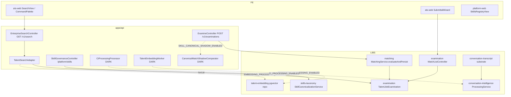
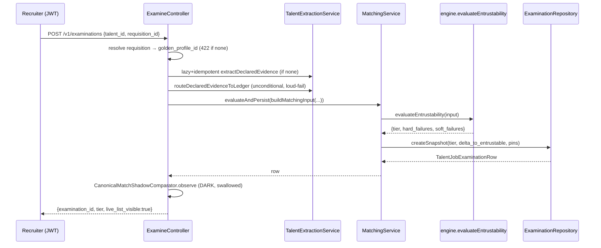

# D11 — Search, Matching, Skills & Intelligence (AS-BUILT)
> Baseline SHA 12330b0f5049c97f01022df0b190035933345212 · category AS-BUILT

## Summary

D11 covers the backend intelligence surfaces: enterprise search (lexical +
dark semantic/pgvector), the deterministic entrustability matching engine and
its immutable examination snapshots, the canonical skills taxonomy registry +
deterministic canonicalization, Conversation Intelligence (CI, ADR-0031) and
its transcript substrate, the operational reporting/dashboard aggregator, and
the usage-metering leaf.

Three of these capabilities ship DARK (fail-closed behind an env flag that must
equal the exact string `"true"`): semantic embedding search
(`EMBEDDING_PROCESSING_ENABLED`, `apps/api/src/embedding/embedding-processing.config.ts:14`),
CI processing (`CI_PROCESSING_ENABLED`, `apps/api/src/conversation-intelligence/ci-processing.config.ts:46`),
and the canonical-match shadow observer (`SKILL_CANONICAL_SHADOW_ENABLED`,
`apps/api/src/examinations/canonical-match-shadow.config.ts:15`). The matching
engine itself is live and synchronous via the examine endpoint; its BullMQ
"match" queue worker exists but has no production enqueue trigger.

All intelligence output is governed by R10 (no portal-forbidden ordinal/match
output reaches a talent-facing surface) and by the Pipeline-Intelligence ⊥ ATS
wall (ADR-0029): `libs/examination` reads requisition state only through the
`RequisitionStateReader` port, never importing `@aramo/job-domain`
(`libs/examination/src/lib/examination.module.ts:17-21`).

## Modules & Services

| name | role | evidence path:line + symbol |
|---|---|---|
| `libs/matching` MatchingModule | Entrustability engine + persistence orchestrator; registers BullMQ `match` queue | `libs/matching/src/lib/matching.module.ts:41` `MatchingModule` |
| matching engine | Pure deterministic tier classifier (ENTRUSTABLE / WORTH_CONSIDERING / STRETCH) | `libs/matching/src/lib/engine.ts:86` `evaluateEntrustability` |
| MatchingService | Runs engine, derives delta_to_entrustable, persists snapshot | `libs/matching/src/lib/matching.service.ts:98` `evaluateAndPersist` |
| MatchingProcessor | BullMQ `match` worker; Redis-gated; no production enqueue trigger | `libs/matching/src/lib/matching.processor.ts:44` `MatchingProcessor` |
| `libs/examination` ExaminationModule | Immutable examination snapshot store + match-list + override HTTP | `libs/examination/src/lib/examination.module.ts:32` `ExaminationModule` |
| MatchListController | `GET /v1/jobs/{job_id}/matches` ranked Live List (Summary-only, recruiter-only) | `libs/examination/src/lib/match-list.controller.ts:80` `MatchListController` |
| OverrideController | `POST /v1/examinations/{examination_id}/overrides` (write-isolated) | `libs/examination/src/lib/override.controller.ts:61` `OverrideController` |
| ExamineController (apps/api) | `POST /v1/examinations` mints a snapshot: extract → derive → sync matching | `apps/api/src/controllers/examine.controller.ts:64` `ExamineController` |
| CanonicalMatchShadowComparator | Dark, best-effort canonical-vs-name observer post-mint | `apps/api/src/examinations/canonical-match-shadow.comparator.ts:19` |
| `libs/skills-taxonomy` SkillsTaxonomyModule | Canonical Skill registry, aliases, versions, relationships, governance, canonicalization | `libs/skills-taxonomy/src/lib/skills-taxonomy.module.ts:39` `SkillsTaxonomyModule` |
| SkillCanonicalizationService | Deterministic, read-only, no-LLM surface-form → canonical resolver | `libs/skills-taxonomy/src/lib/skill-canonicalization.service.ts:61` `resolve` |
| SkillCanonicalizationProcessor | BullMQ worker that RESOLVES only (persists nothing) | `libs/skills-taxonomy/src/lib/skill-canonicalization.processor.ts:70` `process` |
| SkillGovernanceController (apps/api) | `/platform/skill*` admin + AI-proposal ratification console | `apps/api/src/skill-governance/skill-governance.controller.ts:69` `SkillGovernanceController` |
| `libs/talent-embedding` TalentEmbeddingModule | pgvector repository behind two string-token ports (write + semantic read) | `libs/talent-embedding/src/lib/talent-embedding.module.ts:12` `TalentEmbeddingModule` |
| EnterpriseSearchModule (apps/api) | `GET /v1/search` orchestrator over 4 entity adapters | `apps/api/src/search/enterprise-search.module.ts:27` `EnterpriseSearchModule` |
| TalentSearchAdapter | exact-email + name + resume-FTS + dark semantic leg; fail-soft | `apps/api/src/search/adapters/talent-search.adapter.ts:49` `TalentSearchAdapter` |
| `libs/conversation-intelligence` | CI run + immutable requisition snapshot + claims/citations/draft | `libs/conversation-intelligence/src/lib/conversation-intelligence.module.ts:37` `ConversationIntelligenceModule` |
| ConversationIntelligenceProcessingService | Evidence-grounded, human-in-loop AI run; stops at `completed` | `libs/conversation-intelligence/src/lib/conversation-intelligence-processing.service.ts:82` `process` |
| CiProcessingModule (apps/api) | Binds CI ports to concrete adapters; BullMQ worker; DARK | `apps/api/src/conversation-intelligence/ci-processing.module.ts:48` `CiProcessingModule` |
| `libs/conversation-transcript` | Provider-neutral transcript acquisition + normalization substrate | `libs/conversation-transcript/src/lib/conversation-transcript.module.ts` `ConversationTranscriptModule` |
| `libs/reporting` ReportingModule | ATS-INTERNAL read aggregator (Core/examination/matching seam-excluded) | `libs/reporting/src/lib/reporting.module.ts:65` `ReportingModule` |
| ReportingController | 16 operational report routes under `/v1/reports` | `libs/reporting/src/lib/reporting.controller.ts:62` `ReportingController` |
| DashboardController | `GET /v1/dashboard` composition route | `libs/reporting/src/lib/dashboard.controller.ts:38` `DashboardController` |
| `libs/metering` recordUsage | PrismaPromise INSERT into `metering."UsageEvent"`, composed into caller's tx | `libs/metering/src/lib/record-usage.ts:45` `recordUsage` |

## Data Models

| schema model | evidence path:line | notes |
|---|---|---|
| `examination.TalentJobExamination` | `libs/examination/prisma/schema.prisma:82` | Immutable analytical snapshot; nested analysis as Json; DB immutability trigger; three version pins NOT NULL |
| `examination.ExaminationOverride` | `libs/examination/prisma/schema.prisma:192` | Append-only recruiter annotation; absolute-immutability trigger; never mutates the examination row |
| `examination.CanonicalMatchShadowObservation` | `libs/examination/prisma/schema.prisma:226` | Append-only DARK telemetry; `match_class` closed vocab; never read by matching, never on an API response |
| enums `ExaminationTrigger` / `ExaminationTier` / `ExaminationLifecycleState` / `OverrideType` | `libs/examination/prisma/schema.prisma:41,56,67,169` | Closed enums per Group 2 §2.4 |
| `skills-taxonomy.Skill` (+ `SkillAlias`, `SkillVersion`, `SkillRelationship`, `SkillGovernanceProposal`, `SkillCorrectionTask`, `SkillAuditEvent`) | `libs/skills-taxonomy/prisma/schema.prisma:26,96,121,146,174,208,71` | Platform-global canonical taxonomy; `normalized_name` collision key |
| `talent_embedding.TalentEmbedding` + enum `TalentEmbeddingStatus` | `libs/talent-embedding/prisma/schema.prisma:33,24` | pgvector vector column; lifecycle pending → ready | failed |
| `conversation_intelligence.ConversationIntelligenceRun` (+ `...Claim`, `...Citation`, `...Draft`, `RequisitionAnalysisContextSnapshot`) | `libs/conversation-intelligence/prisma/schema.prisma:139,181,208,230,58` | Immutable run + claims + transcript-span citations + draft carrier |
| `conversation_transcript.ConversationTranscript` (+ enums `TranscriptState`/`TranscriptCustodyMode`/`TranscriptSourceType`/`TranscriptRecordingDependency`) | `libs/conversation-transcript/prisma/schema.prisma:112,51,73,88,99` | Metadata + integrity hashes; bodies by reference in object storage |
| `metering.UsageEvent` | `libs/metering/prisma/schema.prisma:40` | General usage stream; free-string `event_type` |

Matching (`libs/matching`) and Reporting (`libs/reporting`) own ZERO prisma
schemas (0 migration dirs each); matching persists through
`examination.TalentJobExamination`, reporting reads ATS-side domain schemas.
Version pins are greenfield constants, not a DB registry
(`libs/matching/src/lib/dto/version-pins.ts:18`).

## API Endpoints

| method | route | scopes / auth | evidence |
|---|---|---|---|
| GET | `/v1/jobs/{job_id}/matches` | JwtAuthGuard + per-route `consumer_type==='recruiter'`; empty-list (not 404) when no active requisition | `libs/examination/src/lib/match-list.controller.ts:89` |
| POST | `/v1/examinations/{examination_id}/overrides` | recruiter-only; Idempotency-Key required; `examination_mutated:false` literal | `libs/examination/src/lib/override.controller.ts:67` |
| POST | `/v1/examinations` | recruiter-only; mints a snapshot (sync matching) | `apps/api/src/controllers/examine.controller.ts:77` |
| GET | `/v1/search` | JwtAuthGuard + EntitlementGuard(`ats`) + RolesGuard; per-entity `<domain>:search` scope enforced inside orchestrator | `apps/api/src/search/enterprise-search.controller.ts:29` |
| GET | `/v1/reports/*` (16 routes incl. tenant-counts, pipeline-rollup, fill-performance, margin, fallthrough, recruiting-funnel, hiring-funnel, source-effectiveness) | `report:read` (+ `assignment:commercials:read` compound on `/margin`) + tenant/site/A3 | `libs/reporting/src/lib/reporting.controller.ts:65-520` |
| GET | `/v1/dashboard` | `dashboard:read` + capability `ats` + site match | `libs/reporting/src/lib/dashboard.controller.ts:41` |
| GET/POST/PATCH/DELETE | `/platform/skills*`, `/platform/skill-proposals*`, `/platform/skill-review-queue` (23 handlers) | `platform:skill:read` / `platform:skill:manage` + `consumer_type==='platform'` | `apps/api/src/skill-governance/skill-governance.controller.ts:80-460` |

No HTTP route exists for CI runs, transcripts, embeddings, or the matching
queue: CI/embedding are async processors, transcript substrate exposes no
controller (`libs/conversation-transcript/.../conversation-transcript.module.ts`
registry ships empty), and matching runs sync through ExamineController.

## Screens & FE→BE Wiring (FE domains only)

| FE surface | app | calls | evidence |
|---|---|---|---|
| Enterprise search (SearchView + CommandPalette) | ats-web | `GET /v1/search` | `apps/ats-web/src/search/enterprise-search-api.ts`, `SearchView.tsx`, `CommandPalette.tsx` |
| Submittal wizard match lookup | ats-web | `GET /v1/jobs/{id}/matches` (filters by talent_id client-side) | `apps/ats-web/src/submittals/submittals-api.ts:155` `findMatchesForRequisition` |
| Reporting views (counts, fill-performance, margin, fallthrough, guarantee-exposure, assignment-pipeline) | ats-web | `GET /v1/reports/*` | `apps/ats-web/src/reporting/*-api.ts` |
| Dashboard | ats-web | `GET /v1/dashboard` | `apps/ats-web/src/dashboard/` |
| Skills registry/governance console | platform-web | `/platform/skills*` | `apps/platform-web/src/skills/skills-api.ts:128`, `SkillsRegistryView.tsx` |

No FE app POSTs to `/v1/examinations` (the examine/mint endpoint) or to
`/v1/examinations/{id}/overrides` at this SHA (grep of `apps/ats-web/src` and
`apps/platform-web/src` for `v1/examinations` returns zero non-test hits).

## Key Flows

### Component map — search / intelligence pipeline



### Examine → deterministic matching → immutable snapshot (synchronous)



### Talent semantic search leg (dark-gated, fail-soft)

```mermaid
sequenceDiagram
  participant A as TalentSearchAdapter
  participant C as EmbeddingProcessingConfig
  participant E as EMBEDDING_PORT (OpenAiEmbeddingProvider)
  participant V as TALENT_EMBEDDING_SEARCH_PORT (pgvector)
  participant T as TalentRecordRepository
  A->>A: exact-email + name + resume-FTS legs (always)
  A->>C: isEnabled()?
  alt EMBEDDING_PROCESSING_ENABLED=="true"
    A->>E: embed(query)
    E-->>A: vector
    A->>V: searchSemanticForActor(tenant/site co-located)
    V-->>A: matches (id + distance)
    A->>T: findById hydrate (record_status==='live')
    A->>A: merge semantic band (below lexical); any failure swallowed
  else dark / failure
    A->>A: return exact+lexical unchanged
  end
```

## Evidence Index

- `libs/matching/src/lib/engine.ts:44` `EVIDENCE_THRESHOLDS` (role-family thresholds; architect=3)
- `libs/matching/src/lib/engine.ts:86` `evaluateEntrustability` pure engine
- `libs/matching/src/lib/engine.ts:238` tier classification (hard>0→STRETCH; soft>0→WORTH_CONSIDERING; else ENTRUSTABLE)
- `libs/matching/src/lib/matching.service.ts:98` `evaluateAndPersist`
- `libs/matching/src/lib/matching.service.ts:51` `buildDeltaToEntrustable`
- `libs/matching/src/lib/matching.processor.ts:71` `onApplicationBootstrap` Redis-gated worker registration
- `libs/matching/src/lib/matching.module.ts:90` `BullModule.registerQueue({ name: MATCH_QUEUE_NAME })`
- `libs/matching/src/lib/dto/version-pins.ts:18` greenfield version-pin constants
- `libs/examination/prisma/schema.prisma:82` `TalentJobExamination`
- `libs/examination/prisma/schema.prisma:192` `ExaminationOverride`
- `libs/examination/prisma/schema.prisma:226` `CanonicalMatchShadowObservation`
- `libs/examination/src/lib/match-list.controller.ts:89` `GET :job_id/matches` (Summary-only, recruiter-only)
- `libs/examination/src/lib/match-list.controller.ts:115` `requisitionState.isActive` port call
- `libs/examination/src/lib/override.controller.ts:159` `examination_mutated:false` literal
- `libs/examination/src/lib/examination.module.ts:17-21` CIP⊥ATS via RequisitionStateReader port (no `@aramo/job-domain` import)
- `apps/api/src/controllers/examine.controller.ts:203` sync `matchingService.evaluateAndPersist`
- `apps/api/src/controllers/examine.controller.ts:210` `canonicalMatchShadow.observe` post-mint
- `apps/api/src/examinations/canonical-match-shadow.config.ts:15` `SKILL_CANONICAL_SHADOW_ENABLED === 'true'`
- `libs/skills-taxonomy/src/lib/skill-canonicalization.service.ts:61` deterministic `resolve` (EXACT_CANONICAL → ALIAS → VERSION)
- `libs/skills-taxonomy/src/lib/normalize-skill-name.ts:15` `normalizeSkillName` (DO-NOT-TOUCH parity with talent-extraction)
- `libs/skills-taxonomy/src/lib/skill-canonicalization.processor.ts:76` resolve-only, persists nothing
- `libs/skills-taxonomy/src/lib/skills-taxonomy.module.ts:68` `registerQueue(SKILL_CANONICALIZATION_QUEUE_NAME)`
- `apps/api/src/skill-governance/skill-governance.controller.ts:468` `assertPlatform` (consumer_type==='platform')
- `apps/api/src/jobs/registration.ts:89` `skill-canonicalization-daily` 05:00 UTC cron (empty scan until fed)
- `apps/api/src/jobs/registration.ts:119` `talent-embedding-300s` tick (DARK)
- `libs/talent-embedding/src/lib/talent-embedding-search.port.ts:18` `searchSemanticForActor` (visibility co-located in SQL)
- `libs/talent-embedding/src/lib/talent-embedding-status.ts:13` lifecycle statuses
- `libs/talent-embedding/prisma/schema.prisma:33` `TalentEmbedding`
- `apps/api/src/search/adapters/talent-search.adapter.ts:116` `embeddingConfig.isEnabled()` dark gate
- `apps/api/src/search/adapters/talent-search.adapter.ts:152` fail-soft catch (semantic never regresses base search)
- `apps/api/src/search/enterprise-search.controller.ts:29` `GET /v1/search`
- `apps/api/src/embedding/embedding-processing.config.ts:14` `EMBEDDING_PROCESSING_ENABLED === 'true'`
- `apps/api/src/embedding/embedding.module.ts:37` embedding boundary (dark worker + ports)
- `libs/conversation-intelligence/src/lib/conversation-intelligence-processing.service.ts:82` CI `process` (stops at completed)
- `libs/conversation-intelligence/src/lib/conversation-intelligence-processing.service.ts:119` ai_processing authz fail-closed before any model call
- `libs/conversation-intelligence/prisma/schema.prisma:58` `RequisitionAnalysisContextSnapshot`
- `libs/conversation-intelligence/prisma/schema.prisma:139` `ConversationIntelligenceRun`
- `apps/api/src/conversation-intelligence/ci-processing.config.ts:46` `CI_PROCESSING_ENABLED === 'true'`
- `apps/api/src/conversation-intelligence/ci-processing.module.ts:48` CI composition (Anthropic adapter, DARK)
- `libs/conversation-transcript/prisma/schema.prisma:112` `ConversationTranscript`
- `libs/conversation-transcript/src/lib/conversation-transcript.module.ts:17` provider registry ships EMPTY, no controller
- `libs/reporting/src/lib/reporting.module.ts:50-57` seam-exclusion (zero Core/selection/submittal/examination/matching imports)
- `libs/reporting/src/lib/reporting.controller.ts:62` `ReportingController` (16 routes)
- `libs/reporting/src/lib/dashboard.controller.ts:41` `GET /v1/dashboard`
- `libs/metering/src/lib/record-usage.ts:45` `recordUsage` composed into caller tx
- `libs/metering/prisma/schema.prisma:40` `metering.UsageEvent`
- `apps/ats-web/src/submittals/submittals-api.ts:155` FE `findMatchesForRequisition`
- `apps/platform-web/src/skills/skills-api.ts:128` FE `/platform/skills`
- `apps/api/src/app.module.ts:229` `MatchingModule` imported at composition root

## NOT VERIFIED

- Whether pgvector / the GS-2A embedding migration is applied in any running
  environment (code is dark-gated; MEMORY notes PROD semantic DARK). Not
  derivable from code at this SHA.
- The `libs/matching` "match" BullMQ queue has a worker
  (`libs/matching/src/lib/matching.processor.ts:44`) but NO production enqueue
  trigger was found (explicitly out of scope per the module header
  `libs/matching/src/lib/matching.module.ts:36-40`); whether any live caller
  enqueues to `MATCH_QUEUE_NAME` is NOT VERIFIED (none found in non-test source).
- Whether CI (`conversation-intelligence`) has a live transcript provider
  adapter registered at runtime: `ConversationTranscriptProviderRegistry`
  ships empty in the lib; apps/api Zoom orchestrator exists under
  `apps/api/src/conversation-transcript/zoom/` but activation state is
  env/credential-gated and NOT VERIFIED from code.
- Exact seeded role→scope membership for `report:read` / `dashboard:read` /
  `platform:skill:*` not re-derived here (seed file not opened in this pass).
