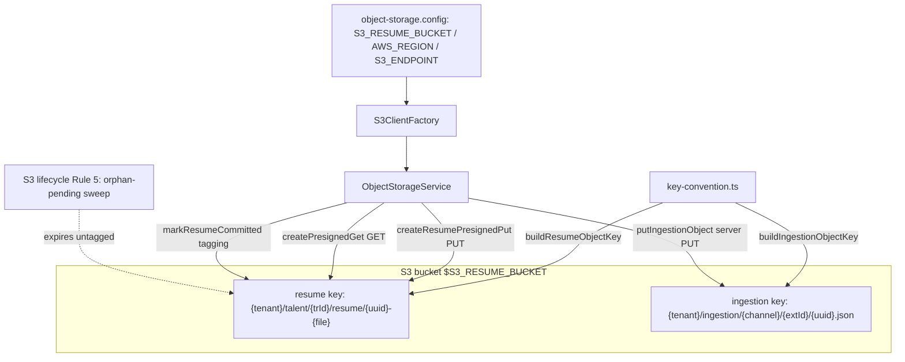
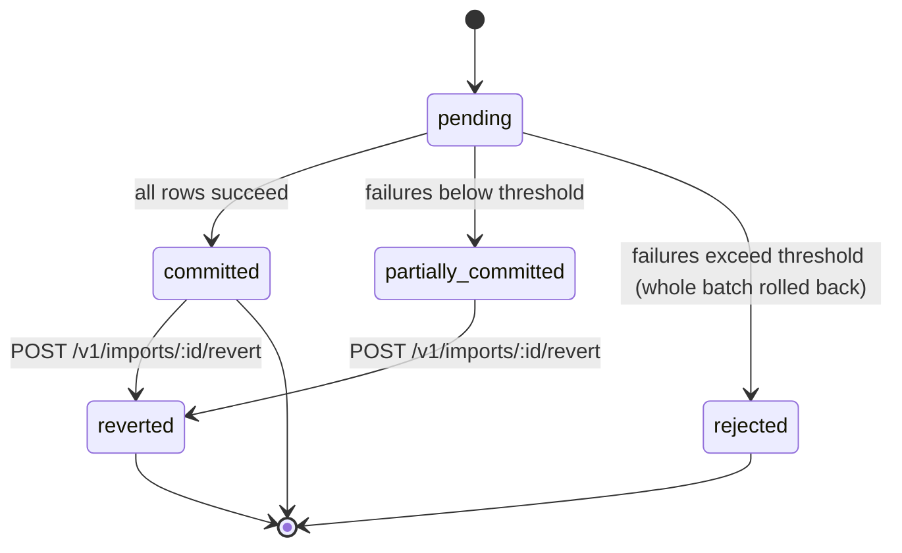

# D12 — Sourcing, Ingestion, Import & Resume Parsing (AS-BUILT)
> Baseline SHA 12330b0f5049c97f01022df0b190035933345212 · category AS-BUILT

## Summary

D12 covers the inbound-material surfaces of the platform: generic payload
ingestion, the Indeed channel (search-results push + Apply webhook), the
raw channel-arrival staging store, bulk CSV/VMS import, object storage
(presigned resume upload + server-side ingestion-object write), deterministic
resume text extraction, and the governed-LLM resume FACT extractor.

Seven libraries carry the domain substrate — `@aramo/ingestion`,
`@aramo/sourced-talent`, `@aramo/import`, `@aramo/cold-ingest-extraction`,
`@aramo/resume-parse`, `@aramo/object-storage`, `@aramo/attachment` — plus the
governed extractor `@aramo/talent-extraction` and the composition-root Indeed
Apply webhook under `apps/api/src/webhooks`. Seven of the eight libs are
directly imported into the API composition root
(`apps/api/src/app.module.ts`); `@aramo/resume-parse` is NOT a direct import —
it is wired transitively via `libs/talent-record/src/lib/talent-record.module.ts:56`
(ResumeParseModule), with app.module.ts referencing it only in a comment
(`apps/api/src/app.module.ts:551`).

Load-bearing facts established by the read:

- **Ingestion is passive-intake only.** `IngestionService.acceptPayload`
  stores what is submitted and runs detect-and-flag dedup (sha256 →
  claimed-email → profile_url); it performs no crawl/search/discovery
  (`libs/ingestion/src/lib/ingestion.service.ts:56`).
- **`source_class` is server-derived, never caller-supplied.**
  `deriveSourceClass` maps a channel to its attestation level from the closed
  `INGESTION_SOURCE_CONTRACT`, fail-closed to `THIRD_PARTY_UNVERIFIED`
  (`libs/ingestion/src/lib/source-contract.ts:124`).
- **Cold-ingest extraction is PARKED/INERT.** The BullMQ worker's `process`
  tick reads no arrivals, writes nothing, and only logs
  (`libs/cold-ingest-extraction/src/lib/cold-ingest-extraction.processor.ts:41`).
- **Resume parsing is split in two.** `@aramo/resume-parse` does deterministic
  bytes→text only (pdf-parse / mammoth, NO LLM); `@aramo/talent-extraction`
  is the governed-LLM FACT extractor that redacts PII before the model and
  grounds returned `source_refs` against the resume source-map
  (`libs/resume-parse/src/lib/resume-parser.service.ts:40`,
  `libs/talent-extraction/src/lib/talent-extraction.service.ts:362`).
- **The import engine never resolves identity.** Importing
  `target_entity='talent_record'` creates TalentRecord rows only; identity
  resolution is canonicalization's job
  (`libs/import/src/lib/import.service.ts:37`).
- **TalentRecord creation is NOT exclusive to import.** The import path is one
  writer; the durable Talent-intake promote path and the sourcing promote path
  also create records — no single D12 surface is the sole creator
  (`libs/talent-record/src/lib/talent-intake/talent-intake.controller.ts:158`,
  `apps/api/src/talent-identity/sourcing.controller.ts:87`).

## Modules & Services

| name | role | evidence path:line + symbol |
| --- | --- | --- |
| `@aramo/ingestion` IngestionController | HTTP front door for generic + Indeed search-results intake under `/v1/ingestion` | `libs/ingestion/src/lib/ingestion.controller.ts:37` `@Controller('v1/ingestion')` |
| `@aramo/ingestion` IngestionService | Passive intake + detect-and-flag dedup; registers source-derived consent for Indeed | `libs/ingestion/src/lib/ingestion.service.ts:50` `IngestionService` |
| `@aramo/ingestion` IngestionRepository | RawPayloadReference writes, dedup queries, cold-ingest extraction poll gates | `libs/ingestion/src/lib/ingestion.repository.ts:71` `IngestionRepository` |
| `@aramo/ingestion` source-contract | Single canonical source/channel contract; derives wire allowlist + source_class map | `libs/ingestion/src/lib/source-contract.ts:63` `INGESTION_SOURCE_CONTRACT` |
| `@aramo/sourced-talent` SourcedTalentRepository | L1 per-arrival staging store (channel dedup memory), idempotent `recordArrival` | `libs/sourced-talent/src/lib/sourced-talent.repository.ts:61` `recordArrival` |
| `@aramo/import` ImportController | Generic CSV import engine: run, suggest-mapping, read, revert | `libs/import/src/lib/import.controller.ts:72` `@Controller('v1/imports')` |
| `@aramo/import` RequisitionImportController | Provider-neutral canonical requisition import (VMS) | `libs/import/src/lib/requisition-import.controller.ts:48` `@Controller('v1/requisition-imports')` |
| `@aramo/import` ImportService | Per-row partial-commit engine + per-target `createForImport` + revert | `libs/import/src/lib/import.service.ts:221` `runImport` |
| `@aramo/import` MappingSuggestionService | Deterministic heuristic column→field mapping (NO LLM) | `libs/import/src/lib/mapping/mapping-suggestion.service.ts:16` design comment |
| `@aramo/cold-ingest-extraction` processor | PARKED BullMQ tick worker — inert (logs only) | `libs/cold-ingest-extraction/src/lib/cold-ingest-extraction.processor.ts:41` `process` |
| `@aramo/resume-parse` ResumeParserService | Deterministic object-bytes→text + artifact sha256 (NO LLM) | `libs/resume-parse/src/lib/resume-parser.service.ts:40` `extractTextFromStorageKey` |
| `@aramo/resume-parse` text-extractor | Magic-byte format sniff + pdf-parse / mammoth extraction | `libs/resume-parse/src/lib/heuristics/text-extractor.ts:54` `extractResumeText` |
| `@aramo/resume-parse` source-map | Deterministic text→ordered source blocks (grounding corpus) | `libs/resume-parse/src/lib/source-map.ts:57` `buildResumeSourceMap` |
| `@aramo/object-storage` ObjectStorageService | Presigned resume PUT/GET, server-side ingestion-object PUT, orphan-sweep tagging | `libs/object-storage/src/lib/object-storage.service.ts:53` `ObjectStorageService` |
| `@aramo/object-storage` key-convention | Tenant-scoped S3 key builders (resume + ingestion) | `libs/object-storage/src/lib/key-convention.ts:68` `buildResumeObjectKey` |
| `@aramo/attachment` AttachmentController | Polymorphic file-attachment CRUD + resume download-url + reindex enqueue | `libs/attachment/src/lib/attachment.controller.ts:53` `@Controller('v1/attachments')` |
| `@aramo/talent-extraction` TalentExtractionService | Governed-LLM resume FACT extractor (PII redaction + source_ref grounding) | `libs/talent-extraction/src/lib/talent-extraction.service.ts:362` `extractDeclaredEvidence` |
| apps/api IndeedApplyController | Unguarded HMAC-authenticated Indeed Apply inbound webhook | `apps/api/src/webhooks/indeed-apply.controller.ts:36` `@Post('apply')` |
| apps/api IndeedApplyWebhookService | SRC-1 spine orchestration: storage → ingestion front door → sourced_talent dedup | `apps/api/src/webhooks/indeed-apply.service.ts:64` `process` |
| apps/api SourcingController | Promotes a sourced L2 subject into a TalentRecord (pipeline / bench) | `apps/api/src/talent-identity/sourcing.controller.ts:43` `@Controller('v1/sourcing')` |

## Data Models

| model | schema | purpose | evidence path:line |
| --- | --- | --- | --- |
| `RawPayloadReference` | `ingestion` | Raw payload stored by reference (storage_ref + sha256); dedup + cold-ingest poll gates (`resolved_subject_id`, `extraction_done_at`, `extraction_attempts`) | `libs/ingestion/prisma/schema.prisma:61` |
| `ResolutionMethod` (enum) | `ingestion` | How canonicalize resolved a payload (writable: `new_identity`, `confirmed_anchor_match`) | `libs/ingestion/prisma/schema.prisma:32` |
| `SourcedTalent` | `sourced_talent` | Immutable L1 per-arrival staging row; dedup key `(tenant_id, source_channel, external_source_id)` | `libs/sourced-talent/prisma/schema.prisma:53` |
| `ImportBatch` | `import` | First-class audit + reversion handle; status lifecycle | `libs/import/prisma/schema.prisma:93` |
| `ImportFailure` | `import` | One row per failed import row (reason + offending_fields + original_row_data) | `libs/import/prisma/schema.prisma:156` |
| `ImportTargetEntity` / `ImportBatchStatus` (enums) | `import` | 4 targets (company/contact/requisition/talent_record); 5 statuses | `libs/import/prisma/schema.prisma:46` (ImportTargetEntity) + `:68` (ImportBatchStatus) |
| `Attachment` | `attachment` | Polymorphic file metadata + `storage_key` (not bytes); `is_resume` flag | `libs/attachment/prisma/schema.prisma:56` |
| `AttachmentOwnerType` (enum) | `attachment` | talent / requisition / company / contact (only `talent` wired) | `libs/attachment/prisma/schema.prisma:42` |

Note: `RawPayloadReference.verified_email` is a documented misnomer — it holds
the channel-CLAIMED email (normalized), NOT a verified one; verification level
is carried by `source_class` (`libs/ingestion/prisma/schema.prisma` field
comment; `libs/ingestion/src/lib/dto/ingestion-payload-request.dto.ts` note).

## API Endpoints

| method | route | scopes | evidence path:line |
| --- | --- | --- | --- |
| POST | `/v1/ingestion/payloads` | JwtAuthGuard only (no scope decorator) | `libs/ingestion/src/lib/ingestion.controller.ts:42` |
| POST | `/v1/ingestion/indeed/search-results` | JwtAuthGuard only | `libs/ingestion/src/lib/ingestion.controller.ts:55` |
| POST | `/v1/webhooks/indeed/apply` | unguarded; HMAC `X-Indeed-Signature` | `apps/api/src/webhooks/indeed-apply.controller.ts:36` |
| GET | `/v1/imports` | `import:read` + site-match | `libs/import/src/lib/import.controller.ts:85` |
| GET | `/v1/imports/:id` | `import:read` | `libs/import/src/lib/import.controller.ts:100` |
| GET | `/v1/imports/:id/failures` | `import:read` | `libs/import/src/lib/import.controller.ts:124` |
| POST | `/v1/imports` | `import:create` + site-match | `libs/import/src/lib/import.controller.ts:145` |
| POST | `/v1/imports/suggest-mapping` | `import:create` | `libs/import/src/lib/import.controller.ts:228` |
| POST | `/v1/imports/:id/revert` | `import:delete` | `libs/import/src/lib/import.controller.ts:268` |
| GET | `/v1/requisition-imports` | `requisition:import:read` | `libs/import/src/lib/requisition-import.controller.ts:54` |
| GET | `/v1/requisition-imports/:id` | `requisition:import:read` | `libs/import/src/lib/requisition-import.controller.ts:69` |
| POST | `/v1/requisition-imports` | `requisition:import:write` | `libs/import/src/lib/requisition-import.controller.ts:92` |
| GET | `/v1/attachments` | `attachment:read` + site-match | `libs/attachment/src/lib/attachment.controller.ts:69` |
| GET | `/v1/attachments/:id` | `attachment:read` | `libs/attachment/src/lib/attachment.controller.ts:103` |
| GET | `/v1/attachments/:id/download-url` | `attachment:read` | `libs/attachment/src/lib/attachment.controller.ts:131` |
| POST | `/v1/attachments` | `attachment:create` | `libs/attachment/src/lib/attachment.controller.ts:158` |
| DELETE | `/v1/attachments/:id` | `attachment:delete` | `libs/attachment/src/lib/attachment.controller.ts:226` |
| POST | `/v1/talent-records/resume-upload-url` | `attachment:create` | `libs/talent-record/src/lib/talent-record.controller.ts:1631` |
| POST/GET/SSE | `/v1/talent-intake-drafts*` (create / complete-upload / promote / events …) | `talent:create` / `talent:read` / `talent:edit` | `libs/talent-record/src/lib/talent-intake/talent-intake.controller.ts:40` |
| POST | `/v1/sourcing/pipeline`, `/v1/sourcing/bench` | `talent:source` | `apps/api/src/talent-identity/sourcing.controller.ts:87` |

## Screens & FE→BE Wiring (ats-web)

| FE module | consumes | evidence path:line |
| --- | --- | --- |
| `settings/import-api.ts` + `ImportSection.tsx` | GET `/v1/imports`, GET `/v1/imports/:id/failures` — READ-ONLY (run/config deliberately deferred, "no dead knob") | `apps/ats-web/src/settings/import-api.ts:17` `fetchImports` |
| `talent/talent-api.ts` | POST `/v1/talent-records/resume-upload-url`; GET/POST `/v1/attachments`; GET `/v1/attachments/:id/download-url` | `apps/ats-web/src/talent/talent-api.ts:279` resume-upload-url path |
| `talent/talent-intake-api.ts` | `/v1/talent-intake-drafts*` durable-async intake flow (create → complete-upload → GET/SSE → promote) | `apps/ats-web/src/talent/talent-intake-api.ts:96` `BASE = '/v1/talent-intake-drafts'` |
| `sourcing/sourcing-api.ts` | GET `/v1/sourcing/pool`, GET `/v1/sourcing/pool/:subjectId`, POST `/v1/sourcing/pipeline`, POST `/v1/sourcing/bench` (+ advisory routes) | `apps/ats-web/src/sourcing/sourcing-api.ts:45` `addToPipeline` POST `/v1/sourcing/pipeline`, `:53` `saveToBench` POST `/v1/sourcing/bench` |
| `requisition-imports/requisition-imports-api.ts` | GET `/v1/requisition-imports`, GET `/v1/requisition-imports/:id` (READ-ONLY) | `apps/ats-web/src/requisition-imports/requisition-imports-api.ts:19` `listRequisitionImports`, `:24` `getRequisitionImport` |

No ats-web FE consumer was found for POST `/v1/imports`, `/v1/imports/suggest-mapping`,
`/v1/imports/:id/revert`, or POST `/v1/requisition-imports` (grep of
`apps/ats-web/src`). The GET sides of `/v1/requisition-imports` and the
`/v1/sourcing/*` surface (pool, pool drill-in, pipeline, bench) ARE consumed —
see the `sourcing/` and `requisition-imports/` rows above.

## Key Flows

### Flow 1 — Indeed Apply webhook (SRC-1 ingestion spine)

```mermaid
sequenceDiagram
    participant Indeed
    participant Ctl as IndeedApplyController
    participant Svc as IndeedApplyWebhookService
    participant OS as ObjectStorageService
    participant Ing as IngestionService
    participant ST as SourcedTalentRepository
    Indeed->>Ctl: POST /v1/webhooks/indeed/apply (raw body + X-Indeed-Signature)
    Ctl->>Svc: process({rawBody, signatureHeader, host})
    Svc->>Svc: secret unset? 503 · bad HMAC? 401 · unknown slug? 404 · no apply_id? 400
    Svc->>OS: putIngestionObject (raw bytes verbatim, server sha256)
    OS-->>Svc: {storage_ref, sha256}
    Svc->>Ing: acceptPayload(source='indeed', storage_ref, sha256)
    Ing->>Ing: dedup sha256; source_class=THIRD_PARTY_UNVERIFIED
    Ing-->>Svc: {ingestion_payload_id}
    Svc->>ST: recordArrival (channel dedup memory; idempotent)
    ST-->>Svc: {arrival_id}
    Svc-->>Ctl: 200 {arrival_id, ingestion_payload_id}
```

Evidence: `apps/api/src/webhooks/indeed-apply.service.ts:64` (process),
`:99` (putIngestionObject), `:119` (acceptPayload), `:127` (recordArrival).

### Flow 2 — Resume upload → text → governed FACT extraction

```mermaid
sequenceDiagram
    participant FE as ats-web
    participant TR as TalentRecordController
    participant OS as ObjectStorageService
    participant AT as AttachmentController
    participant RP as ResumeParserService
    participant TX as TalentExtractionService
    participant AI as AiDraftService
    FE->>TR: POST /v1/talent-records/resume-upload-url {filename, content_type}
    TR->>OS: createResumePresignedPut (orphan-pending tag baked in)
    OS-->>FE: {storage_key, presigned_url}
    FE->>OS: PUT bytes directly to S3
    FE->>AT: POST /v1/attachments (is_resume=true, owner=talent)
    AT->>OS: markResumeCommitted (clear orphan tag)
    AT->>AT: enqueueReindex (ResumeTextService; async, best-effort)
    Note over RP,AI: durable-async intake worker path
    RP->>OS: createPresignedGet + fetch bytes
    RP->>RP: extractResumeText (pdf-parse / mammoth, NO LLM)
    RP-->>TX: extracted text + source-map
    TX->>TX: redactPii(block text) before model
    TX->>AI: single-read structured generation (FACT + source_refs)
    TX->>TX: ground source_refs against source-map blocks
```

Evidence: `libs/talent-record/src/lib/talent-record.controller.ts:1631`,
`libs/object-storage/src/lib/object-storage.service.ts:59` + `:443` + `:368`,
`libs/attachment/src/lib/attachment.controller.ts:158` + `:208`,
`libs/resume-parse/src/lib/resume-parser.service.ts:40`,
`libs/resume-parse/src/lib/heuristics/text-extractor.ts:54`,
`libs/talent-extraction/src/lib/talent-extraction.service.ts:362` + `:836`.

### Flow 3 — Object-storage component map



Evidence: `libs/object-storage/src/lib/key-convention.ts:68` + `:104`,
`libs/object-storage/src/lib/object-storage.service.ts:59` + `:143` + `:368` + `:443`,
`libs/object-storage/src/lib/object-storage.config.ts:60`.

### Flow 4 — ImportBatch lifecycle



Evidence: `libs/import/prisma/schema.prisma:68` (ImportBatchStatus enum),
`libs/import/src/lib/import.service.ts:221` (runImport),
`libs/import/src/lib/import.controller.ts:268` (revert).

## Evidence Index

- `libs/ingestion/src/lib/ingestion.controller.ts:37` — `@Controller('v1/ingestion')`
- `libs/ingestion/src/lib/ingestion.controller.ts:42` — `@Post('payloads')` submitPayload
- `libs/ingestion/src/lib/ingestion.controller.ts:55` — `@Post('indeed/search-results')`
- `libs/ingestion/src/lib/ingestion.service.ts:56` — `acceptPayload` (passive intake + dedup)
- `libs/ingestion/src/lib/ingestion.service.ts:177` — `acceptIndeedSearchResults`
- `libs/ingestion/src/lib/ingestion.service.ts:226` — `registerSourceDerivedConsent` call
- `libs/ingestion/src/lib/source-contract.ts:63` — `INGESTION_SOURCE_CONTRACT`
- `libs/ingestion/src/lib/source-contract.ts:124` — `deriveSourceClass` (fail-closed)
- `libs/ingestion/src/lib/source-class.map.ts:18` — re-export of `deriveSourceClass`
- `libs/ingestion/src/lib/ingestion.repository.ts:74` — `createPayload`
- `libs/ingestion/src/lib/ingestion.repository.ts:109` — `findArrivalsNeedingExtraction`
- `libs/ingestion/src/lib/ingestion.repository.ts:144` — `markExtractionDone`
- `libs/ingestion/src/lib/ingestion.repository.ts:162` — `findBySha256`
- `libs/ingestion/src/lib/dto/ingestion-payload-request.dto.ts:35` — `@IsIn(INGESTION_SOURCES)` wire gate
- `libs/ingestion/prisma/schema.prisma:32` — `ResolutionMethod` enum
- `libs/ingestion/prisma/schema.prisma:61` — `model RawPayloadReference`
- `libs/sourced-talent/src/lib/sourced-talent.repository.ts:61` — `recordArrival` (idempotent)
- `libs/sourced-talent/prisma/schema.prisma:53` — `model SourcedTalent`
- `libs/import/src/lib/import.controller.ts:72` — `@Controller('v1/imports')`
- `libs/import/src/lib/import.controller.ts:145` — POST run
- `libs/import/src/lib/import.controller.ts:228` — POST suggest-mapping
- `libs/import/src/lib/import.controller.ts:268` — POST revert (`import:delete`)
- `libs/import/src/lib/import.service.ts:37` — talent_record no-identity-resolution boundary comment
- `libs/import/src/lib/import.service.ts:221` — `runImport`
- `libs/import/src/lib/import.service.ts:412` — `runCanonicalRequisitionImport`
- `libs/import/src/lib/mapping/mapping-suggestion.service.ts:16` — deterministic (NO LLM) design comment
- `libs/import/src/lib/requisition-import.controller.ts:92` — POST requisition import
- `libs/import/prisma/schema.prisma:46` — `ImportTargetEntity` enum
- `libs/import/prisma/schema.prisma:68` — `ImportBatchStatus` enum
- `libs/import/prisma/schema.prisma:93` — `model ImportBatch`
- `libs/import/prisma/schema.prisma:156` — `model ImportFailure`
- `libs/cold-ingest-extraction/src/lib/cold-ingest-extraction.processor.ts:8` — PARKED/INERT header
- `libs/cold-ingest-extraction/src/lib/cold-ingest-extraction.processor.ts:41` — inert `process` tick
- `libs/resume-parse/src/lib/resume-parser.service.ts:40` — `extractTextFromStorageKey`
- `libs/resume-parse/src/lib/resume-parser.service.ts:70` — `extractTextAndSha256FromStorageKey`
- `libs/resume-parse/src/lib/resume-parser.service.ts:86` — `fetchBytes` (presigned GET + fetch)
- `libs/resume-parse/src/lib/heuristics/text-extractor.ts:23` — `detectResumeFormat`
- `libs/resume-parse/src/lib/heuristics/text-extractor.ts:54` — `extractResumeText` (pdf-parse / mammoth)
- `libs/resume-parse/src/lib/source-map.ts:57` — `buildResumeSourceMap`
- `libs/object-storage/src/lib/object-storage.service.ts:59` — `createResumePresignedPut`
- `libs/object-storage/src/lib/object-storage.service.ts:143` — `putIngestionObject`
- `libs/object-storage/src/lib/object-storage.service.ts:368` — `createPresignedGet`
- `libs/object-storage/src/lib/object-storage.service.ts:443` — `markResumeCommitted`
- `libs/object-storage/src/lib/key-convention.ts:68` — `buildResumeObjectKey`
- `libs/object-storage/src/lib/key-convention.ts:104` — `buildIngestionObjectKey`
- `libs/object-storage/src/lib/object-storage.config.ts:60` — `S3_RESUME_BUCKET` resolution
- `libs/attachment/src/lib/attachment.controller.ts:53` — `@Controller('v1/attachments')`
- `libs/attachment/src/lib/attachment.controller.ts:131` — GET download-url
- `libs/attachment/src/lib/attachment.controller.ts:158` — POST create
- `libs/attachment/src/lib/attachment.controller.ts:208` — `resumeText.enqueueReindex`
- `libs/attachment/prisma/schema.prisma:42` — `AttachmentOwnerType` enum
- `libs/attachment/prisma/schema.prisma:56` — `model Attachment`
- `libs/talent-extraction/src/lib/talent-extraction.service.ts:362` — `extractDeclaredEvidence`
- `libs/talent-extraction/src/lib/talent-extraction.service.ts:836` — `redactPii` applied before model
- `apps/api/src/webhooks/indeed-apply.controller.ts:36` — `@Post('apply')`
- `apps/api/src/webhooks/indeed-apply.service.ts:64` — `process` (anti-oracle order)
- `apps/api/src/webhooks/indeed-apply.service.ts:99` — `putIngestionObject` call
- `apps/api/src/webhooks/indeed-apply.service.ts:119` — `acceptPayload` call
- `apps/api/src/webhooks/indeed-apply.service.ts:127` — `recordArrival` call
- `apps/api/src/talent-identity/sourcing.controller.ts:43` — `@Controller('v1/sourcing')`
- `apps/api/src/talent-identity/sourcing.controller.ts:87` — addToPipeline (promotes → TalentRecord)
- `libs/talent-record/src/lib/talent-record.controller.ts:1631` — `createResumeUploadUrl`
- `libs/talent-record/src/lib/talent-intake/talent-intake.controller.ts:40` — `@Controller('v1/talent-intake-drafts')`
- `libs/talent-record/src/lib/talent-intake/talent-intake.controller.ts:158` — POST promote (creates TalentRecord)
- `apps/ats-web/src/settings/import-api.ts:17` — `fetchImports` (FE read-only)
- `apps/ats-web/src/talent/talent-api.ts:279` — resume-upload-url FE call
- `apps/ats-web/src/talent/talent-intake-api.ts:96` — intake FE base path
- `libs/identity/src/lib/dto/scope.dto.ts:258` — `'import:read'` seeded (create/delete absent)
- `apps/api/src/app.module.ts:228` — IngestionModule wired into composition root
- `openapi/ingestion.yaml:16` — `/v1/ingestion/payloads` documented
- `openapi/ingestion.yaml:93` — `/v1/ingestion/indeed/search-results` documented

## NOT VERIFIED (explicit)

- **Live S3 CORS state** on the production `aramo-prod-resumes-use1` bucket is a
  runtime/infra fact (flagged in standing memory as a broken upload), not
  derivable from repository code; the resume-upload presign path itself is
  present and correct in code. NOT VERIFIED here.
- **Terraform `s3-resume-bucket` lifecycle Rule 5 + orphan retention days** are
  referenced in code comments
  (`libs/object-storage/src/lib/object-storage.service.ts:83`) but the IaC
  module contents were not read in this pass. NOT VERIFIED.
- **Runtime behaviour of the durable-async intake worker** (outbox → worker →
  `ResumeExtractionOrchestrator.extractResume`) is wired through
  `libs/talent-record` and `@aramo/talent-extraction`; the orchestrator's own
  file was not fully read. The D12-owned seams (object-storage, resume-parse,
  talent-extraction entry) are verified; the orchestration glue is NOT VERIFIED
  end-to-end here.
- **Pact contract coverage** for the D12 HTTP surfaces was not enumerated in
  this pass. NOT VERIFIED.
- Whether any non-ats-web FE (platform-admin/portal) consumes import or
  sourcing endpoints — only `apps/ats-web/src` was grepped. NOT VERIFIED for
  other FE apps.
