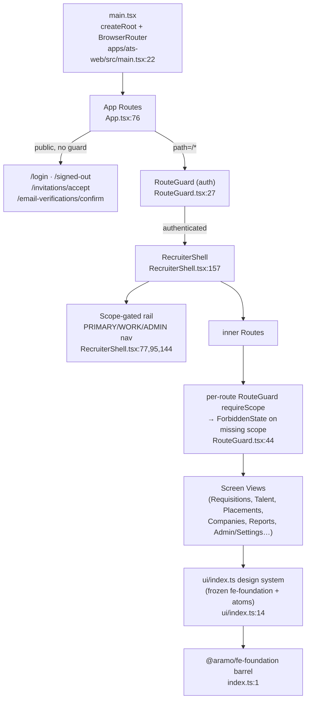
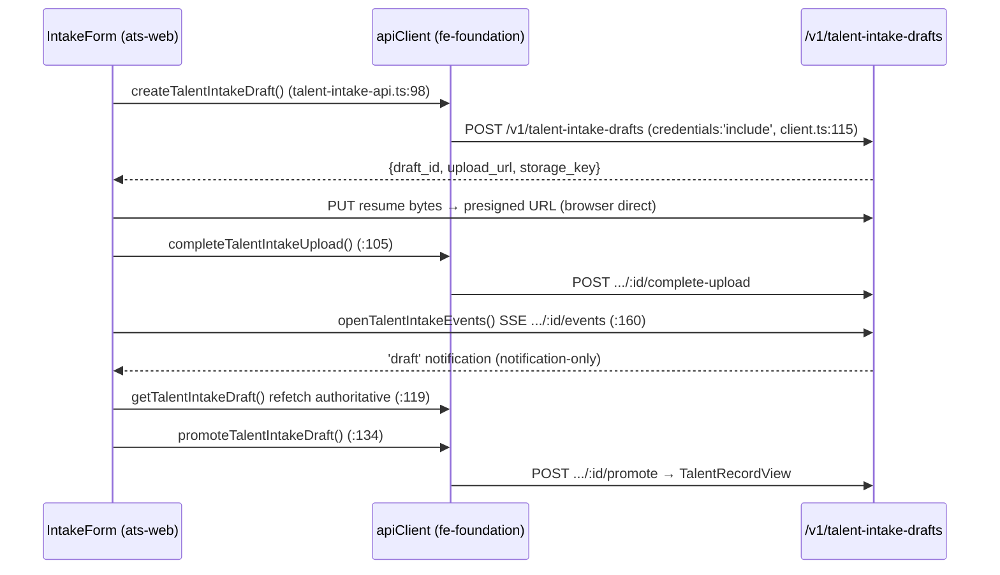
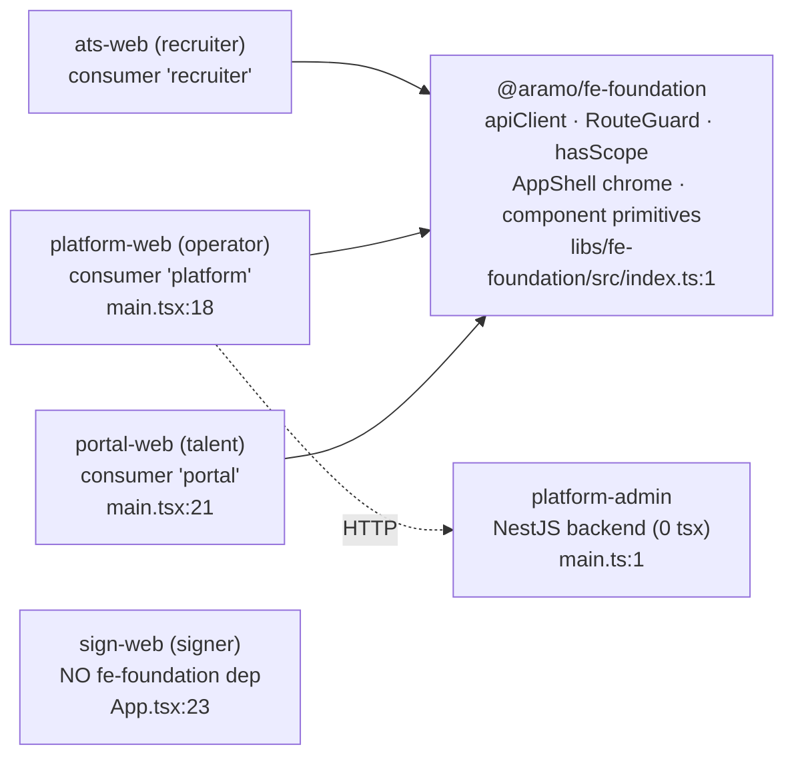

# D13 — Frontend Architecture & Screen Inventory (AS-BUILT)

> Baseline SHA 12330b0f5049c97f01022df0b190035933345212 · category AS-BUILT · generated by read-only recon

## Summary

At baseline `12330b0f` the platform ships **four browser SPAs** and **one app named like a FE but actually a NestJS backend service**:

- **`aramo-ats-web`** (`apps/ats-web`) — the unified recruiter console (recruiter surface + the admin/settings section after the FE Consolidation retired tenant-console). 410 `.tsx` + 242 `.ts` git-tracked source files; the largest FE by an order of magnitude.
- **`aramo-platform-web`** (`apps/platform-web`) — the platform-operator console (tenant provisioning/lifecycle + the skill-governance console). 27 `.tsx` + 8 `.ts`.
- **`aramo-portal-web`** (`apps/portal-web`) — the talent-facing privacy portal (records, verified identity, disputes, notice, erasure). 21 `.tsx` + 4 `.ts`; HTTP-only against `/v1/portal`.
- **`aramo-sign-web`** (`apps/sign-web`) — the isolated external-signer SPA (DOC-4 e-signature journey). 3 `.tsx` + 2 `.ts`; deliberately has **no** design-system dependency.
- **`platform-admin`** (`apps/platform-admin`) — **NOT a frontend**. It is a NestJS backend service (`apps/platform-admin/src/main.ts:1`, `apps/platform-admin/src/app/app.module.ts:1`) with 0 `.tsx` files; it holds the platform provisioning controllers/DTOs consumed by `platform-web`.

Three of the four SPAs — ats-web, platform-web, portal-web — share the same chassis. Each boots through a Vite `main.tsx` that mounts `createRoot` inside a `<BrowserRouter>` wrapping an `<App>` (`apps/ats-web/src/main.tsx:22`; `apps/platform-web/src/main.tsx:25`; `apps/portal-web/src/main.tsx:28`) and consumes the domain-neutral **`@aramo/fe-foundation`** library (`libs/fe-foundation/src/index.ts:1`) for the API client, session/auth, scope-gating, the `AppShell` chrome kit, and the Radix-based component primitives. The fourth SPA, **sign-web**, is deliberately the exception: it boots without a `<BrowserRouter>` and carries no `@aramo/fe-foundation` dependency (detailed at lines 30, 101–103, 151 below). `fe-foundation` itself carries **no `@aramo/*` domain import** by design (Radix + react + react-router only) and side-effect-imports its own token/font CSS (`libs/fe-foundation/src/index.ts:10`).

**Authorization is scopes-only and mirrored at the routing boundary.** The backend session payload carries `Session.scopes: string[]`; the FE mirror is `hasScope(session, scope)` (`libs/fe-foundation/src/auth/scopes.ts:20`) plus a `requireScope` axis on `RouteGuard`. An authenticated session missing a required scope renders `<ForbiddenState>` — **never** a login redirect (a redirect would loop) (`libs/fe-foundation/src/auth/RouteGuard.tsx:44`). The same `hasScope` filter hides nav items so a gated-away section performs no fetch.

The ats-web design system layers on top of the frozen `fe-foundation` primitives: `ui/index.ts` re-exports frozen-themed primitives and adds new app-layer atoms (`apps/ats-web/src/ui/index.ts:14`); `main.tsx` imports `theme.css` → `ui.css` → `settings.css` **after** the `fe-foundation` barrel so the `:root` token re-map wins on equal specificity (`apps/ats-web/src/main.tsx:11`). A lint-enforced **raw-element guard (G1/R2)** bans raw `<button>/<input>/<select>/<textarea>/<dialog>` in `apps/**` product code, forcing use of the foundation primitives (`eslint.config.mjs:47`, `eslint.config.mjs:241`).

## Modules & Services

| Name | Role | Evidence (path:line · symbol) |
|------|------|-------------------------------|
| `apps/ats-web` — unified recruiter console SPA | React/Vite SPA; `App` renders the full `<Routes>` tree inside `RecruiterShell`. | `apps/ats-web/src/App.tsx:76` `export function App`; `apps/ats-web/src/main.tsx:22` `createRoot(...).render` |
| `RecruiterShell` — ats-web app chrome | Scope-gated left rail (PRIMARY/WORK/ADMIN nav arrays) + sticky top bar; renders real react-router `NavLink`s. | `apps/ats-web/src/shell/RecruiterShell.tsx:157` `RecruiterShell`; `:77` `PRIMARY_NAV`; `:95` `WORK_NAV`; `:144` `ADMIN_NAV` |
| `apps/ats-web/src/ui` — Confident Blue design system | Re-exports frozen `fe-foundation` primitives (themed via token re-map) + new app-layer atoms (pills, Stepper, ActivityFeed, StateViews, stage/band maps). | `apps/ats-web/src/ui/index.ts:14` frozen re-exports; `:47` new atoms (`Card`,`CardHead`) |
| `apps/platform-web` — platform-operator console SPA | React/Vite SPA; app-level `platform:tenant:read` gate, then tenant + skill-governance routes inside `PlatformShell`. | `apps/platform-web/src/App.tsx:29` `export function App`; `apps/platform-web/src/main.tsx:18` `configureAuthConsumer('platform')` |
| `apps/portal-web` — talent privacy portal SPA | React/Vite SPA; passwordless portal, records/verifications/disputes/notice/rights inside `PortalShell`; HTTP-only vs `/v1/portal`. | `apps/portal-web/src/App.tsx:26` `export function App`; `apps/portal-web/src/main.tsx:21` `configureAuthConsumer('portal')` |
| `apps/sign-web` — external-signer SPA | Self-contained signer state machine (OPEN→DISCLOSURE→SIGN→DONE/ERROR); typed or drawn signature; no fe-foundation dependency; native controls behind narrow G1 escape hatches. | `apps/sign-web/src/App.tsx:23` `export function App`; `apps/sign-web/src/sign-api.ts:1` |
| `apps/platform-admin` — NestJS backend service (NOT FE) | Platform provisioning/lifecycle controllers + DTOs; 0 `.tsx`; consumed by `platform-web`. | `apps/platform-admin/src/main.ts:1`; `apps/platform-admin/src/app/platform/platform.controller.ts:1` |
| `@aramo/fe-foundation` — domain-neutral FE foundation lib | Single shared barrel: `apiClient`/`ApiError`, session/auth, `hasScope`, `RouteGuard`, `AppShell` chrome kit, the Radix-based component primitives; side-effect token/font CSS. No `@aramo/*` domain import. | `libs/fe-foundation/src/index.ts:1`; `:10` side-effect `tokens.css`; `:81` `export * from './ui'` |
| `fe-foundation` `AppShell` — shared chrome kit | App-layer chrome (Rail, RailNavItem, TopBar, Breadcrumb, CmdKSearch, NotificationButton, UserMenu) built ABOVE the frozen `Shell`; consumed by every SPA's shell. | `libs/fe-foundation/src/ui/AppShell.tsx:54` `export function AppShell` |
| `fe-foundation` `apiClient` — cookie-bearing fetch wrapper | Always sends HttpOnly session cookies (`credentials:'include'`); parses the backend error taxonomy into `ApiError{status,code,details}`; GET/POST/PUT/PATCH/DELETE. | `libs/fe-foundation/src/api/client.ts:33` `ApiError`; `:61` `ApiClient`; `:115` `credentials:'include'` |
| `fe-foundation` `RouteGuard` / `hasScope` — FE authz boundary | `RouteGuard` loading/unauth/forbidden triage + optional `requireScope`; `hasScope` is the single scope-lookup primitive. | `libs/fe-foundation/src/auth/RouteGuard.tsx:27` `RouteGuard`; `libs/fe-foundation/src/auth/scopes.ts:20` `hasScope` |
| `libs/portal` — **backend** portal lib (not FE) | Nest controller/module/resolver + DTOs serving `/v1/portal`; the `portal-web` SPA's server counterpart. Listed here only to disambiguate the name. | `libs/portal/src/lib/portal.controller.ts:1`; `libs/portal/src/lib/portal.module.ts:1` |

## Data Models

D13 (frontend) owns **no persisted data model**; all shapes are TS view/DTO interfaces mirroring backend responses. Representative FE-owned view contracts:

| Name | Shape (abbrev.) | Evidence (path:line · symbol) |
|------|-----------------|-------------------------------|
| `TalentIntakeDraftView` | `id`, `processing_status`, `review_status`, `review_payload`, `promoted_talent_record_id\|null`, `version`, `duplicate\|null`, `required{met,total}`, `admissible`, `actions[]` | `apps/ats-web/src/talent/talent-intake-api.ts:55` `interface TalentIntakeDraftView` |
| `TalentIntakeField` | `value: string\|boolean\|null`, `origin: 'RESUME_EXTRACTION'\|'RECRUITER'` | `apps/ats-web/src/talent/talent-intake-api.ts:10` `interface TalentIntakeField` |
| `Session` (FE auth payload) | carries `scopes: string[]` consumed by `hasScope`/`RouteGuard` | `libs/fe-foundation/src/auth/scopes.ts:18` import of `Session`; `:21` `session.scopes.includes` |

## API Endpoints

D13 defines **no HTTP routes** (the FE apps are clients). It wires FE calls to backend `/v1/*` endpoints. ats-web source references **236 distinct `/v1/...` path tokens** across its `.ts`/`.tsx` (65 `*-api.ts` wiring modules). The count is method-dependent; 236 is the de-duplicated token set from `git ls-files 'apps/ats-web/src/*.ts' 'apps/ats-web/src/*.tsx' | xargs grep -hoE '/v1/[a-zA-Z0-9_:/-]+' | sort -u | wc -l` (counting only quoted `'/v1/...'` string literals yields 134). Representative talent-intake wiring (`apps/ats-web/src/talent/talent-intake-api.ts`, base `/v1/talent-intake-drafts` at `:96`):

| Method | Route (client call) | Evidence (path:line · symbol) |
|--------|---------------------|-------------------------------|
| POST | `/v1/talent-intake-drafts` | `apps/ats-web/src/talent/talent-intake-api.ts:98` `createTalentIntakeDraft` |
| POST | `/v1/talent-intake-drafts/:id/complete-upload` | `apps/ats-web/src/talent/talent-intake-api.ts:105` `completeTalentIntakeUpload` |
| GET | `/v1/talent-intake-drafts` / `/:id` | `apps/ats-web/src/talent/talent-intake-api.ts:115` `listTalentIntakeDrafts`; `:119` `getTalentIntakeDraft` |
| PATCH | `/v1/talent-intake-drafts/:id` | `apps/ats-web/src/talent/talent-intake-api.ts:123` `patchTalentIntakeReview` |
| POST | `/v1/talent-intake-drafts/:id/{retry,promote,replace-resume}` | `apps/ats-web/src/talent/talent-intake-api.ts:130` `retry...`; `:134` `promote...`; `:140` `replace...` |
| DELETE | `/v1/talent-intake-drafts/:id` | `apps/ats-web/src/talent/talent-intake-api.ts:152` `discardTalentIntakeDraft` |
| SSE | `/v1/talent-intake-drafts/:id/events` (EventSource, notification-only) | `apps/ats-web/src/talent/talent-intake-api.ts:160` `openTalentIntakeEvents` |

## Screens & FE→BE Wiring (FE domains only)

### ats-web routing (`apps/ats-web/src/App.tsx`)

Three **public, session-less** routes sit OUTSIDE `RouteGuard` (mirroring `/login`): `/login` (`:82`), `/signed-out` (`:88`), `/invitations/accept` (`:93`), `/email-verifications/confirm` (`:101`). Two DEV-only showcase routes (`/ui-gallery` `:108`, `/ui-shell-preview` `:111`) are excluded from production builds. Everything else lives under the authenticated `path="/*"` subtree (`:114`) inside `RecruiterShell`, each route wrapped in `RouteGuard requireScope=...`. 73 `path="..."` attributes (70 distinct path values), plus unattributed `index` routes. Representative authenticated screens:

| Route | Screen component | requireScope | Rail nav | Evidence (App.tsx line) |
|-------|------------------|--------------|----------|--------------------------|
| `index` (`/`) | `IndexRoute` (My Desk) | (shell `dashboard:read`) | PRIMARY | `:120` |
| `search` | `SearchView` | internal per-section | (⌘K top-bar) | `:124` |
| `requisitions` / `requisitions/new` / `requisitions/:reqId` | `RequisitionsListView` / `RequisitionCreateView` / `RequisitionDetailView` | `requisition:read` / `:create` / `:read` | PRIMARY | `:243` `:254` `:269` |
| `placements` | `OfferStartWorklistView` | `pipeline:read` | PRIMARY | `:284` |
| `placements/:placementId` | `PlacementDetailView` | `placement:read` | — | `:295` |
| `onboarding/:placementId` | `PreStartWorkspaceView` | `pre_start_requirement:read` | — | `:309` |
| `offer-start/:pipelineId` | `OfferStartJourneyView` | `pipeline:read` | — (deep-linked) | `:324` |
| `talent` / `talent/new` / `talent/:talentId` / `talent/:talentId/edit` | `TalentListView` / `TalentCreateView` / `Talent360View` / `TalentEditView` | `talent:read` / `:create` / `:read` / `:edit` | PRIMARY | `:335` `:346` `:368` `:379` |
| `sourcing` | `SourcingPoolView` | `talent:source` | PRIMARY | `:393` |
| `talent/:talentId/submittal/:requisitionId` / `.../workspace` | `SubmittalWizard` / `SubmittalWorkspaceView` | `submittal:create` / `talent:read` | — (contextual) | `:446` `:461` |
| `selections/:selectionId` | `SelectionDetailView` | `selection:read` | — | `:472` |
| `companies` / `companies/new` / `companies/:companyId` | `CompaniesListView` / `CompaniesListView initialCreate` / `CompanyDetailView` | `company:read` / `:create` / `:read` | PRIMARY | `:483` `:498` `:509` |
| `contacts` / `contacts/new` | `ContactsListView` (drawer surfaces) | `contact:read` / `:create` | PRIMARY | `:525` `:543` |
| `tasks` | `MyTasksView` | `task:read` | WORK | `:131` |
| `interviews` / `interviews/:sessionId` | `InterviewsView` / `InterviewDetailView` | `client-selection:read` | — | `:146` `:157` |
| `reports` + 5 report pages | `ReportingLanding` + Fill/Fallthrough/AssignmentPipeline/GuaranteeExposure/Margin views | `report:read` | WORK | `:171` `:182` `:193` `:204` `:217` `:232` |
| `identity/advisories` / `identity/portal-disputes` / `trust/proposals` | `IdentityAdvisoriesView` / `PortalDisputesView` / `TrustProposalsView` | `identity:resolve` / `identity:resolve` / `talent:read` | WORK | `:407` `:420` `:435` |
| `settings/me` | `MySettingsView` (personal; hosts MS-365 connect) | any signed-in | account menu | `:129` |
| `admin/settings/integrations/*` | `IntegrationsSection` | `requisition:import:read` OR `integration:read` | — | `:573` |
| `admin/*` subtree (`AdminGate` + `SettingsShell`) | Users/Org/Teams + ~18 settings sections + tools + per-record deep links | `tenant:admin:*` family | ADMIN "Settings" | `:615` |

The `admin/settings/integrations/*` route is deliberately more specific than the `admin/*` splat so a recruiter holding the P3 read scope reaches integrations monitoring WITHOUT any admin scope; every other settings section stays inside the `AdminGate` subtree (`apps/ats-web/src/App.tsx:573`, `:615`).

### platform-web routing (`apps/platform-web/src/App.tsx`)

Whole app gated by `platform:tenant:read` at `:61`. Routes: `/` → `DashboardView` (`:67`); `/tenants` → `TenantsListView` (`:68`); `/tenants/new` → `ProvisionTenantView` (`:69`); `/tenants/:id` → `TenantDetailView` (`:71`); skill-governance `/skills`, `/skills/review-queue`, `/skills/proposals`, `/skills/proposals/:id`, `/skills/:id` each additionally gated on `platform:skill:read` with inline `hasScope`→`ForbiddenState` (`:84`, `:98`, `:107`, `:116`, `:125`); `*`→`Navigate to="/"` (`:133`). Wiring via `apps/platform-web/src/platform-api.ts` and `apps/platform-web/src/skills/skills-api.ts`.

### portal-web routing (`apps/portal-web/src/App.tsx`)

Session-less `/signed-out` short-circuit (`:34`); then authenticated routes inside `PortalShell`: `/`→`RecordsListView` (`:62`), `/records/:id`→`RecordDetailView` (`:63`), `/verifications`→`VerificationsView` (`:64`), `/disputes` + `/disputes/:id` (`:65`,`:66`), `/notice`→`NoticeView` (`:67`), `/rights`→`RightsView` (erasure) (`:68`), `*`→`Navigate` (`:69`). Wiring via `apps/portal-web/src/portal-api.ts`.

### sign-web (`apps/sign-web/src/App.tsx`)

No react-router; a single `App` state machine resolves the signing token from `/s/:token` or `?token=` (`apps/sign-web/src/App.tsx:18`) and drives OPEN→DISCLOSURE→SIGN→DONE via `signApi.exchange`/`acceptDisclosure`/`fillField`/`complete` (`apps/sign-web/src/App.tsx:43`). A signature value is mandatory before completion (`apps/sign-web/src/App.tsx:68`).

## Key Flows

### FE app-shell / routing composition (ats-web)

### FE→BE wiring (talent intake, representative)

### Multi-SPA / shared-foundation topology

## Evidence Index (load-bearing path:line citations)

- `apps/ats-web/src/main.tsx:11` — theme/ui/settings CSS imported after fe-foundation barrel (token re-map wins)
- `apps/ats-web/src/main.tsx:22` — `createRoot(...).render` in `<BrowserRouter>`
- `apps/ats-web/src/App.tsx:76` — `export function App`
- `apps/ats-web/src/App.tsx:82` / `:88` / `:93` / `:101` — public session-less routes
- `apps/ats-web/src/App.tsx:108` / `:111` — DEV-only showcase routes
- `apps/ats-web/src/App.tsx:114` — authenticated `path="/*"` subtree
- `apps/ats-web/src/App.tsx:120`…`:734` — authenticated route table (see Screens section for per-route lines)
- `apps/ats-web/src/App.tsx:573` / `:615` — integrations route out-ranks admin splat; AdminGate subtree
- `apps/ats-web/src/shell/RecruiterShell.tsx:157` — `RecruiterShell`; `:77`/`:95`/`:144` nav arrays
- `apps/ats-web/src/ui/index.ts:14` — frozen primitive re-exports; `:47` new atoms
- `apps/ats-web/src/talent/talent-intake-api.ts:10` / `:55` / `:96` / `:98` / `:105` / `:115` / `:119` / `:123` / `:130` / `:134` / `:140` / `:152` / `:160` — intake FE client
- `libs/fe-foundation/src/index.ts:1` / `:10` / `:81` — barrel, side-effect CSS, ui re-export
- `libs/fe-foundation/src/api/client.ts:33` / `:61` / `:115` — `ApiError`, `ApiClient`, `credentials:'include'`
- `libs/fe-foundation/src/auth/RouteGuard.tsx:27` / `:44` — `RouteGuard`, ForbiddenState on missing scope
- `libs/fe-foundation/src/auth/scopes.ts:18` / `:20` — `Session` import, `hasScope`
- `libs/fe-foundation/src/ui/AppShell.tsx:54` — `AppShell`
- `apps/platform-web/src/App.tsx:29` / `:61` / `:67`–`:133` — platform-web routes
- `apps/platform-web/src/main.tsx:18` — `configureAuthConsumer('platform')`
- `apps/portal-web/src/App.tsx:26` / `:34` / `:62`–`:69` — portal-web routes
- `apps/portal-web/src/main.tsx:21` — `configureAuthConsumer('portal')`
- `apps/sign-web/src/App.tsx:18` / `:23` / `:43` / `:68` — signer token/state machine (`export function App` at `:23`)
- `apps/sign-web/src/sign-api.ts:1` — signer API client
- `apps/platform-admin/src/main.ts:1` / `src/app/app.module.ts:1` / `src/app/platform/platform.controller.ts:1` — platform-admin is a NestJS backend
- `libs/portal/src/lib/portal.controller.ts:1` / `portal.module.ts:1` — `libs/portal` is a backend lib
- `eslint.config.mjs:47` / `:241` — G1/R2 raw-element guard (apps/** only)
- `apps/ats-web/src/ui/funnel-css-drift.spec.ts:36` — ui.css class-set exclusivity drift guard

## NOT VERIFIED (explicit)

- **Exact per-SPA screen counts as "screens"**: counted by `*View.tsx`/`*Section.tsx` filename convention (ats-web 46 `*View.tsx` + 15 `*Section.tsx`; platform-web 18 `.tsx`; portal-web 9 `.tsx`), not by route or by a runtime screen registry. Dialogs/drawers (non-routed surfaces) are excluded from the route table.
- **Production build output / nginx `/srv` SPA roots**: the deploy-time static hosting (MEMORY notes `/srv/{ats,admin,portal,sign}`) was NOT confirmed from repo files in this pass; `ADR-0023` (front door) describes host routing but the `/srv` mapping is operational state.
- **Guard decorators on the backend endpoints** the FE calls are documented in backend domains (D03), not re-verified here.
- **`configureAuthConsumer` default `'recruiter'`** for ats-web is inferred from the absence of a `configureAuthConsumer` call in `apps/ats-web/src/main.tsx` plus the fe-foundation default; the default value itself was not opened in `consumer.ts`.
- **Every one of 236 `/v1` client strings**: the count is a de-duplicated grep over ats-web source; individual endpoint-by-endpoint FE→BE pairing was spot-checked (talent-intake) not exhaustively mapped.
