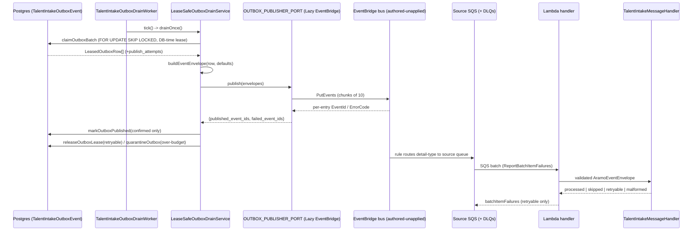
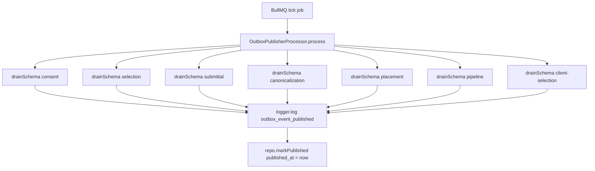
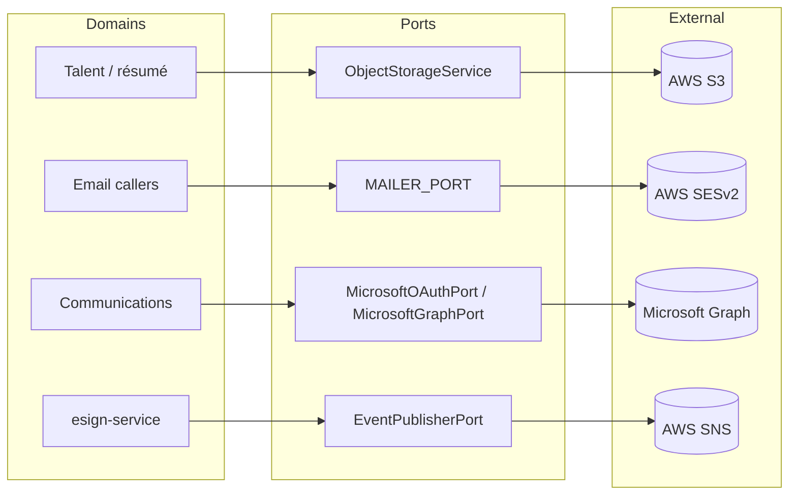

# D14 — Cross-Cutting Platform & External Integrations (AS-BUILT)
> Baseline SHA 12330b0f5049c97f01022df0b190035933345212 · category AS-BUILT

## Summary

D14 covers the platform substrate that every domain reuses: the durable cross-service
event backbone, the background-job (BullMQ) substrate, and the external-system adapters
(SES email, S3 object storage, Microsoft Graph, EventBridge/SQS/Lambda, SNS, Secrets
Manager, Cognito KMS).

Two outbox-dispatch mechanisms coexist in `apps/api`, both imported by the same
`AppModule` (`apps/api/src/app.module.ts:600` `OutboxPublisherModule`;
`apps/api/src/app.module.ts:332` `TalentIntakePublisherModule`):

1. **Legacy structured-log multi-schema drain** (`libs/outbox-publisher`): a BullMQ
   worker that polls 7 domain `OutboxEvent` tables and emits **structured logs only** —
   there is no SNS/SQS/EventBridge dispatch in this path despite its comments referring to
   a future "SNS dispatch" (`libs/outbox-publisher/src/lib/outbox-publisher.processor.ts:189`).
2. **ADR-0033 lease-safe EventBridge publisher** (`libs/events` + `libs/outbox-publisher` +
   `apps/api/src/talent-intake-consumer`): a Redis-independent interval drain of the Talent
   Intake outbox → canonical envelope → `OutboxPublisherPort` → EventBridge bus, with a
   separate SQS→Lambda consumer. The producer is wired into `apps/api`; the consumer is a
   Lambda entrypoint. ADR-0033's EventBridge/SQS/Lambda Terraform module is authored but
   not applied (`infrastructure/environments/prod/talent-intake.tf:2`).

The ADR-0033 envelope and lease-safe-outbox contracts live in `libs/events`; the
transport adapters (EventBridge, structured-log, fake) and the transport-agnostic drain
orchestration live in `libs/outbox-publisher`. External-system access is uniformly
port/adapter-mediated: `MAILER_PORT` (SES vs stub), `ObjectStorageService` (S3),
`MicrosoftGraphPort`/`MicrosoftOAuthPort` (Graph, ports-only lib), and the esign
`EventPublisherPort` (SNS vs local no-op).

26 BullMQ processors exist across the workspace, all following the ADR-0018 `libs/matching`
pattern (`manualRegistration` + `BullRegistrar.register()` gated on
`RedisConnectionConfig.isConfigured`).

## Modules & Services

| name | role | evidence path:line + symbol |
| --- | --- | --- |
| `AramoEventEnvelope` | Canonical versioned cross-service event envelope (11 fields) | `libs/events/src/lib/event-envelope.ts:16` `interface AramoEventEnvelope` |
| `buildEventEnvelope` | Pure, deterministic outbox-row→envelope mapper (row id→event_id, created_at→occurred_at) | `libs/events/src/lib/event-envelope.ts:81` `export function buildEventEnvelope` |
| `OutboxPublisherPort` | Reusable dispatch port; string DI token; at-least-once with per-id published/failed split | `libs/events/src/lib/outbox-publisher.port.ts:25` `interface OutboxPublisherPort`; token `:13` `OUTBOX_PUBLISHER_PORT` |
| `LeaseSafeOutboxRepository` | Concurrency-safe claim/lease/mark/release/quarantine contract (FOR UPDATE SKIP LOCKED, DB-time lease) | `libs/events/src/lib/lease-safe-outbox.ts:21` `interface LeaseSafeOutboxRepository` |
| `LeaseSafeOutboxDrainService` | Transport-agnostic per-tick drain orchestration (claim→map→quarantine-unmappable→publish→mark-confirmed→release/quarantine) | `libs/outbox-publisher/src/lib/lease-safe-outbox-drain.service.ts:34` `class LeaseSafeOutboxDrainService` |
| `EventBridgeOutboxPublisher` | EventBridge adapter; PutEvents in chunks of 10, per-entry positional success mapping | `libs/outbox-publisher/src/lib/eventbridge-outbox-publisher.ts:33` `class EventBridgeOutboxPublisher` |
| `StructuredLogOutboxPublisher` | Log-only port adapter (local/test/backward-compat); reports every envelope published | `libs/outbox-publisher/src/lib/structured-log-outbox-publisher.ts:16` `class StructuredLogOutboxPublisher` |
| `OutboxPublisherProcessor` | BullMQ worker draining 7 domain outbox schemas, structured-log emit only | `libs/outbox-publisher/src/lib/outbox-publisher.processor.ts:79` `class OutboxPublisherProcessor` |
| `OutboxPublisherModule` | BullMQ wiring (manualRegistration) for the multi-schema drain | `libs/outbox-publisher/src/lib/outbox-publisher.module.ts:96` `class OutboxPublisherModule` |
| `TalentIntakePublisherModule` | ADR-0033 producer composition (api side): binds port, lease repo, drain, worker | `apps/api/src/talent-intake-consumer/talent-intake-publisher.module.ts:114` `class TalentIntakePublisherModule` |
| `LazyEventBridgeOutboxPublisher` | Lazy fail-closed EventBridge port; throws if bus unset on first publish | `apps/api/src/talent-intake-consumer/lazy-eventbridge-outbox-publisher.ts:20` `class LazyEventBridgeOutboxPublisher` |
| `TalentIntakeOutboxDrainWorker` | Redis-independent `setInterval` drain tick; in-process overlap latch | `apps/api/src/talent-intake-consumer/talent-intake-outbox-drain.worker.ts:23` `class TalentIntakeOutboxDrainWorker` |
| `loadTalentIntakeEventsConfig` | Producer transport config; default `eventbridge`, fail-closed | `apps/api/src/talent-intake-consumer/talent-intake-events.config.ts:28` `export function loadTalentIntakeEventsConfig` |
| `TalentIntakeConsumerModule` | ADR-0033 consumer composition (Lambda side); no publisher/drain | `apps/api/src/talent-intake-consumer/talent-intake-consumer.module.ts:35` `class TalentIntakeConsumerModule` |
| `handler` (Lambda entrypoint) | Cold-start-cached Nest context; delegates to SQS batch adapter | `apps/api/src/talent-intake-consumer/talent-intake-consumer.handler.ts:41` `export async function handler` |
| `processTalentIntakeSqsBatch` | SQS record decode, EventBridge unwrap, envelope validate, partial-batch-failure mapping | `apps/api/src/talent-intake-consumer/sqs-lambda.adapter.ts:88` `export async function processTalentIntakeSqsBatch` |
| `MailerModule` / `MAILER_PORT` | Transactional email; env-selected SES vs stub adapter; fixed FROM | `libs/mailer/src/lib/mailer.module.ts:60` `class MailerModule`; port token `libs/mailer/src/lib/tokens.ts:8` `MAILER_PORT`; interface `libs/mailer/src/lib/mailer.port.ts:31` `interface MailerPort` |
| `SesMailerAdapter` | SESv2 `SendEmailCommand` adapter; FROM pinned to `SES_FROM_ADDRESS` | `libs/mailer/src/lib/ses-mailer.adapter.ts:24` `class SesMailerAdapter` |
| `ObjectStorageModule` / `ObjectStorageService` | Presigned PUT/GET + server-side PUT/GET/HEAD/DELETE over S3; expiry-capped; PII-floor logging | `libs/object-storage/src/lib/object-storage.module.ts:32` `class ObjectStorageModule`; service `libs/object-storage/src/lib/object-storage.service.ts:53` `class ObjectStorageService` |
| `S3ClientFactory` | Lazy S3 client; SDK default cred chain; checksum pinned WHEN_REQUIRED for presigned URLs | `libs/object-storage/src/lib/s3-client.factory.ts:19` `class S3ClientFactory` |
| `DelegatedAuthorizationService` | Microsoft Graph delegated OAuth: authorize/callback/usable-token/revoke; ports-only, token-free views | `libs/microsoft-graph/src/lib/delegated-authorization.service.ts:102` `class DelegatedAuthorizationService` |
| `SnsEventPublisher` / `eventPublisherFromEnv` | esign SNS publisher (refs-only); env-gated, local no-op default (DARK) | `apps/esign-service/src/app/sns-event-publisher.ts:11` `class SnsEventPublisher`; factory `:34` `eventPublisherFromEnv` |
| `AwsSecretsManagerAdapter` | Secrets Manager read/write port adapter | `libs/integration/src/lib/secrets/aws-secrets-manager.adapter.ts:22` `class AwsSecretsManagerAdapter` |
| `TaskModule` / `TaskController` | Recruiter Task entity CRUD (not a BullMQ job); forRoot binds assignee + requisition-context validators | `libs/task/src/lib/task.module.ts:89` `class TaskModule`; controller `libs/task/src/lib/task.controller.ts:68` `class TaskController` |
| `AuditModule` | Empty `@Module({})` shell; exported but referenced by no app/lib | `libs/audit/src/lib/audit.module.ts:4` `export class AuditModule` |
| `ExportModule` / `SavedListModule` / `EntitlementModule` / `SettingsModule` / `CanonicalReconcileModule` / `PlatformTrustModule` | Other cross-cutting leaf modules (domain-adjacent; detailed in their own domains) | `libs/export/src/lib/export.controller.ts:54` `@Controller('v1/exports')`; `libs/saved-list/src/lib/saved-list.controller.ts:58` `@Controller('v1/saved-lists')` |

## Data Models

The ADR-0033 envelope is a TypeScript contract, not a single physical table.
`CanonicalOutboxRow` (`libs/events/src/lib/event-envelope.ts:47`) is the durable-row shape
a publisher maps to an envelope; envelope columns (`source`, `subject_type`, `subject_id`,
`event_version`, `causation_id`, `correlation_id`) are nullable so a not-yet-migrated row
still maps via `EnvelopeDefaults` fallbacks (`libs/events/src/lib/event-envelope.ts:62`).
Domain-local physical outbox tables are retained per domain (ADR-0033 Decision 4); the
multi-schema BullMQ processor drains 7 of them (consent, selection, submittal,
canonicalization, placement, pipeline, client_selection) via a shared `OutboxRepositoryShape`
(`libs/outbox-publisher/src/lib/outbox-publisher.processor.ts:59`).

## API Endpoints

| method | route | scopes | evidence |
| --- | --- | --- | --- |
| GET | /v1/tasks | task:read | `libs/task/src/lib/task.controller.ts:86` `@Get()` + `:88` `@RequireScopes('task:read')` |
| GET | /v1/tasks/:id | task:read | `libs/task/src/lib/task.controller.ts:141` `@Get(':id')` + `:143` `@RequireScopes('task:read')` |
| POST | /v1/tasks | task:write | `libs/task/src/lib/task.controller.ts:168` `@Post()` + `:170` `@RequireScopes('task:write')` |
| PATCH | /v1/tasks/:id | task:write | `libs/task/src/lib/task.controller.ts:258` `@Patch(':id')` + `:260` `@RequireScopes('task:write')` |
| DELETE | /v1/tasks/:id | task:write | `libs/task/src/lib/task.controller.ts:311` `@Delete(':id')` + `:313` `@RequireScopes('task:write')` |

The ADR-0033 Talent Intake transport exposes NO synchronous HTTP endpoint of its own — it
is driven by an outbox row + a scheduled drain (producer) and an SQS event source (consumer).
The esign SNS publisher and the mailer/object-storage adapters are likewise consumed by
other domains, not surfaced directly as D14 HTTP routes.

## Screens & FE->BE Wiring

D14 is a backend/integrations domain; it owns no dedicated front-end domain. The S3 presigned
PUT/GET surface is consumed by the ats-web résumé upload path (referenced in
`libs/object-storage/src/lib/s3-client.factory.ts:33` comment naming the ats-web browser PUT
in `talent-api.ts putResumeToStorage`). FE wiring for those flows is owned by the Talent
domains, not D14.

## Key Flows

### ADR-0033 producer → EventBridge → SQS → Lambda consumer

### Legacy multi-schema BullMQ outbox drain (structured-log only)

### External integration adapters (ports → AWS/Microsoft)

## Evidence Index

- `libs/events/src/lib/event-envelope.ts:16` — `AramoEventEnvelope` (11-field canonical envelope)
- `libs/events/src/lib/event-envelope.ts:47` — `CanonicalOutboxRow` durable-row shape
- `libs/events/src/lib/event-envelope.ts:62` — `EnvelopeDefaults` fallbacks
- `libs/events/src/lib/event-envelope.ts:81` — `buildEventEnvelope` pure mapper
- `libs/events/src/lib/outbox-publisher.port.ts:13` — `OUTBOX_PUBLISHER_PORT` string token
- `libs/events/src/lib/outbox-publisher.port.ts:25` — `OutboxPublisherPort` interface
- `libs/events/src/lib/lease-safe-outbox.ts:21` — `LeaseSafeOutboxRepository` interface
- `libs/events/src/lib/events.module.ts:4` — empty `EventsModule`
- `libs/outbox-publisher/src/lib/lease-safe-outbox-drain.service.ts:34` — `LeaseSafeOutboxDrainService`
- `libs/outbox-publisher/src/lib/lease-safe-outbox-drain.service.ts:46` — `drainOnce()` orchestration
- `libs/outbox-publisher/src/lib/eventbridge-outbox-publisher.ts:33` — `EventBridgeOutboxPublisher`
- `libs/outbox-publisher/src/lib/eventbridge-outbox-publisher.ts:46` — chunking at MAX_ENTRIES_PER_PUT=10
- `libs/outbox-publisher/src/lib/structured-log-outbox-publisher.ts:16` — `StructuredLogOutboxPublisher`
- `libs/outbox-publisher/src/lib/outbox-publisher.processor.ts:79` — `OutboxPublisherProcessor`
- `libs/outbox-publisher/src/lib/outbox-publisher.processor.ts:59` — `OutboxRepositoryShape`
- `libs/outbox-publisher/src/lib/outbox-publisher.processor.ts:189` — "structured log only; SNS dispatch is M7" comment
- `libs/outbox-publisher/src/lib/outbox-publisher.module.ts:96` — `OutboxPublisherModule` (7-schema imports)
- `libs/outbox-publisher/src/lib/outbox-publisher.queue.constants.ts:10` — `OUTBOX_PUBLISHER_QUEUE_NAME`
- `apps/api/src/app.module.ts:332` — `TalentIntakePublisherModule` import
- `apps/api/src/app.module.ts:600` — `OutboxPublisherModule` import
- `apps/api/src/app.module.ts:247` — `MailerModule` import
- `apps/api/src/app.module.ts:580` — `ObjectStorageModule` import
- `apps/api/src/talent-intake-consumer/talent-intake-publisher.module.ts:114` — `TalentIntakePublisherModule`
- `apps/api/src/talent-intake-consumer/talent-intake-publisher.module.ts:61` — `OUTBOX_PUBLISHER_PORT` useFactory (eventbridge vs structured-log)
- `apps/api/src/talent-intake-consumer/lazy-eventbridge-outbox-publisher.ts:20` — `LazyEventBridgeOutboxPublisher`
- `apps/api/src/talent-intake-consumer/lazy-eventbridge-outbox-publisher.ts:30` — fail-closed throw on null busName
- `apps/api/src/talent-intake-consumer/talent-intake-outbox-drain.worker.ts:23` — `TalentIntakeOutboxDrainWorker`
- `apps/api/src/talent-intake-consumer/talent-intake-outbox-drain.worker.ts:37` — `TALENT_INTAKE_DRAIN_ENABLED` disable switch
- `apps/api/src/talent-intake-consumer/talent-intake-events.config.ts:28` — `loadTalentIntakeEventsConfig`
- `apps/api/src/talent-intake-consumer/talent-intake-events.config.ts:31` — transport default `eventbridge`
- `apps/api/src/talent-intake-consumer/talent-intake-consumer.module.ts:35` — `TalentIntakeConsumerModule`
- `apps/api/src/talent-intake-consumer/talent-intake-consumer.handler.ts:41` — Lambda `handler`
- `apps/api/src/talent-intake-consumer/sqs-lambda.adapter.ts:48` — `validateEnvelope`
- `apps/api/src/talent-intake-consumer/sqs-lambda.adapter.ts:88` — `processTalentIntakeSqsBatch`
- `libs/mailer/src/lib/mailer.module.ts:60` — `MailerModule`
- `libs/mailer/src/lib/tokens.ts:8` — `MAILER_PORT` DI string token
- `libs/mailer/src/lib/mailer.port.ts:31` — `MailerPort` interface
- `libs/mailer/src/lib/ses-mailer.adapter.ts:24` — `SesMailerAdapter`
- `libs/object-storage/src/lib/object-storage.module.ts:32` — `ObjectStorageModule`
- `libs/object-storage/src/lib/object-storage.service.ts:53` — `ObjectStorageService`
- `libs/object-storage/src/lib/object-storage.service.ts:143` — `putIngestionObject` (server-side PUT)
- `libs/object-storage/src/lib/s3-client.factory.ts:19` — `S3ClientFactory`
- `libs/object-storage/src/lib/s3-client.factory.ts:40` — checksum pinned `WHEN_REQUIRED`
- `libs/microsoft-graph/src/lib/delegated-authorization.service.ts:102` — `DelegatedAuthorizationService`
- `libs/microsoft-graph/src/lib/delegated-authorization.service.ts:188` — `getUsableAccessToken` refresh/rotate
- `apps/esign-service/src/app/sns-event-publisher.ts:11` — `SnsEventPublisher`
- `apps/esign-service/src/app/sns-event-publisher.ts:34` — `eventPublisherFromEnv` env-gated factory
- `libs/integration/src/lib/secrets/aws-secrets-manager.adapter.ts:22` — `AwsSecretsManagerAdapter`
- `libs/task/src/lib/task.module.ts:89` — `TaskModule`
- `libs/task/src/lib/task.controller.ts:68` — `TaskController` (`@Controller('v1/tasks')` at :65)
- `libs/audit/src/lib/audit.module.ts:4` — empty `AuditModule`
- `infrastructure/modules/talent-intake-events/main.tf:31` — `aws_cloudwatch_event_bus`
- `infrastructure/modules/talent-intake-events/main.tf:246` — `aws_lambda_function` consumer
- `infrastructure/modules/talent-intake-events/main.tf:274` — `aws_lambda_event_source_mapping` (ReportBatchItemFailures)
- `infrastructure/environments/prod/talent-intake.tf:2` — "AUTHORED, NOT APPLIED" comment

## NOT VERIFIED (explicit)

- **Prod runtime transport selection.** The code default is `transport=eventbridge`
  (`talent-intake-events.config.ts:31`); which value `TALENT_INTAKE_TRANSPORT` /
  `TALENT_INTAKE_EVENT_BUS` actually hold on the running Lightsail box is a deploy-env fact
  not derivable from the repo at this SHA.
- **Whether the EventBridge/SQS/Lambda Terraform has ever been applied.** The prod root
  comment states it has not (`talent-intake.tf:2`); I did not inspect remote Terraform state.
- **26 BullMQ processors** is a `grep -rln "@Processor("` count over `libs/` + `apps/`
  excluding tests/spec; it includes processors owned by other domains and is listed as
  substrate context, not a D14-exclusive inventory.
- **Full endpoint surface of the other cross-cutting leaf libs** (export, saved-list,
  entitlement, settings, canonical-reconcile, platform-trust) was not enumerated — those
  surfaces belong to their own domains; only module/controller anchors are cited here.
</content>
</invoke>
