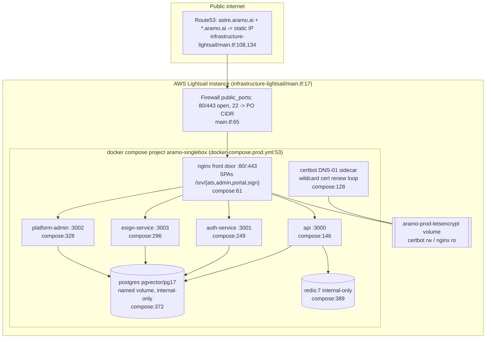
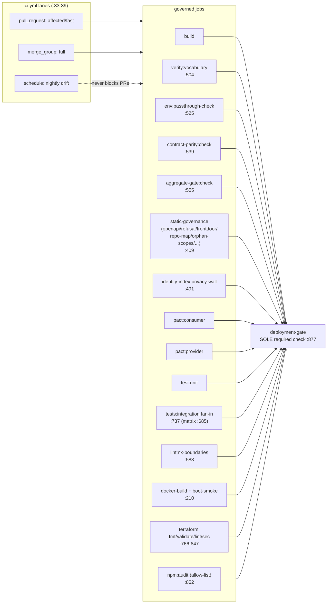
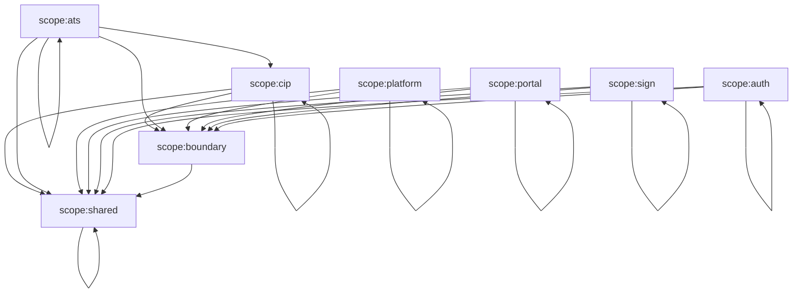

# D15 — Infrastructure, Deployment, Persistence Ops & Quality/Contract Enforcement (AS-BUILT)
> Baseline SHA 12330b0f5049c97f01022df0b190035933345212 · category AS-BUILT

## Summary

Aramo runs as a **single-box Docker-Compose stack on AWS Lightsail** (the live
prod substrate) with a **parallel, authored-but-largely-unapplied AWS
ECS/Fargate IaC track** under `infrastructure/`. The two deployment topologies
coexist in-tree: `infrastructure-lightsail/` is the box that is actually
reconciled and applied; `infrastructure/environments/{dev,staging,prod}/` is the
account-independent Fargate composition that validates in CI but whose
`talent-intake.tf` and `doc4-esign.tf` are explicitly annotated AUTHORED /
NOT-APPLIED.

The runnable prod stack is `docker-compose.prod.yml` (project name
`aramo-singlebox`, `docker-compose.prod.yml:53`): an **nginx** front door
(the only service publishing ports 80/443) baking four SPAs and reverse-proxying
five container-internal backends (api, auth-service, esign-service,
platform-admin) plus Postgres (pgvector/pg17) and Redis, with a **certbot
DNS-01 sidecar** owning the `*.aramo.ai` wildcard cert.

Quality/contract enforcement is concentrated in **one GitHub Actions workflow**
(`.github/workflows/ci.yml`) with three lanes (pull_request fast / merge_group
full / nightly schedule) converging on a single required check,
**`deployment-gate`** (`.github/workflows/ci.yml:877`). Governance walls include:
an nx module-boundary wall, a two-tier vocabulary gate, OpenAPI validate/lint/
drift, route↔OpenAPI contract parity, env-passthrough parity, Pact
consumer/provider (10 consumer projects + 1 provider), a dynamic integration
matrix driven by a canonical registry (`ci/integration-roots.json`, 47 roots),
Terraform fmt/validate/lint/sec, npm-audit with an allow-list, and a privacy
wall for `identity_index`. Persistence ops (migrate/seed) are gated shell
scripts under `deploy/`.

## Modules & Services (role | evidence path:line+symbol)

| name | role | evidence path:line+symbol |
| --- | --- | --- |
| `aramo-singlebox` compose stack | the runnable prod stack (single box) | `docker-compose.prod.yml:53` `name: aramo-singlebox` |
| nginx front door | sole public ingress on 80/443; TLS term + static SPA + path routing | `docker-compose.prod.yml:61` `nginx:`; ports `docker-compose.prod.yml:83` |
| certbot DNS-01 sidecar | owns `*.aramo.ai` wildcard cert (renew loop; Route53) | `docker-compose.prod.yml:128` `certbot:` image `certbot/dns-route53:v3.1.0` |
| api | apps/api backend, container-internal | `docker-compose.prod.yml:146` `api:` PORT 3000 |
| auth-service | apps/auth-service backend, container-internal | `docker-compose.prod.yml:249` `auth-service:` PORT 3001 |
| esign-service | native e-sign backend, container-internal | `docker-compose.prod.yml:296` `esign-service:` PORT 3003 |
| platform-admin | platform-console backend, container-internal | `docker-compose.prod.yml:328` `platform-admin:` PORT 3002 |
| postgres | persisted named-volume DB, pgvector-capable PG17, never port-published | `docker-compose.prod.yml:372` `image: pgvector/pgvector:pg17` |
| redis | BullMQ substrate, never port-published | `docker-compose.prod.yml:389` `image: redis:7` |
| Lightsail instance (live prod) | the box: instance + static IP + firewall + Route53 | `infrastructure-lightsail/main.tf:17` `aws_lightsail_instance.this` |
| Lightsail firewall | full public-port set 80/443 + SSH restricted to PO CIDR | `infrastructure-lightsail/main.tf:65` `aws_lightsail_instance_public_ports.this` |
| Route53 wildcard A record | `*.aramo.ai` → static IP (tenant onboarding = data op) | `infrastructure-lightsail/main.tf:134` `aws_route53_record.wildcard` |
| certbot DNS-01 IAM principal | least-privilege ACME-challenge IAM (no key in state) | `infrastructure-lightsail/main.tf:223` `module "certbot_dns"` |
| api Secrets Manager policy | scoped RW to connector/msgraph-delegated/tenant-llm secret namespaces | `infrastructure-lightsail/main.tf:189` `aws_iam_user_policy.api_secrets` |
| Fargate prod composition (IaC) | account-independent ECS/ALB/RDS/ECR/Secrets wiring (validates; apply gated) | `infrastructure/environments/prod/compute.tf:124` `module "ecs_service_api"` |
| talent-intake events (IaC) | EventBridge→SQS→Lambda durable foundation, AUTHORED-NOT-APPLIED | `infrastructure/environments/prod/talent-intake.tf:9` `module "talent_intake_events"` |
| esign KMS+SNS (IaC) | asymmetric sign/verify key + executed-envelope topic, AUTHORED-NOT-APPLIED | `infrastructure-lightsail/doc4-esign.tf:15` `aws_kms_key.esign_evidence` |
| CI workflow | single workflow, 3 lanes, converging on deployment-gate | `.github/workflows/ci.yml:31` `name: ci` |
| deployment-gate | the SOLE branch-protection required check | `.github/workflows/ci.yml:877` `deployment-gate:` |
| static-governance | consolidated cheap governance walls (one npm ci, named steps) | `.github/workflows/ci.yml:409` `static-governance:` |
| integration matrix | dynamic per-root matrix, max-parallel 8, serial per leg | `.github/workflows/ci.yml:685` `integration:`; `:699` `max-parallel: 8` |
| vocabulary gate | two-tier locked-vocab + R7 + retired-front-door scan | `scripts/verify-vocabulary.sh:491` `TIER2_TERMS_REGEX` |
| nx module-boundary wall | scope-tag dep constraints (cip/ats/platform/portal/sign/auth) | `eslint.config.mjs:77` `SCOPE_DEP_CONSTRAINTS` |
| integration-root registry + guard | canonical root list + default-deny coverage proof | `ci/integration-roots.json:3` `"roots"`; guard `ci/scripts/check-integration-roots.ts:5` |
| persistence ops — migrate gate | apply pending migrations + gate zero-pending before recreate | `deploy/migrate-prod.sh` (header + `set -euo pipefail`) |
| persistence ops — seed gate | regen host Prisma client + seed + assert before recreate | `deploy/seed-prod.sh` |

## Data Models

D15 owns **no application Prisma models**; its substrate is infra config, CI
registries, and operational scripts. The one persistence-ops data structure is
the box-local migration ledger `public._local_migrations` written by the
idempotent runner invoked from `deploy/migrate-prod.sh` (header, lines 28–30).
Repository-wide tracked persistence footprint (re-derived, see coverage): 53
tracked `schema.prisma` files, 209 `model` declarations, 253 tracked
`migrations/*/migration.sql` directories.

## API Endpoints

D15 defines no HTTP endpoints of its own. It **routes and gates** endpoints
owned by other domains at the nginx edge
(`deploy/nginx/templates/aramo.conf.template`):

| method | route | host block | evidence |
| --- | --- | --- | --- |
| (edge route) | `/v1/` → `api:3000` | tenant/wildcard | `aramo.conf.template:78` |
| (edge route) | `/auth/` → `auth-service:3001` (enlarged header buffers) | tenant/admin/portal | `aramo.conf.template:81` |
| (edge route) | `= /.well-known/jwks.json` → `auth-service:3001` | all | `aramo.conf.template:93` |
| (edge route) | `= /v1/webhooks/indeed/apply` → `api:3000` (3m body cap) | tenant | `aramo.conf.template:53` |
| (edge route) | `~ ^/v1/talent-intake-drafts/[^/]+/events$` → `api:3000` (SSE, buffering off) | tenant | `aramo.conf.template:66` |
| (edge route) | `/platform/skills`, `/platform/skill-review-queue`, `/platform/skill-proposals` → `api:3000` | admin | `aramo.conf.template:139` |
| (edge route) | `/platform/` → `platform-admin:3002` | admin | `aramo.conf.template:148` |
| (edge route) | `/v1/portal/` → `api:3000` (ONLY /v1 surface on portal host) | portal | `aramo.conf.template:184` |
| (edge route) | `/v1/esign/signing/` → `esign-service:3003` | sign | `aramo.conf.template:226` |
| (edge route) | `= /healthz` → `return 200`; `/` → `301 https` | port-80 | `aramo.conf.template:243` |

## Screens & FE->BE Wiring (FE domains only)

D15 is backend/infra; it hosts no React screens. It **serves** the four built
SPAs as static roots baked into the nginx image and routes their API traffic:
`/srv/ats` (tenant host, `aramo.conf.template:100`), `/srv/admin` (admin host,
`:162`), `/srv/portal` (portal host, `:203`), `/srv/sign` (sign host, `:231`).
Each uses `try_files $uri /index.html` SPA fallback. The admin host carries **no
`/v1` proxy** by deliberate negative control (`aramo.conf.template:155`), so the
tenant API surface is unreachable from the console host.

## Key Flows

### Single-box Lightsail deployment topology

### CI gate topology (merge-blocking members of deployment-gate)

### nx module-boundary scope wall

Source: `eslint.config.mjs:77` `SCOPE_DEP_CONSTRAINTS`, enforced via
`@nx/enforce-module-boundaries` (`eslint.config.mjs:140`). ATS may reach CIP;
platform/portal/sign/auth are each walled from ATS and CIP (ADR-0029 I15 wall).

## Evidence Index (load-bearing path:line citations)

- `.github/workflows/ci.yml:31` — `name: ci` (single workflow)
- `.github/workflows/ci.yml:34` — `push:` trigger (branches main)
- `.github/workflows/ci.yml:36` — `pull_request:` trigger
- `.github/workflows/ci.yml:37` — `merge_group:` trigger (full gate)
- `.github/workflows/ci.yml:39` — `cron: '0 7 * * *'` nightly drift
- `.github/workflows/ci.yml:210` — `docker-build:` matrix (api/auth/platform-admin/nginx) + boot-smoke
- `.github/workflows/ci.yml:325` — `release-manifest:` (main-only, immutable digests)
- `.github/workflows/ci.yml:409` — `static-governance:` consolidated walls
- `.github/workflows/ci.yml:491` — `identity-index-privacy-wall:` kept standalone
- `.github/workflows/ci.yml:504` — `verify-vocabulary:`
- `.github/workflows/ci.yml:525` — `env-passthrough-check:`
- `.github/workflows/ci.yml:539` — `contract-parity-check:`
- `.github/workflows/ci.yml:555` — `aggregate-gate-check:`
- `.github/workflows/ci.yml:570` — `placement-sql-check:` (NOT a deployment-gate member)
- `.github/workflows/ci.yml:583` — `lint-nx-boundaries:`
- `.github/workflows/ci.yml:660` — `integration-discovery:` (matrix from registry)
- `.github/workflows/ci.yml:685` — `integration:` matrix; `:699` `max-parallel: 8`
- `.github/workflows/ci.yml:737` — `tests-integration:` stable fan-in
- `.github/workflows/ci.yml:823` — `terraform-sec:`; `:835` `TFSEC_VERSION=v1.28.14`; `:847` `--minimum-severity=HIGH`
- `.github/workflows/ci.yml:766` / `:782` / `:804` — terraform fmt / validate / lint
- `.github/workflows/ci.yml:852` — `npm-audit:`; `:862` `bash scripts/audit-check.sh`
- `.github/workflows/ci.yml:877` — `deployment-gate:`; needs list `:881-899`
- `.github/workflows/ci.yml:940` — final grep fails on any `failure|cancelled|skipped`
- `docker-compose.prod.yml:53` — `name: aramo-singlebox`
- `docker-compose.prod.yml:61` / `:83` — nginx service / ports 80:80,443:443
- `docker-compose.prod.yml:128` — certbot `certbot/dns-route53:v3.1.0`
- `docker-compose.prod.yml:146` / `:249` / `:296` / `:328` — api / auth / esign / platform-admin
- `docker-compose.prod.yml:164` — `CI_PROCESSING_ENABLED` default false (dark)
- `docker-compose.prod.yml:172` — `EMBEDDING_PROCESSING_ENABLED` default false (dark)
- `docker-compose.prod.yml:218` — `&identity_pepper ARAMO_IDENTITY_PEPPER` YAML anchor (single-sourced to auth)
- `docker-compose.prod.yml:372` — `image: pgvector/pgvector:pg17`
- `docker-compose.prod.yml:389` — `image: redis:7`
- `deploy/nginx/templates/aramo.conf.template:25` / `:106` / `:168` / `:213` / `:239` — tenant / admin / portal / sign / port-80 blocks
- `deploy/nginx/templates/aramo.conf.template:139` — `/platform/skills` → api (edge provider map)
- `deploy/nginx/templates/aramo.conf.template:155` — admin host negative control (no `/v1`)
- `infrastructure-lightsail/main.tf:11` — `aws_lightsail_key_pair.this`
- `infrastructure-lightsail/main.tf:17` — `aws_lightsail_instance.this` (ignore_changes user_data+key_pair_name)
- `infrastructure-lightsail/main.tf:49` — `aws_lightsail_static_ip.this`
- `infrastructure-lightsail/main.tf:65` — `aws_lightsail_instance_public_ports.this` (22 → `var.ssh_source_cidr`)
- `infrastructure-lightsail/main.tf:108` / `:134` — Route53 `app` + `wildcard` A records
- `infrastructure-lightsail/main.tf:189` — `aws_iam_user_policy.api_secrets` (connector/msgraph-delegated/tenant-llm scope)
- `infrastructure-lightsail/main.tf:223` — `module "certbot_dns"` (no access key in state)
- `infrastructure-lightsail/doc4-esign.tf:15` — `aws_kms_key.esign_evidence` `key_spec = "RSA_2048"` (AUTHORED-NOT-APPLIED)
- `infrastructure-lightsail/doc4-esign.tf:29` — `aws_sns_topic.esign_executed` (no subscription)
- `infrastructure/environments/prod/compute.tf:19` / `:32` / `:124` / `:162` — ECR / Secrets / api+auth ECS services
- `infrastructure/environments/prod/talent-intake.tf:9` — `module "talent_intake_events"` AUTHORED-NOT-APPLIED; `:33` api publish policy attach
- `ci/integration-roots.json:3` — `"roots"` canonical registry (47 roots; 1 coverageAlias; 0 exemptions)
- `ci/scripts/check-integration-roots.ts:5` — default-deny coverage proof
- `ci/scripts/ci-integration.sh:8` — every run SERIAL (`--no-file-parallelism`)
- `ci/scripts/verify-env-passthrough.ts:42` — `REQUIRED_PASSTHROUGH` manifest
- `ci/scripts/verify-api-contract-parity.ts:36` — `MANIFEST_PATH` = `ci/config/api-surface-manifest.json`
- `eslint.config.mjs:77` — `SCOPE_DEP_CONSTRAINTS`; `:140` `@nx/enforce-module-boundaries`
- `scripts/verify-vocabulary.sh:36` — `R7_ALLOWLIST` (Tier-1); `:77` `FRONTDOOR_LEGACY_ALLOWLIST`; `:491` `TIER2_TERMS_REGEX`
- `scripts/audit-check.sh:1` — allow-list-aware `npm audit` wrapper (ADR-0014)
- `deploy/migrate-prod.sh:1` — migrate-then-gate before recreate
- `deploy/seed-prod.sh:1` — regen client + seed + assert before recreate

## NOT VERIFIED (explicit)

- **Live-box reconciliation state** (what is actually running on the Lightsail
  instance, `ARAMO_RELEASE_REVISION`, applied-vs-declared Terraform drift) is a
  runtime fact NOT observable from the repo at this SHA; only the declared
  desired-state (`infrastructure-lightsail/*.tf`, `docker-compose.prod.yml`) was
  read.
- **Apply status of `infrastructure/environments/{prod,staging}/`** beyond the
  in-file annotations (`talent-intake.tf:1-7`, `doc4-esign.tf:1-5` say
  AUTHORED-NOT-APPLIED) was not independently verified against any state bucket.
- `.env.prod.example` env surface and the full `REQUIRED_PASSTHROUGH` contents
  were referenced by file but not enumerated line-by-line.
- The exact count of individual Terraform resources per environment was not
  re-derived; only the `*.tf` file inventory (70 tracked) was counted.
- Whether every one of the 10 pact consumer projects currently has green
  provider verification is a run-time result, NOT verified here (only the
  `pact:consumer` / `pact:provider` wiring in `package.json` was read).
- The `deploy-public-staging.yml` workflow was inventoried (2 workflow files
  total) but its internals were not deeply read for this fragment.
