# Talent Module — Identity-Keying ER Diagram

**Artifact type:** Documentation (read-only). No schema or code change.
**Purpose:** Supports Lead ratification of the Phase-0 gap report's **Path A vs Path B** fork
(Talent Module Gap-Closure Directive v1.0, Ruling B / E). It maps the *identity-keying graph* —
how the recruiter-facing ATS `TalentRecord`, the Core `Talent` system-of-record, and the
evidence / consent / examination entities are (and are **not**) wired together.
**Date:** 2026-06-27.

> **The one fact this diagram exists to make visible:** every structured evidence/consent/examination
> entity keys to the **Core `Talent.id`** (a bare cross-schema UUID, no FK, no relation). The manual
> Add-Talent flow creates an **ATS `TalentRecord`** whose `core_talent_id` is **nullable and unset at
> create**. There is therefore **no edge** between `TalentRecord` and any evidence/consent entity until
> canonicalization links them. That absence is the keying wall.

---

## ER Diagram

Edge style encodes the keying nature:

- **Solid `--`** = real, DB-enforced **FK**, intra-schema.
- **Dotted `..`** = **logical cross-schema reference, UUID-only, NO FK** (Architecture v2.x §7.3).
- Crow's-foot left cardinality: `||` exactly-one parent · `|o` zero-or-one parent (the nullable link seam).

```mermaid
erDiagram
  %% ============================================================
  %% schema: talent  (Core — tenant-AGNOSTIC system of record)
  %% ============================================================
  Talent {
    uuid   id               PK "Core identity anchor (tenant-agnostic)"
    string lifecycle_status     "enum(str): active|inactive|archived|deleted"
    ts     created_at
    ts     updated_at
  }
  TalentTenantOverlay {
    uuid   id                  PK
    uuid   talent_id           FK "intra-schema FK -> Talent.id"
    uuid   tenant_id              "cross-schema -> identity.Tenant (UUID-only)"
    uuid   source_recruiter_id    "nullable"
    string source_channel         "enum(str): self_signup|recruiter_capture|referral|import"
    string tenant_status
  }

  %% ============================================================
  %% schema: talent_record  (ATS — recruiter-facing, tenant-scoped)
  %% ============================================================
  TalentRecord {
    uuid   id                  PK "ATS record id (NOT the person identity)"
    uuid   tenant_id              "required; tenant-scoped"
    uuid   core_talent_id         "NULLABLE LINK SEAM -> talent.Talent.id; set ONLY by canonicalization"
    uuid   site_id                "nullable"
    string first_name
    string last_name
    string email1                 "nullable; NO uniqueness constraint today"
    string email2                 "nullable"
    string availability_status    "enum(str): available_now|open_to_offers|not_looking|unknown"
    string engagement_type        "enum(str): contract_to_hire|contract|direct_hire"
    string current_pay            "FREE-TEXT (not structured rate)"
    string desired_pay            "FREE-TEXT"
    string key_skills             "CSV free-text"
    uuid   owner_id               "nullable -> identity.User"
    uuid   import_batch_id        "nullable -> import.ImportBatch"
  }

  %% ============================================================
  %% schema: talent_evidence  (Core-talent-keyed structured evidence)
  %% ============================================================
  TalentWorkAuthorization {
    uuid     id                        PK
    uuid     talent_id                    "CORE Talent.id (bare UUID, NO relation to TalentRecord)"
    uuid     tenant_id
    string   work_authorization_status    "enum: US_CITIZEN|PERMANENT_RESIDENT|VISA_HOLDER|REQUIRES_SPONSORSHIP|OTHER|NOT_DISCLOSED"
    string_a authorized_to_work_in        "String[] (Postgres array)"
    string   visa_type                    "nullable free-text"
    bool     requires_sponsorship
    ts       updated_at
  }
  TalentRateExpectation {
    uuid   id               PK
    uuid   talent_id           "CORE Talent.id (bare UUID, NO relation to TalentRecord)"
    uuid   tenant_id
    string employment_type     "enum TalentEmploymentType: W2|1099|C2C|FTE"
    float  min_rate
    float  target_rate         "nullable"
    string currency
    string period              "enum TalentRatePeriod: HOURLY|ANNUAL"
    string source              "enum TalentRateSource: talent_declared|recruiter_entered"
    ts     updated_at
  }

  %% ============================================================
  %% schema: consent
  %% ============================================================
  TalentConsentEvent {
    uuid   id                 PK "UUID v7"
    uuid   talent_id             "CORE Talent.id (bare UUID, NO relation to TalentRecord)"
    uuid   tenant_id
    string scope                 "enum(str): profile_storage|resume_processing|matching|contacting|cross_tenant_visibility"
    string action                "enum(str): granted|revoked|expired"
    string captured_method       "enum(str): self_signup|recruiter_capture|upload_flow|import"
    uuid   captured_by_actor_id  "nullable"
    ts     occurred_at
    ts     expires_at            "nullable"
  }

  %% ============================================================
  %% schema: examination  (read by the submittal builder)
  %% ============================================================
  TalentJobExamination {
    uuid   id              PK "UUID v7; immutable analytical snapshot"
    uuid   tenant_id
    uuid   talent_id          "CORE Talent.id (bare UUID, NO relation to TalentRecord)"
    uuid   job_id
    uuid   golden_profile_id
    string trigger            "enum: initial_match|talent_data_change|job_data_change|model_recompute|taxonomy_recompute|recruiter_requested|scheduled_refresh"
    string tier               "enum: ENTRUSTABLE|WORTH_CONSIDERING|STRETCH"
    string lifecycle_state    "enum: active|archived|cold_storage"
  }

  %% ---- relationships ----
  %% intra-schema, real FK (solid):
  Talent ||--o{ TalentTenantOverlay : "talent_id (intra-schema FK)"

  %% the nullable link seam (dotted = UUID-only, no FK; |o = zero-or-one Core Talent per record):
  Talent |o..o{ TalentRecord : "core_talent_id — NULLABLE; set ONLY at canonicalization (LINK-NOT-CREATE)"

  %% Core-talent-keyed evidence/consent/examination (dotted = UUID-only, no FK):
  Talent ||..o{ TalentWorkAuthorization : "talent_id (Core UUID, no FK)"
  Talent ||..o{ TalentRateExpectation   : "talent_id (Core UUID, no FK)"
  Talent ||..o{ TalentConsentEvent      : "talent_id (Core UUID, no FK)"
  Talent ||..o{ TalentJobExamination    : "talent_id (Core UUID, no FK)"

  %% NOTE: there is intentionally NO edge between TalentRecord and any
  %% talent_evidence / consent / examination entity. The absence is the point.
```

> Mermaid `erDiagram` has no subgraphs; entities are grouped by Postgres schema via the `%%` comment
> banners above and the **schema legend** below. `string_a` is a stand-in token for a `String[]` (Postgres
> array) column — Mermaid has no array type.

---

## Schema legend (grouping)

| Postgres schema | Module (`libs/…`) | Entities | Identity nature |
|---|---|---|---|
| `talent` | `libs/talent` | `Talent`, `TalentTenantOverlay` | **Core system-of-record.** Tenant-agnostic person identity. |
| `talent_record` | `libs/talent-record` | `TalentRecord` | **ATS recruiter row.** Tenant-scoped; links to Core via nullable `core_talent_id`. |
| `talent_evidence` | `libs/talent-evidence` | `TalentWorkAuthorization`, `TalentRateExpectation` | Core-talent-keyed structured evidence. |
| `consent` | `libs/consent` | `TalentConsentEvent` | Core-talent-keyed consent ledger (immutable). |
| `examination` | `libs/examination` | `TalentJobExamination` | Core-talent-keyed analytical snapshot; read by the submittal builder. |

---

## Keying-wall legend (the load-bearing distinction)

| Column | Entity | Exact nature |
|---|---|---|
| `core_talent_id` | `TalentRecord` | **Nullable** logical ref → `talent.Talent.id`. Cross-schema, **no FK**. Set/cleared **only** by `TalentLinkService` (never a free PATCH); unset on most records and at manual create. **This is the link seam.** |
| `talent_id` | `TalentWorkAuthorization`, `TalentRateExpectation`, `TalentConsentEvent`, `TalentJobExamination` | **Bare Core `Talent.id` UUID.** Cross-schema, **no FK, no Prisma relation to `TalentRecord`.** Reachable only once a Core `Talent` exists. |
| `talent_id` | `TalentTenantOverlay` | The **only intra-schema real FK** to `Talent` (same `talent` schema). |

**LINK-NOT-CREATE boundary (annotated):** the Core `Talent` row is created **only** by canonicalization
(ingestion-driven). The ATS create path, the linker, and the import engine **never** call Core
`createTalent` / `createOverlay` — proven structurally by bit-identical `talent.*` row-counts pre/post ATS
ops (`ats-batch4b-talent-link.integration.spec.ts`) and the canonicalization tripwire spec. Consequently the
evidence/consent `talent_id` cannot be populated from the manual create flow without first minting a Core
`Talent`, which is forbidden here.

---

## Path A vs Path B — the decision surface (no schema change in this doc)

The gap report's Ruling-B fork asks where recruiter-entered **Work Authorization** + **E-Verify** land,
given the keying wall above:

- **Path A — new `TalentRecord` columns (ATS schema).** Add e.g. `work_authorization` (enum),
  `work_auth_expiry` (date), `requires_sponsorship` (bool), `work_auth_note` (text), `e_verify_status`
  (enum) **directly on `TalentRecord`**. Recruiter-authored, tenant-scoped, **available at create** with no
  Core `Talent`. Consistent with how `current_pay` / `availability_status` already live on `TalentRecord`.
  The Core-keyed `TalentWorkAuthorization` remains the *canonical/ingested* home, reconciled in later when
  `core_talent_id` links. The submittal precondition (Ruling E) would read work-auth from `TalentRecord`.
  *Diagram impact:* new columns on the `TalentRecord` node — **no new edge**, no Core dependency.

- **Path B — extend the Core-keyed `TalentWorkAuthorization` (+ an E-Verify field there).** Reuses the
  existing Sensitive entity and its `talent_id` keying, but **forces solving the `core_talent_id` /
  Core-creation seam now** (the same blocker that deferred consent-grant persistence). *Diagram impact:* the
  manual create path would need a new write into `talent_evidence` keyed by a Core `Talent.id` it does not
  yet possess — i.e. it must cross the keying wall.

> **Enum collision to resolve alongside the fork:** Ruling B proposes a **13-value** granular enum
> (`USC, GC, GC_EAD, H1B, H4_EAD, L2_EAD, OPT_F1, STEM_OPT_F1, CPT_F1, TN, E3, OTHER_EAD,
> REQUIRES_SPONSORSHIP`). The existing `TalentWorkAuthorizationStatus` is **6 coarse values**
> (`US_CITIZEN, PERMANENT_RESIDENT, VISA_HOLDER, REQUIRES_SPONSORSHIP, OTHER, NOT_DISCLOSED`) + a free
> `visa_type`. Path A can adopt the 13-value enum cleanly on a new column; Path B must reconcile against the
> shipped 6-value enum.

---

## File:line provenance (source of truth)

Every entity/enum above is transcribed from the live Prisma schemas:

| Element | File | Lines |
|---|---|---|
| `TalentRecord` model | [libs/talent-record/prisma/schema.prisma](../libs/talent-record/prisma/schema.prisma#L52) | 52–157 |
| `TalentRecord.core_talent_id` (link seam) | [libs/talent-record/prisma/schema.prisma](../libs/talent-record/prisma/schema.prisma#L102) | 102–112 |
| `TalentRecord.availability_status` / `engagement_type` | [libs/talent-record/prisma/schema.prisma](../libs/talent-record/prisma/schema.prisma#L95) | 95–96 |
| `Talent` (Core) model | [libs/talent/prisma/schema.prisma](../libs/talent/prisma/schema.prisma#L33) | 33–47 |
| `TalentTenantOverlay` model | [libs/talent/prisma/schema.prisma](../libs/talent/prisma/schema.prisma#L57) | 57–78 |
| `TalentWorkAuthorization` model | [libs/talent-evidence/prisma/schema.prisma](../libs/talent-evidence/prisma/schema.prisma#L262) | 262–276 |
| `TalentWorkAuthorizationStatus` enum (6 values) | [libs/talent-evidence/prisma/schema.prisma](../libs/talent-evidence/prisma/schema.prisma#L111) | 111–120 |
| `TalentRateExpectation` model | [libs/talent-evidence/prisma/schema.prisma](../libs/talent-evidence/prisma/schema.prisma#L240) | 240–256 |
| `TalentEmploymentType` enum | [libs/talent-evidence/prisma/schema.prisma](../libs/talent-evidence/prisma/schema.prisma#L85) | 85–92 |
| `TalentRatePeriod` enum | [libs/talent-evidence/prisma/schema.prisma](../libs/talent-evidence/prisma/schema.prisma#L95) | 95–100 |
| `TalentRateSource` enum | [libs/talent-evidence/prisma/schema.prisma](../libs/talent-evidence/prisma/schema.prisma#L103) | 103–108 |
| `TalentConsentEvent` model | [libs/consent/prisma/schema.prisma](../libs/consent/prisma/schema.prisma#L29) | 29–67 |
| `TalentJobExamination` model | [libs/examination/prisma/schema.prisma](../libs/examination/prisma/schema.prisma#L82) | 82–159 |
| `ExaminationTier` / `ExaminationLifecycleState` / `ExaminationTrigger` enums | [libs/examination/prisma/schema.prisma](../libs/examination/prisma/schema.prisma#L41) | 41–73 |

*Cross-schema convention:* all `talent_id` / `core_talent_id` / `tenant_id` references are UUID-only with
**no foreign key** per Architecture v2.x §7.3 (Schema-per-Module). The only FK above is the intra-`talent`
relation `TalentTenantOverlay.talent_id → Talent.id`.
